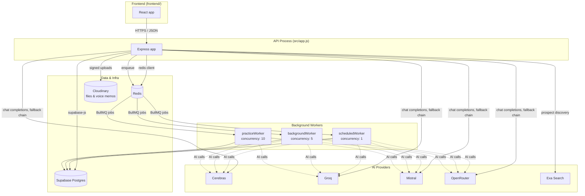
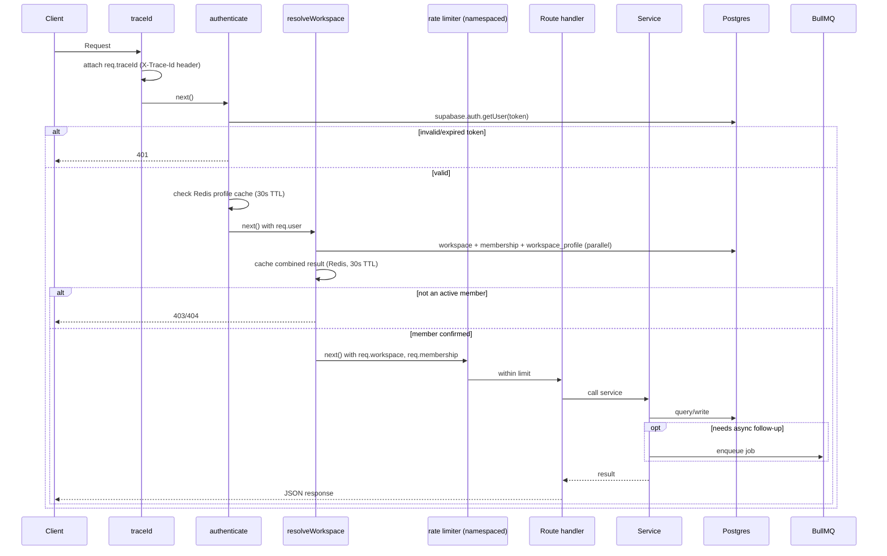
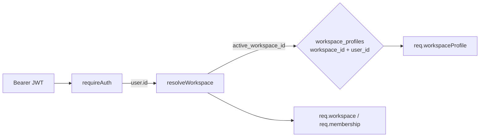
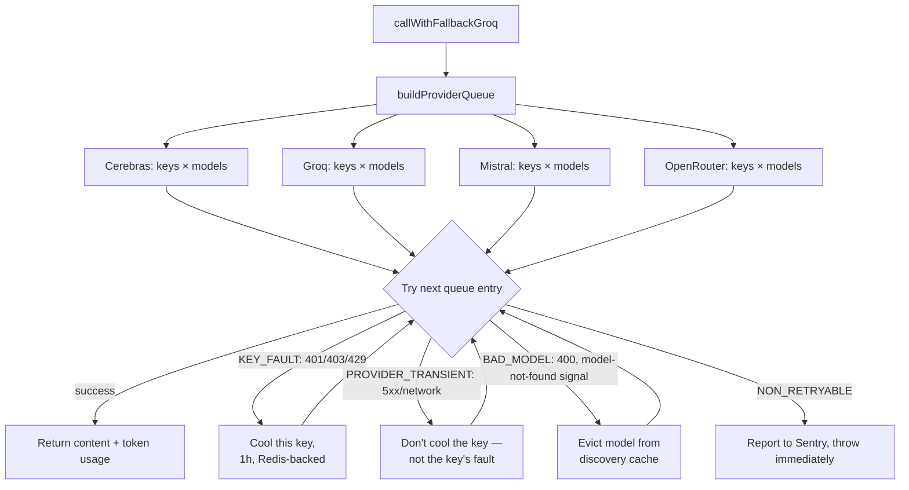
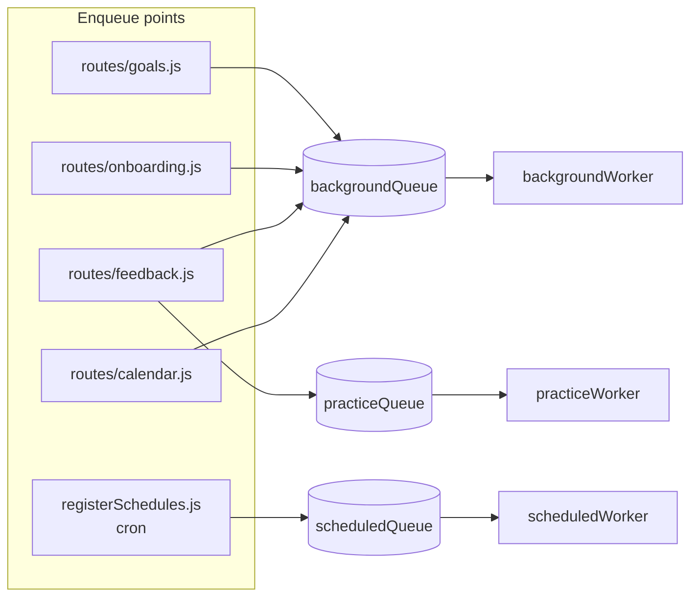
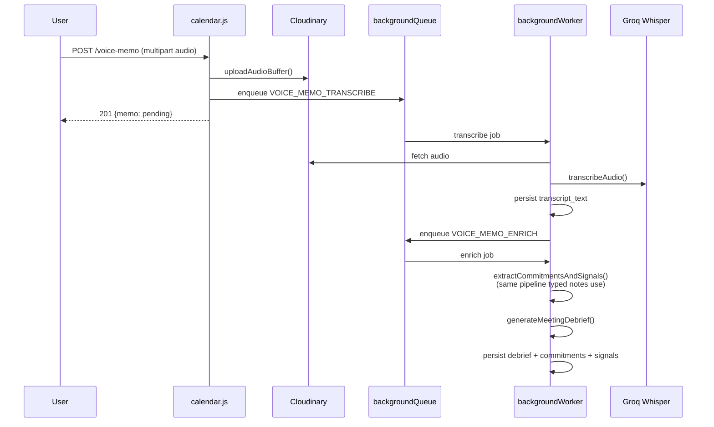

# FounderSales Backend — Architecture

**Scope:** this document covers `backend/` — a Node.js/Express API plus its background job system. The frontend (`frontend/`, React) lives in this same repository but is covered separately; this document is about the API and job system only.

---

## 1. System Overview

FounderSales is a multi-tenant backend: every piece of data belongs to a **workspace** (a team or a solo founder's own space), and almost every route resolves the caller's workspace membership before touching anything else. The system has two halves that share the same codebase but run different responsibilities:

- **The API** — Express routes that read/write Supabase Postgres directly, call one of four LLM providers with automatic fallback, and enqueue background jobs for anything that shouldn't block a response.
- **The job system** — BullMQ workers, backed by Redis, that run scheduled jobs (nightly pattern detection, weekly skill snapshots, daily digests) and on-demand jobs enqueued by the API (message scoring, meeting prep, voice memo transcription).



---

## 2. Why this shape

The product's core loop (see `PRODUCT_OVERVIEW.md`) requires a lot of AI calls that don't need to block a request: scoring a message after feedback is logged, generating a weekly skill snapshot, detecting patterns across two months of messages, transcribing a voice memo. None of these need to finish before the HTTP response returns. The architecture is built around that split: **the API does the minimum work needed to acknowledge a request and enqueue everything else**, and three purpose-built workers pick the work up.

Three separate workers, not one, because their job shapes are genuinely different:

| Worker | Concurrency | Job shape |
|---|---|---|
| `scheduledWorker` | 1 | Cron-driven, whole-workspace-or-global sweeps (pattern detection, digests). Deliberately serialized — these jobs read large slices of data and shouldn't overlap with themselves. |
| `backgroundWorker` | 5 | Fire-and-forget, per-record jobs (calendar prep, commitment extraction, voice memo enrichment). Retried with exponential backoff. |
| `practiceWorker` | 10 | High-frequency, low-latency jobs tied to an active user session (delivery/seen simulation, skill scoring, coaching annotations). Needs headroom because a user is often waiting on the *next* thing in the UI even though this specific job is async. |

---

## 3. Backend Layers

```
src/
├── app.js              # Express assembly — middleware chain, route mounting, error handler
├── config/              # External client singletons + centralized rate-limiter registry
├── middleware/            # auth, workspace resolution, validation, error handling, trace IDs
├── routes/                # One Express router per resource
├── services/               # Business logic — DB queries, AI calls, orchestration
├── schemas/                  # Zod schemas that validate AI *output*, not just request input
├── validators/                 # Zod schemas for request bodies
├── jobs/                        # Queue definitions, three workers, and every job handler
└── utils/                        # Logging, pagination, provider-error classification, parsing
```

Routes stay thin: parse `req.body`/`req.params`, call a service or two, shape the response. Business logic — including every AI prompt — lives in `services/`. This is what makes it possible for the exact same conversation-analysis logic to run whether it was triggered by an HTTP request or a queued job (`jobs/conversationAnalysisJob.js` is called from both `routes/feedback.js`'s enqueue and `practiceWorker.js`'s dispatch).

---

## 4. Request Lifecycle



Every workspace-scoped router is mounted behind the same two-middleware chain (`authenticate`, `resolveWorkspace`) in `app.js`, so a route file never has to re-implement "is this a valid, active member." Field-level authorization (e.g. only an `owner` can transfer ownership, only `manager`+ can view team pipeline) is layered on top via `requirePermission(role)`.

---

## 5. Authentication & Identity

Identity is delegated entirely to **Supabase Auth**. The backend never stores or checks passwords itself — `middleware/auth.js` calls `supabaseAdmin.auth.getUser(token)` to verify the bearer JWT, then loads the corresponding `users` row (cached in Redis for 30 seconds, keyed per user, explicitly invalidated on profile writes).

A user's **product context** — product description, target audience, voice profile, archetype — deliberately does *not* live on the `users` table. It lives on `workspace_profiles`, scoped to `(workspace_id, user_id)`. This is what makes multi-workspace membership correct: the same person can be a member of two workspaces with two different products and two different voice profiles, and `resolveWorkspace` resolves the right one per request based on `users.active_workspace_id`.



Google OAuth is supported through Supabase's own OAuth flow; the backend's job on callback is limited to verifying the returned token and creating/resolving the `users` + `workspace_profiles` rows via an atomic RPC (`create_user_with_workspace`), never handling credentials directly.

---

## 6. Workspace / Multi-Tenancy Model

Every data-bearing table carries `workspace_id`. Membership rows (`workspace_members`) carry a `role` (`owner` / `admin` / `manager` / `member`) and a `status` (`active` / `suspended` / `pending_invite` / `removed`). Invites are token-based: a random token is hashed before storage, and acceptance is handled by a Postgres function (`accept_workspace_invite`) rather than sequential application-level writes, so a token can't be redeemed twice under concurrent requests.

Two Redis caches sit in front of this model — the auth-layer profile cache (§5) and a separate 30-second workspace-context cache (`middleware/workspace.js`) holding the resolved workspace + membership + workspace_profile triple. Both are explicitly invalidated on the write paths that change them (role change, member removal, profile update) rather than relying purely on TTL expiry — the TTL is a ceiling on staleness, not the only invalidation mechanism.

---

## 7. Database Design

Postgres via Supabase. A few structural choices worth calling out:

**Sequence columns for stable pagination.** `chats`, `chat_messages`, and `user_events` each carry a `bigserial seq` column, independent of `created_at`. Timestamp-based cursors break under concurrent inserts with equal timestamps; `seq` doesn't. `chat.js`'s message pagination and `calendar.js`'s cursor pagination both key off `seq`, not `created_at`.

**Generated columns for derived scores.** `opportunities.composite_score` and `prospects.name_normalized` are `GENERATED ALWAYS AS (...) STORED` columns — the composite score (average of fit/timing/intent) and the whitespace/case-normalized name used for fuzzy-dedup matching are computed by Postgres itself, not recalculated in application code on every read.

**A three-layer prospect deduplication model** (`services/prospectDedup.js`):
1. Exact identifier match (email or LinkedIn URL) → auto-merge, no ambiguity.
2. Normalized-name exact match (whitespace/case variance only) → auto-merge.
3. Trigram similarity (`pg_trgm`, via a `find_similar_prospects` RPC) on genuinely different-looking names → **never** auto-merged, only flagged into `prospect_merge_candidates` for a human decision. Auto-merging on fuzzy name similarity risks silently combining two different real people who happen to share a name — a real failure mode, not a hypothetical one, so the system deliberately stops short of automating that specific decision.

**Buyer psychology as structured JSON, not free text.** `practice_sessions.buyer_profile`, `buyer_state`, and `buyer_state_history` store the AI buyer's persona and a running history of interest/trust/confusion scores at every exchange — this is what lets `insights.js`'s `practice/buyer-state-trajectory` endpoint compute, across 20 sessions, the exact exchange index where founder momentum typically peaks and where it typically drops off.

**Immutable-by-convention scoring history.** `conversation_analyses`, `skill_progression`, and `user_skill_profile` are append-only per period — a new week's snapshot is a new row, not an update to last week's. This is what makes week-over-week delta computation (`composite_delta`) a simple two-row comparison rather than a derived/reconstructed value.

---

## 8. AI Provider Layer

`services/multiProvider.js` is the single choke point every AI call in the codebase goes through. It maintains a priority-ordered queue across four providers — Cerebras, Groq, Mistral, OpenRouter — each with its own pool of API keys, and walks the queue on failure rather than surfacing a provider outage to the caller.



Two decisions here worth spelling out:

**Structured error classification, not string matching.** `utils/providerErrors.js` classifies failures by the real HTTP status code and parsed error body captured at the point the request was made, not by pattern-matching a formatted error message. The earlier approach (kept as a documented fallback path) treated any 4xx/5xx roughly the same and risked cooling a key down for an hour over a provider-wide outage that had nothing to do with that specific key's validity.

**Vision support without penalizing every other model.** Only `meta-llama/llama-4-scout` (in the Groq queue) is flagged vision-capable. Image parts are attached to the outgoing request only when the model actually being tried this attempt is that one; every other model in the fallback chain still receives plain-text messages. This means an image attachment doesn't silently degrade the whole fallback chain's reliability just because most of the providers in it can't see it.

**Redis-backed key cooldown and model discovery, shared across instances.** A key that returns 429 is marked cooling in Redis (not in-process memory) for one hour, so a second API instance doesn't keep hammering a key the first instance already learned was rate-limited. Model discovery (which models a provider's `/models` endpoint actually lists right now) is cached for 6 hours behind a distributed lock, so only one instance ever performs the discovery HTTP call per provider per window — every other instance reads the shared result. A `MULTIPROVIDER_REDIS_STATE_ENABLED` kill switch reverts the whole file to its original in-memory-only behavior with no deploy required, specifically because this is the single highest-traffic file in the codebase and any change to it needs an instant rollback path.

Every call records token usage against `(workspace_id, user_id, model, source_job)` via `services/tokenTracker.js`, which is how per-workspace AI cost is queryable later without a separate observability system.

---

## 9. Search / Prospect Discovery

`services/exa.js` wraps Exa's neural search API with the same multi-key, Redis-backed cooldown mechanism as the LLM layer (via a shared `services/providerCooldown.js` module — the cooldown logic itself isn't duplicated between the two files, just parameterized by provider name).

Before spending a search call, `needsRealTimeSearch()` runs a cheap LLM call that looks at how developed the founder's profile is (product description length, target audience specificity, ICP trigger) and decides whether a live search is likely to find anything real. If the profile is too thin, or the workspace's daily Exa quota is exhausted, the system falls back to AI-generated practice examples — clearly flagged `is_example: true` so they're never displayed as real leads.

---

## 10. Background Jobs

### 10.1 Job types and dispatch

`config/constants.js`'s `BACKGROUND_JOB_TYPES` is the single source of truth for job names — a route enqueues by constant, `backgroundWorker.js` dispatches by the same constant, so a typo in a job name fails at import time rather than silently creating an unlistened-to queue.



### 10.2 Idempotency for calendar prep — a two-layer guard

Meeting prep can be triggered from three independent places: event creation, a manual "regenerate" button, and a nightly sweep that catches anything prep-generation missed. All three previously risked generating prep twice for the same event under a race. The fix has two layers:

1. **BullMQ jobId dedup** — every enqueue uses a deterministic `jobId` (`prep:${eventId}`), so two enqueues for the *same* trigger collapse into one queued job.
2. **A DB-state re-check inside the handler itself** — before generating anything, the handler re-reads `user_events.prep_generated` from Postgres. jobId dedup alone doesn't protect against two *different* jobIds (the on-creation path and the nightly sweep) racing for the same event; the DB check does.

This pattern — durable job + a fresh DB check at the top of the handler — is used anywhere prep-like generation exists in this codebase, rather than trusting the queue's own dedup as sufficient on its own.

### 10.3 AI cost gating before generation

`services/calendarAiGate.js` is a rule engine every calendar AI trigger routes through *before* spending a model call: skip prep for a low-context "other" event type with no attendee info; skip research if the same prospect was already researched within the last 14 days (reusing the cached research instead); skip commitment/signal extraction on notes under 20 characters. Every gate decision — proceed, skip, or reuse-cache — is logged to `calendar_ai_events` with a reason, so the cost-reduction impact of the gate is queryable, not just asserted.

### 10.4 Chat history summarization

Full conversation history isn't replayed to the model forever. `constants.js`'s `CHAT_HISTORY_WINDOW` (20 messages) is what actually gets sent raw; anything older is folded into a running `chats.summary` field by a background job once a chat accumulates `CHAT_SUMMARIZE_EVERY_N_MESSAGES` (20) new messages since its last summarization. `buildSystemPromptForChat()` prepends that summary ahead of the live window, so a long-running coaching conversation doesn't grow its per-turn token cost linearly with the conversation's total length.

---

## 11. Streaming

Chat responses can stream over Server-Sent Events. `services/streaming.js`'s `streamAndSave()` inserts a placeholder assistant message row first, streams tokens to the client as they arrive from the provider, and finalizes the row (content, token count, delivery status) once the stream completes — so a client that disconnects mid-stream still leaves a consistent, queryable message row behind rather than an orphaned placeholder. `stream_options: { include_usage: true }` is set on every streaming request specifically so the final SSE chunk carries real token counts; without it, streamed responses had no token accounting at all.

---

## 12. Rate Limiting

Every limiter in the codebase is defined once, in `config/limiters.js`, each with an explicit, unique Redis namespace (`ratelimit:<namespace>:`). This exists because of a real bug class: several limiters previously called a shared store-construction function with no namespace argument, which silently defaulted every one of them to the same `'default'` Redis key prefix — meaning a user hitting an AI-heavy route and a completely unrelated pipeline route could decrement the *same* counter. `createRateLimitStore()` now warns loudly if anything ever calls it without an explicit namespace, so a regression here is visible in logs immediately instead of silently merging two limits again.

Limiters are sized per route's actual cost profile rather than one blanket "AI limiter" — `chat`/`practice` (every user turn = one model call) get more headroom than `goals`/`commitments` (one cheap call per user action), and `insights` (mostly cache-shielded, 4–24h TTLs) is more generous than a raw per-request-cost estimate would suggest, since most requests never reach the model at all.

If Redis is unavailable at the moment a limiter's store is constructed, the limiter falls back to express-rate-limit's in-memory store (degraded — per-instance, not cluster-wide — but functional) rather than the request failing outright.

---

## 13. Caching Strategy

Redis serves four distinct roles, kept in separate key namespaces so a problem in one doesn't look like a problem in another:

| Role | TTL | Fail mode |
|---|---|---|
| Auth profile cache (`profile:{userId}`) | 30s | Falls back to a fresh Postgres read |
| Workspace context cache (`ws:ctx:{userId}:{workspaceId}`) | 30s | Falls back to a fresh Postgres read |
| Rate-limit counters (`ratelimit:{namespace}:`) | rolling window | Falls back to in-memory (per-instance) |
| AI provider state — key cooldowns, model discovery (`mp:*`) | 1h / 6h | Falls back to in-memory, kill-switchable |

Every Redis-backed feature in this codebase is written to **fail open**: a Redis outage degrades precision (slightly stale cache, per-instance rate limiting, per-instance provider cooldown) but never blocks a request outright. This is a deliberate, consistent choice — Redis is treated as an optimization layer over Postgres and process state, never as a system of record.

---

## 14. File Storage & Voice Memos

Uploads (avatars, attachments, voice memos) go through Cloudinary rather than a self-managed object store. Voice memos specifically use Cloudinary's `video` resource type (its convention for audio), which returns duration metadata in the upload response for free, avoiding a second probe of the file.

Voice memo processing is a three-stage async pipeline, each stage its own idempotent job:



A voice memo is never a parallel feature with its own AI logic — `enrichMemo()` calls the exact same `extractCommitmentsAndSignals` and `generateMeetingDebrief` functions the typed-notes debrief flow uses. The only thing that differs between a typed debrief and a voice-memo debrief is which function produced the raw text.

---

## 15. Error Handling & Logging

A shared `AppError` hierarchy (`middleware/errorHandler.js`) carries an explicit `statusCode`; services throw typed errors, routes never construct HTTP status codes themselves. A catch-all in the error handler translates raw Postgres/Supabase errors into a generic `DB_ERROR` response so a leaked driver error never reaches a client.

Every log line is namespaced (`createLogger('Chat')`, `createLogger('Practice')`, ...) with structured `key=value` fields rather than free-text concatenation, and every request carries a trace ID (generated or forwarded from an upstream `X-Trace-Id` header) echoed back in the response, so a single request's log lines can be correlated even when interleaved with concurrent requests.

Sentry is wired in as a genuinely optional, no-op-if-unconfigured layer (`config/sentry.js`) — the app runs identically with `SENTRY_DSN` unset. Because most AI-call failures in this codebase are already caught locally and turned into a graceful fallback value rather than rethrown, automatic Express-level error capture alone would miss the failures most worth seeing. `Sentry.captureException` calls are placed at a small number of deliberate choke points instead — final provider-fallback exhaustion, job-handler failures, non-retryable AI errors — rather than scattered across every individual catch block.

---

## 16. Security Notes

- **Service-role Postgres access is the practical trust boundary**, not Row-Level Security — the backend uses Supabase's service-role client for nearly all operations, so authorization is enforced by the middleware chain (`authenticate` → `resolveWorkspace` → `requirePermission`), not by RLS policies. This is architecturally consistent *as long as* the service-role key never reaches a client, which the code respects.
- **Mass-assignment protection via explicit Zod schemas with `.strict()`** on update routes (e.g. `prospects.js`'s `updateProspectSchema`) — a client cannot smuggle `workspace_id` or `user_id` into a body that gets spread into an update call.
- **Invite tokens are hashed before storage** and compared by hash, never stored or logged in plaintext.
- **Ownership checks precede mutations, not just reads** — `.eq('user_id', userId)` is applied on every `UPDATE`/`DELETE`, not only on the preceding `SELECT`, closing a class of bug where a pre-check passes but the actual mutation is unscoped.
- **Copyright/PII-conscious search behavior** is enforced at the calling layer (`web_search`), not covered here — this document is about the backend's own data boundaries.

---

## 17. Scaling Considerations

- **Stateless API tier.** No in-process session state; the auth and workspace caches are Redis-backed specifically so a second API instance sees the same cache, not an independent one.
- **Workers scale independently of the API.** Each worker is its own process with its own concurrency setting — `practiceWorker` can be given more headroom under load without touching the API's request-handling capacity.
- **Cursor-based pagination on every high-volume list** (chats, chat messages, calendar events) via the `seq` column, so a client paging through history is doing an index-backed keyset lookup, not an offset scan that gets slower as the table grows.
- **Batched queries over N+1** — several endpoints (workspace analytics, team leaderboard, dashboard) fetch all rows for a set of member IDs in one query and aggregate in application code, rather than issuing one query per member.
