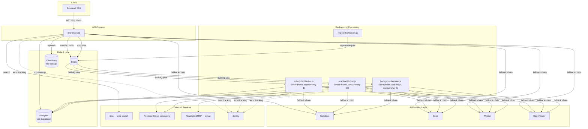
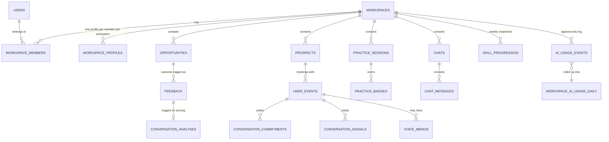
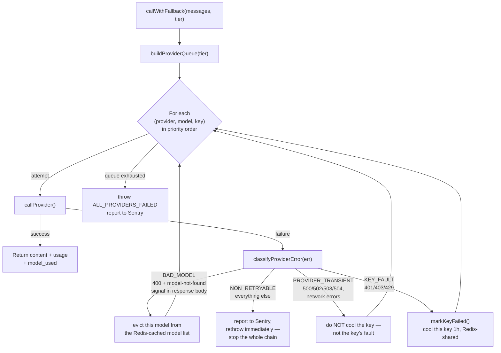
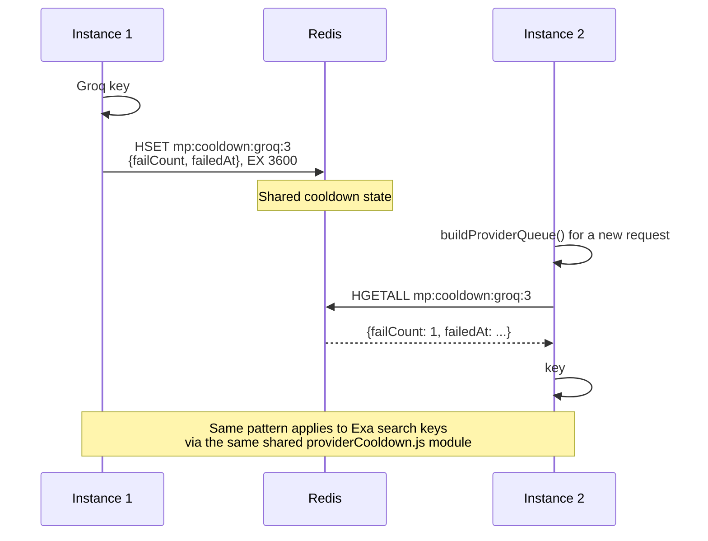
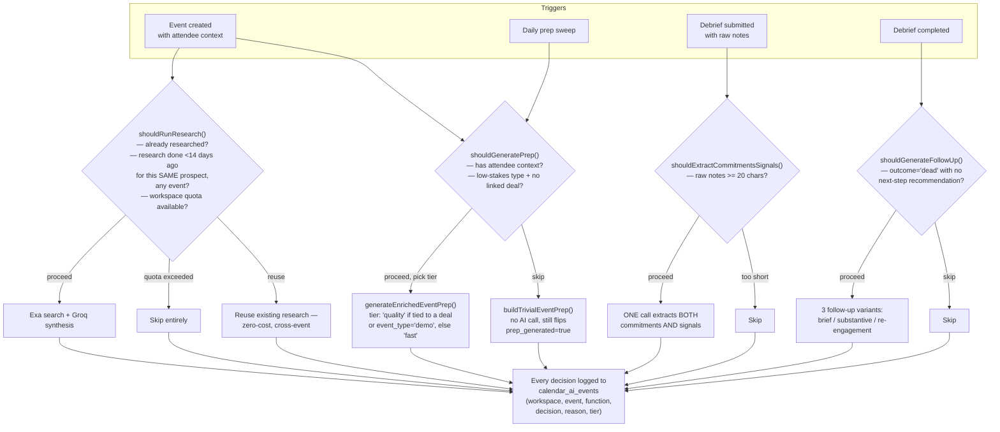
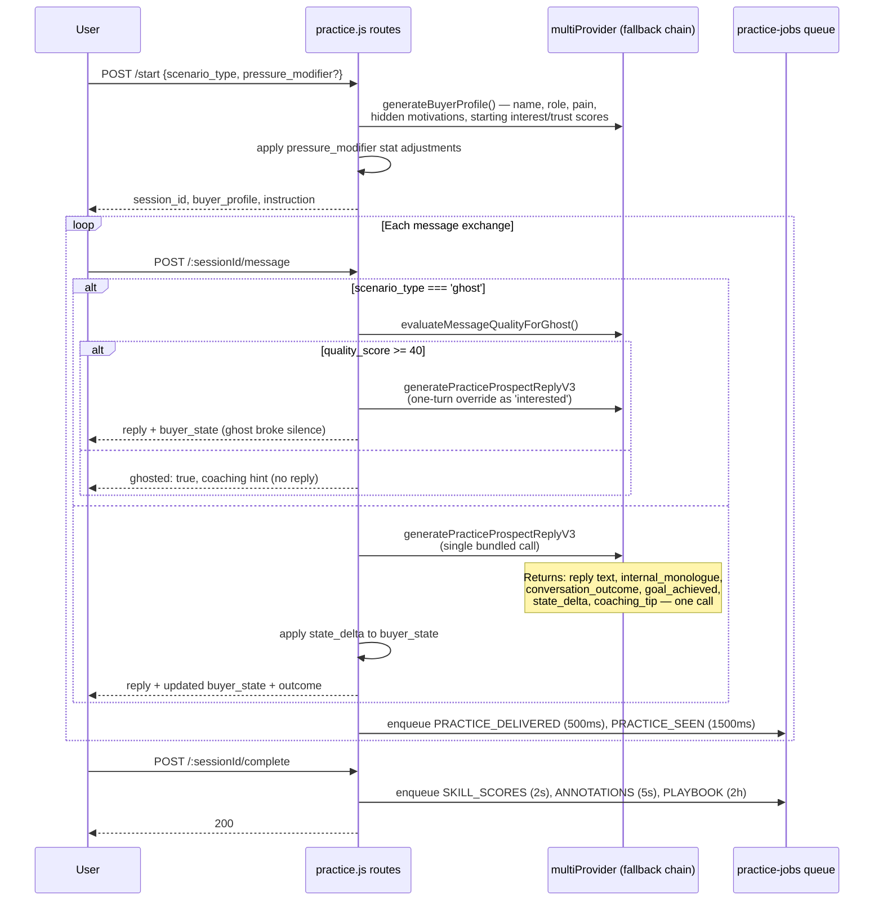
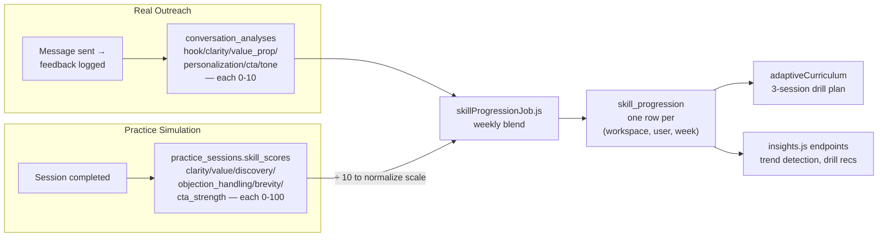

# Architecture

**Scope:** the `src/` backend service — API, services, background workers, and the AI infrastructure underneath all of it. Frontend source isn't part of this document; where the frontend is mentioned, it's inferred from the API surface it must be calling, not from its own code.

---

## 1. Overview

FounderSales is a multi-tenant sales coaching and outreach platform. A single Node.js/Express service (ESM, `"type": "module"`) backed by Supabase Postgres and Redis, following a layered structure — routes → middleware → services → Supabase — with business logic living in `services/`, written to accept plain parameters rather than Express `req`/`res` objects specifically so the same functions are callable from an HTTP route or a background worker without duplication.

**Why this shape, not microservices:** the domain — a person's product context, outreach history, practice performance, calendar — is a small number of tightly related entities with cross-cutting AI concerns (a voice profile informs message generation, practice scoring, *and* calendar prep) that are cheaper to share as one process's library code than to split across service boundaries. The one place the system genuinely decomposes is synchronous request handling vs. asynchronous background work — a real scaling axis, covered in §11.

---

## 2. Architectural Principles

1. **Thin routes, fat services.** Route handlers parse the request, call one or more service functions, and shape the response. Business logic — Supabase queries, RPC calls, AI orchestration, notification dispatch — lives in `services/`.
2. **One shared implementation per concern.** Calendar prep generation used to exist in three separate places (inline in a route, re-implemented in the background worker, and a third helper nobody actually called) and now exists in exactly one function (`services/calendarPrep.js`) used by every trigger path. `utils/pagination.js`, `utils/parser.js`, and the shared logger factory (`utils/logger.js`) follow the same pattern.
3. **Workspace-scoped, not user-scoped, data.** Every AI-relevant table (`workspace_profiles`, `practice_sessions`, `conversation_analyses`, `skill_progression`, `communication_patterns`) is keyed by `(workspace_id, user_id)`, not `user_id` alone, because one person can belong to multiple workspaces with legitimately different voice profiles and practice history in each. This wasn't the original design — comments throughout the job files document a migration where `workspace_profiles!inner` joins started returning arrays from Supabase's client, and the fix in every case was finding the array element matching `active_workspace_id` rather than trusting index 0.
4. **AI cost is a design constraint, not an afterthought.** `services/calendarAiGate.js` exists solely to decide whether an AI call is worth making *before* making it, with every decision logged to `calendar_ai_events` so the impact is queryable. See §6.
5. **Structured error classification over string matching.** `utils/providerErrors.js` replaced substring-matching a formatted error message (`err.message.includes('429')`) with a typed `ProviderCallError` carrying the real HTTP status, network error code, and parsed response body — a substring match on "500" can't distinguish an actual HTTP 500 from a token count that happens to contain those digits.
6. **Redis state is shared across instances by design, with an explicit kill switch.** AI-provider key cooldowns, model-discovery caching, and rate-limit counters are all Redis-backed so a horizontally-scaled deployment behaves correctly. Every one of these has a documented in-memory fallback and an environment-variable kill switch (`MULTIPROVIDER_REDIS_STATE_ENABLED`) to revert without a deploy.

---

## 3. Request Lifecycle

### Authentication

`authenticate` (`middleware/auth.js`) verifies a Supabase JWT via `supabaseAdmin.auth.getUser(token)` and attaches `req.user` — identity and device fields only (name, email, tier, FCM token, notification preferences). Product/business context deliberately does not live on `req.user`; it's fetched separately by workspace resolution, because a user's voice profile is workspace-specific, not global. The profile fetch is Redis-cached 30s per user. The raw JWT is never attached to `req.user`, even post-verification — no legitimate downstream use for it, and keeping it off the request object closes off any risk of it leaking into a log line or error response by accident.

### Workspace resolution

`resolveWorkspace` (`middleware/workspace.js`) verifies the caller is an active member of `req.user.active_workspace_id`, fetching workspace, membership, and workspace-profile rows in parallel and caching the combined result 30s (`ws:ctx:{userId}:{workspaceId}`). Every route mounted behind the `...ws` spread in `app.js` gets this. The 30-second window is an explicit, bounded staleness trade-off against removing two-to-three Postgres round-trips from the single most frequently executed check in the API — a role change made through the app takes effect immediately for the device that made it, but can take up to 30 seconds to propagate to a different session (workspace switches and role changes explicitly invalidate the cache for the affected user, so this window only matters for *other* concurrent sessions).

### Rate limiting

Every limiter is defined once in `config/limiters.js` via a `buildLimiter()` factory that **requires** an explicit, unique Redis namespace — there is no default namespace available from that factory. This is a direct fix for a real bug: several limiters previously called `createRateLimitStore()` with no argument, silently defaulting to a shared `'default'` Redis key space and, in a few cases, genuinely merging counters across unrelated routes (an onboarding burst and a goals check-in decrementing the same Redis counter). Nineteen distinct limiters exist today, each sized to its own actual cost profile — a chat message (40/min, every message triggers an AI call) is a fundamentally different cost than a pipeline stage-drag (120/min, cheap DB writes, no AI at all).

---

## 4. Backend Structure

### Routes and services

Route files live in `routes/`, one per domain (`opportunities.js`, `practice.js`, `calendar.js`, etc.), mounted in `app.js` behind the `authenticate` + `resolveWorkspace` middleware pair (aliased `...ws`) except for auth routes themselves. Business logic lives in `services/` — AI orchestration (`groq-*.js` split by concern, `multiProvider.js`, `exa.js`), calendar intelligence (`calendarPrep.js`, `calendarAiGate.js`, `calendarCommitmentsSignals.js`, `groqCalendarIntelligence.js`, `exaCalendar.js`), prospect dedup (`prospectDedup.js`), notifications (`notifications.js`), file storage (`storage.js`, `voiceMemoService.js`), and infra (`redis.js`, `providerCooldown.js`, `tokenTracker.js`).

### Validation

Zod schemas in `validators/` (or inline in the route file for smaller routers), applied via a `validate(schema, source)` middleware that returns structured field errors on failure.

### Middleware chain

`middleware/` holds `auth.js`, `workspace.js`, `errorHandler.js` (distinguishes DB errors, `AppError` instances with a `statusCode`, and unhandled errors — each gets a distinct response shape), and `traceId.js` (attaches an `X-Trace-Id` header, honoring an incoming header from an upstream load balancer if present, for correlating log lines across a single request).

---

## 5. Data Architecture

### Access pattern

The backend uses Supabase's Postgres exclusively through the `supabase-js` query builder via the **service-role client**, which bypasses Row-Level Security entirely. Authorization is enforced by the middleware chain (§3), not by RLS policies. This is a real, deliberate trade-off: correct as long as the service-role key stays server-side and the middleware chain is never bypassed, with **no independent database-layer backstop today**. See §13 for this listed explicitly as a known trade-off, not a hidden one.

### Core schema shape

### Atomicity via Postgres RPCs

Every genuine race-condition boundary is pushed into a Postgres stored procedure rather than emulated with sequential JS calls:

| RPC | Called from | Prevents |
|---|---|---|
| `create_workspace_for_user` | `workspaces.js`, `auth.js` registration | A workspace existing with no owning member row, or vice versa |
| `accept_workspace_invite` | `user.js` invite acceptance | Two simultaneous accept attempts both succeeding |
| `transfer_workspace_ownership` | `workspaces.js` | Ownership existing on two members simultaneously, or on neither, mid-transfer |
| `increment_chat_stats` | Every chat message insert path | Lost updates to `message_count`/`last_message_at` under concurrent writes |
| `increment_performance_stats` | `feedback.js` | Lost updates to send/positive/negative counters |
| `increment_goal_progress` | `goals.js` note submission | Lost updates to a goal's current value |
| `record_ai_usage` | `tokenTracker.js`, every AI-call site with workspace context | A usage event logged without its daily rollup updating in the same operation |
| `find_similar_prospects` | `prospectDedup.js` | N+1 client-side fuzzy matching — trigram similarity computed in the database |
| `upsert_objection_count` | `conversationAnalysisJob.js` | Lost updates to an objection's occurrence count under concurrent analysis jobs |

### Soft state, not soft deletes

Most entities use status/state fields (`opportunities.stage`, `practice_sessions.completed`, `voice_memos.transcription_status`) rather than deletion. `users.is_deleted` is a full soft-delete with PII scrubbing on account deletion; workspace-member removal is `status = 'removed'`. Financial/outcome history (`feedback`, `conversation_analyses`) is never deleted once created.

### Multi-tenancy

A single `users` row can hold membership in multiple `workspaces`, each a separate `workspace_members` row with its own role and its own `workspace_profiles` row — the same person can have a different product description, voice profile, and practice history per workspace. `users.active_workspace_id` determines which workspace's context is in scope for a request.

---

## 6. AI Provider Infrastructure

This is the layer every other AI feature sits on top of, and it's worth understanding on its own before looking at any individual feature.

### 6.1 The fallback chain

Provider priority is fixed — **Cerebras → Groq → Mistral → OpenRouter** — chosen by free-tier throughput. Within each provider, multiple API keys can be configured (`GROQ_API_KEY_1` through `_10`, similarly for the others) so one account hitting its own rate limit doesn't take the whole provider out of rotation. Every request tries every (provider, model, key) combination in priority order until one succeeds or the queue is exhausted — in the common case the first entry succeeds and nothing past it is touched.

### 6.2 Why four classifications, not "retryable vs. not"

The classifier's real question is **who is at fault**:

- A `429` is the key's fault right now — cool it, try the next key or provider.
- A `503` is the provider's fault — cooling the key would be actively wrong, leaving it unavailable for an hour over an outage that has nothing to do with it.
- A `400` naming a model that no longer exists is the model reference's fault, not the key's — evicting the model from the discovery cache (rather than the key from rotation) means other requests, and other instances via the shared Redis cache, stop hitting the same known-dead model without waiting out an unrelated key cooldown.
- Anything else is presumed to be an actual bug in how the request was built — retrying that against three more providers just wastes time reproducing the same failure, so the chain aborts immediately and reports to Sentry.

### 6.3 Cross-instance coordination

Without this, an instance that discovers a bad key has no way to tell any other instance — every other instance keeps sending traffic to a key already known to be failing until it independently rediscovers the same failure. `services/providerCooldown.js` is generic over an arbitrary `provider` string, which is why Exa's key rotation shares the exact same mechanism rather than maintaining a structurally identical, independently-drifting copy.

Model discovery works the same way: cached in Redis for 6 hours, refreshed by whichever instance wins a short-lived distributed lock (`withLock()`, 15s TTL) rather than every instance independently hitting every provider's `/models` endpoint on every boot.

### 6.4 Selective vision routing

Only two models across the entire four-provider, ~13-model priority list (`meta-llama/llama-4-scout-17b-16e-instruct`, `google/gemma-4-31b-it:free`) are actually vision-capable. Rather than sending a multi-part payload to every model regardless, `buildMessagesForProvider()` checks the *specific* model about to be called on *this specific attempt* and only restructures the request when that model can use it — every other model in the queue gets the same plain-text request it always would, with the image attachment represented instead as a text placeholder describing that an image was attached (built by `buildGrokAttachmentPrompt()`). If the fallback chain lands on a non-vision model, the user's image doesn't cause a malformed request; it just isn't visually interpreted on that particular attempt.

### 6.5 Usage tracking

Every AI call carrying `workspaceId` + `userId` is recorded via `record_ai_usage`, a Postgres RPC that writes an append-only row to `ai_usage_events` *and* atomically upserts a same-day rollup in `workspace_ai_usage_daily` in one write. This backs Exa's daily quota checks and the workspace usage-summary endpoint, deliberately workspace-and-user-scoped together — a prior single-`id`-parameter design had genuinely ambiguous semantics (sometimes "user," sometimes "workspace") that made cost reporting unreliable.

### 6.6 AI workflow inventory

Each of these is a distinct pipeline, not a generic "call the AI" pattern — see [PRODUCT_OVERVIEW.md §16](PRODUCT_OVERVIEW.md#16-ai-powered-experiences--summary) for the product-facing summary, and the relevant `groq-*.js` file for the actual prompt construction:

- **Onboarding** (`groq-onboarding.js`) — burst question generation, voice-profile synthesis, memory seeding, archetype detection, sample-message generation.
- **Opportunity discovery** (`groq-outreach.js`, `exa.js`) — search-worth-it routing, batch scoring, message generation with a self-correction pass against the user's avoid-phrase list.
- **Practice** (`groq-practice.js`) — buyer persona generation, the bundled per-turn reply call (`generatePracticeProspectReplyV3`), the ghost-scenario quality gate.
- **Calendar** (`groqCalendarIntelligence.js`, `calendarCommitmentsSignals.js`) — enriched prep generation, meeting debrief, merged commitment+signal extraction, follow-up variant generation, weekly pattern insights, prospect summaries.
- **Chat** (`chat.js`, `groq-coaching.js`) — system prompt assembly with memory-relevance splitting, streamed responses, rolling summarization.
- **Coaching/growth** (`groq-coaching.js`) — daily tips, check-in responses, weekly plans.
- **Session analysis** (`groq-session.js`) — multi-axis scoring, coaching annotations, adaptive curriculum, playbook generation, retry comparison.

### 6.7 Structured output handling

Two different reliability strategies exist for parsing AI JSON output, and they're not interchangeable by accident:

- **`utils/parser.js`** — a six-strategy cascade (direct parse, strip markdown fences, regex-extract an object, regex-extract an array, fix common mistakes like trailing commas and unquoted keys, bracket-balance extraction) used by most `groq-*.js` functions. Falls back to a hardcoded default object rather than throwing, so a malformed model response degrades a single feature instead of crashing a request.
- **`schemas/calendarAiSchemas.js`** — real Zod schema validation (`MeetingPrepSchema`, `MeetingDebriefSchema`, `FollowUpOptionsSchema`) with a `validateOrFallback()` helper that logs the raw model output on validation failure so prompt drift is observable. This is the one place structured AI output is validated against an actual schema rather than just parsed leniently — everywhere else relies on the parser cascade plus manual field-presence checks (`validateAndFill`).

---

## 7. Calendar Cost-Gating

Calendar AI is the feature most deliberately engineered around not spending AI calls reflexively.

This is what makes "AI cost was optimized here" a checkable claim: the actual proceed/skip ratio, and why each skip happened, is a real query against `calendar_ai_events`, not something inferred from logs.

---

## 8. Practice Simulation Engine

The most conversationally sophisticated AI feature, and the one running synchronously inside the request/response cycle rather than as a background job — the user is having a live conversation and needs the reply immediately.

An earlier architecture (still present as V1/V2 functions in `groq-practice.js`, kept for reference rather than deleted) made the reply, monologue, outcome, and coaching tip as separate sequential calls. Bundling into one response cuts both latency and cost per conversational turn — the trade-off is a more constrained, carefully-engineered prompt and JSON schema that has to reliably produce all six fields in one shot, with `parseV3Reply()` providing field-by-field fallback defaults if the model's response is malformed rather than failing the whole turn.

---

## 9. Skill Scoring Model

The two sources score genuinely different axes — real messages are scored on what's observable from static text (hook, tone, personalization); practice sessions additionally score `discovery` and `objection_handling`, which only exist as a signal across a multi-turn conversation. Where axes overlap, the weekly job blends both by simple averaging *after* normalizing practice's 0–100 scale down to conversation-analysis's 0–10 scale — a detail worth calling out because getting this normalization backwards (blending a 0–100 and a 0–10 number directly) was a real bug fixed during development, documented inline in `skillProgressionJob.js`.

---

## 10. Redis Usage

Redis is used for six genuinely different purposes here, not one "caching layer" — worth being precise about which is which:

| Purpose | Where | Mechanism |
|---|---|---|
| **Caching** | Auth profile (30s), workspace context (30s), insights/coaching-report results (4–24h), model discovery lists (6h) | `getCache`/`setCache`, plain key-value with TTL |
| **Queues** | All background job processing | BullMQ over a **separate `ioredis` connection**, deliberately isolated from the `redis`-package client used for everything else |
| **Rate limiting** | 19 namespaced limiters | `rate-limit-redis` wrapping the shared raw client, one Redis key-prefix per limiter |
| **Distributed locks** | Model-discovery refresh (15s TTL) | `SET NX PX` + a Lua script for compare-and-delete release, so a lock can only be released by the process that acquired it |
| **Cross-instance coordination** | AI provider key cooldowns, Exa key cooldowns | Redis hash per `(provider, keyIndex)`, shared by `multiProvider.js` and `exa.js` via one module (`providerCooldown.js`) |
| **Distributed concurrency guard** | Onboarding AI-call staggering | A Redis sorted set (`stagger:groq_queue:active`) where each in-flight call is a member scored by its acquisition timestamp — self-healing via a staleness sweep rather than depending on a single shared TTL |

The queue Redis connection and the caching/coordination Redis connection are two separate client instances (`bullmq.js`'s `ioredis` vs `redis.js`'s `redis` package) that can share the same `REDIS_URL` but are configured, connected, and retried independently.

**Fail-open by design.** Every Redis helper returns a safe empty value (`null`/`false`/`[]`) on any error rather than throwing — a Redis outage degrades precision (rate limits become per-instance instead of global, caching becomes a no-op, coordination falls back to in-memory) but never takes down a request. `utils/reportDegradation.js` throttles the resulting alert to once per condition per 5 minutes, deliberately kept in-memory rather than Redis-coordinated — coordinating "Redis is down" alerts through Redis would be circular.

---

## 11. Scalability & Deployment Topology

The codebase can run as a single combined process (`app.js` — starts the Express server, then calls `startAllJobs()` to boot the scheduler and all three BullMQ workers in the same process) or as two independent processes:

- **`server.js`** — API only, no `startAllJobs()` call. Bull Board is still mounted here (read-only — it reads queue state from Redis, not from in-process workers), so it's safe to expose from the API process even with no local workers running.
- **`workers/index.js`** — scheduler + all three workers, no Express server at all. Has its own top-level `SIGTERM`/`SIGINT` handler with a bounded 10-second force-exit timer as a safety net on top of each worker's own graceful-shutdown handler.

Both files are fully implemented today. `app.js` remains what `package.json`'s `start`/`dev` scripts actually run — the split topology is available and correctly wired, not merely sketched out, but adopting it as the default deployment shape is an operational decision that hasn't been made yet. The AI provider layer's Redis-backed state (§6.3) is what makes horizontal *API* scaling safe regardless of which topology is running — any number of instances can run concurrently against the same Redis without duplicating rate-limit counters or key-cooldown state, because none of that state is held in process memory as the source of truth.

---

## 12. Security

- JWT verification via Supabase Auth, with a 30-second Redis-cached profile lookup and the raw token deliberately never attached to `req.user`.
- Workspace membership resolved and cached per-request with explicit invalidation on role changes and workspace switches, not left to expire silently.
- 19 independently-namespaced Redis-backed rate limiters (§3), each sized to its own cost profile.
- Invite tokens are 32-byte random values, SHA-256 hashed before storage — the plaintext token is never persisted, only compared by hash on acceptance.
- File uploads are MIME-validated both client-side (multer `fileFilter`) and against the actual bytes received; chat attachments are capped by an aggregate 16,000-character budget so a large attachment can't silently balloon what gets sent to the AI.
- Prospect deduplication never auto-merges a fuzzy match — only exact identifiers or normalized-name exact matches merge automatically; anything else is flagged for human review.
- The service-role Supabase client bypasses Row-Level Security; the middleware chain is the actual enforcement boundary, not RLS. Documented as a deliberate trade-off in §5 and §13, not glossed over.

---

## 13. Known Gaps & Engineering Trade-offs

Documented explicitly because a system with zero visible trade-offs is less credible, not more:

1. **`pattern_insights` has no registered handler.** A self-enqueued job from the weekly pattern-detection run fails every time — see [BACKGROUND_JOBS.md §4.3](BACKGROUND_JOBS.md#43-known-gap-pattern_insights) for the exact mechanics. Scoped and understood, pending a decision between two wiring options rather than a guess.
2. **Combined process is still the default deployment shape.** The split-process topology (§11) is fully built and available; it isn't what actually runs by default yet.
3. **Service-role Postgres access, not RLS, is the enforcement boundary** (§5, §12) — correct as long as the middleware chain is never bypassed, with no independent database-layer backstop.
4. **30-second membership/profile cache staleness** (§3) — an explicit, bounded trade-off against two extra Postgres round-trips on the hottest part of every authenticated request.
5. **Booking pages are schema-present but not wired.** `booking_pages` and `availability_windows` exist in the schema for a planned public booking-page feature — no route or service uses them yet.
6. **No billing system.** Tier values (`free`/`pro`/`enterprise`) gate a handful of things (Exa quota tiers, market-intel enrichment eligibility) but there's no payment provider integration or subscription lifecycle behind them.
7. **Dead job handlers kept, not removed.** `PRACTICE_REPLY` and `PRACTICE_GHOST` still have working handlers in `messageQueueWorker.js`, but nothing enqueues them since the practice reply path moved fully synchronous (§8). Kept as a defensive fallback rather than deleted mid-migration.
8. **Frontend architecture isn't documented here.** This document covers the backend; the frontend's own source wasn't part of this documentation pass.
