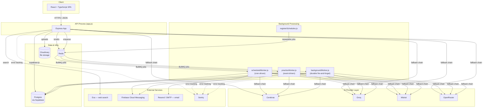
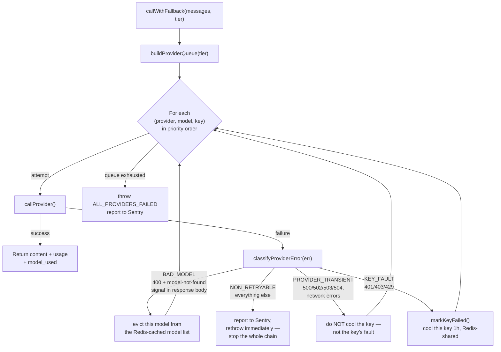
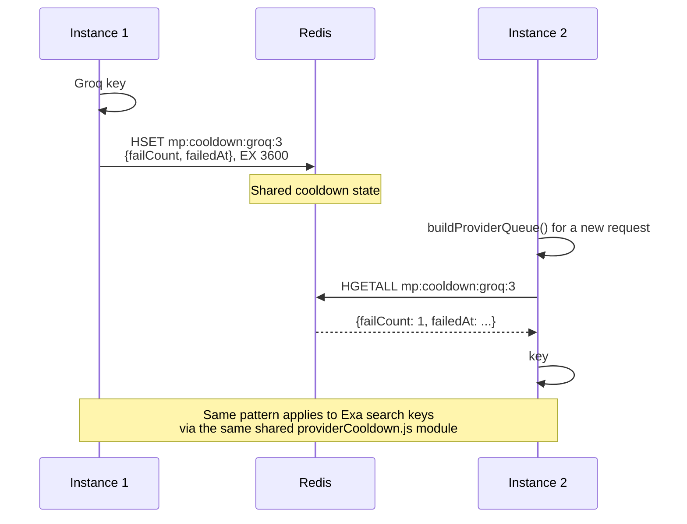
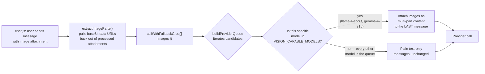
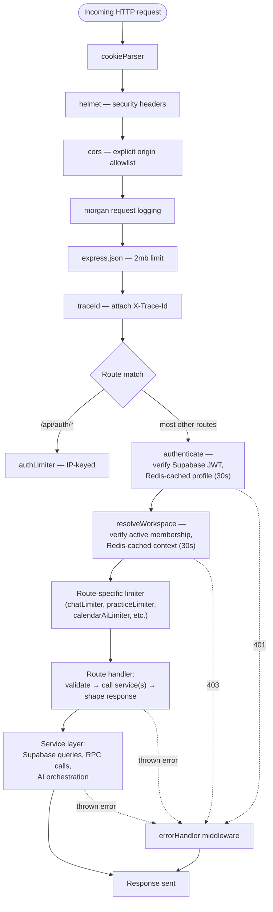
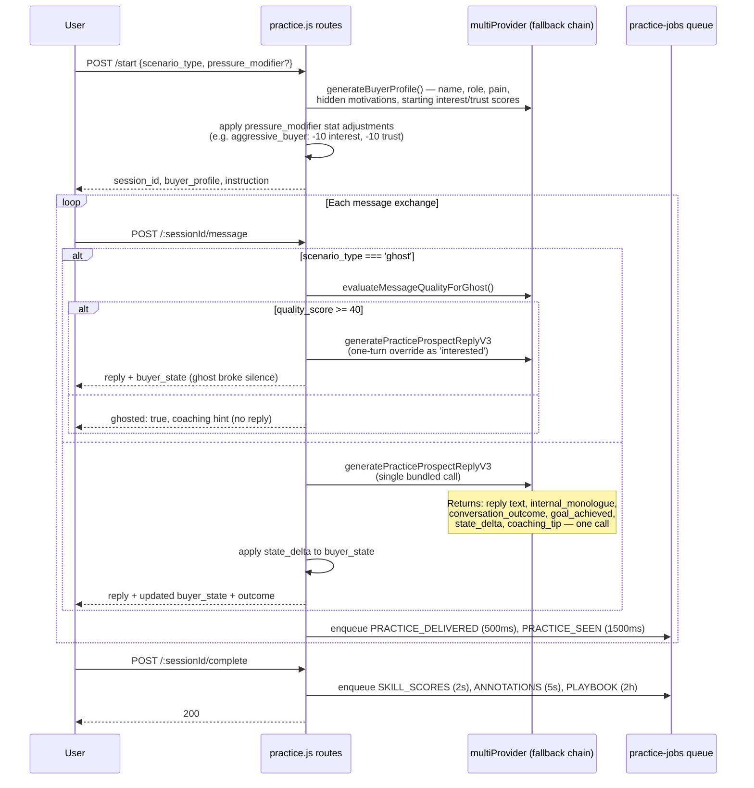
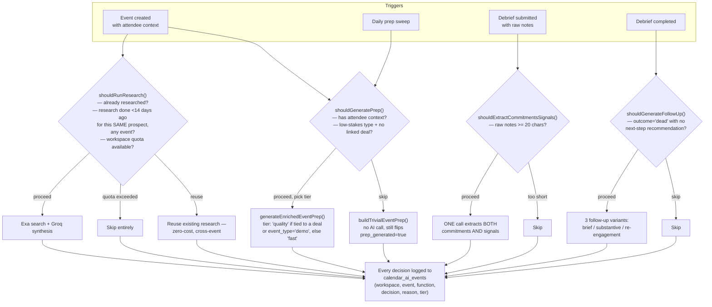
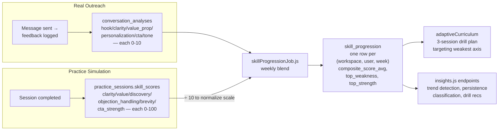
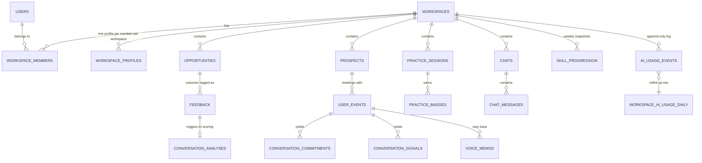

# FounderSales — System Architecture

**Status:** Backend architecture reference. Frontend is React + TypeScript; see §12 for what's documented about it and why the rest is deliberately out of scope for now.
**Scope:** The `src/` backend service — API, services, background workers, and the AI infrastructure layer underneath all of it.

---

## 1. Executive Summary

FounderSales is a multi-tenant sales coaching and outreach platform. A user's product context, voice, and history flow through an AI layer (branded to the user as **Clutch**, the platform's AI companion) that appears in five distinct places: opportunity discovery, outreach message generation, roleplay practice with a simulated buyer, calendar meeting intelligence, and ongoing coaching driven by real outcome data.

The backend is a single Node.js/Express service (ESM, `"type": "module"`) backed by **Supabase (Postgres)** for persistence and **Redis** for background job coordination, distributed rate limiting, and cross-instance AI-provider state. It follows a layered structure — routes → middleware → controllers/route-handlers → services → Supabase — with business logic living in `services/` specifically so the same functions are callable from an HTTP route or a background worker without duplication.

What makes this backend more than a thin AI wrapper is concentrated in a few places worth naming up front, each covered in depth later in this document:

- **A four-provider AI fallback chain** (§4) with per-key cooldown state shared across horizontally-scaled instances via Redis, structured error classification (not string-matching) driving four distinct retry behaviors, and selective vision-model routing that only attaches image data to models actually capable of using it.
- **A cost-gating layer for calendar AI** (§7) that decides, before spending a token, whether a given AI call is worth making at all — cooldown-based research reuse, low-stakes event skipping, quota-aware degradation.
- **A single-request practice-conversation engine** (§6) that bundles reply generation, an internal buyer monologue, outcome detection, and coaching feedback into one AI call rather than four sequential ones.
- **A blended skill-scoring system** (§8) that reconciles two independently-scored data sources — real sent-message analysis and simulated practice sessions — onto one comparable scale.

---

## 2. System Overview

**Why this shape, not microservices:** the domain — a person's product context, their outreach history, their practice performance, their calendar — is a small number of tightly related entities with cross-cutting AI concerns (a voice profile informs message generation, practice scoring, *and* calendar prep) that are cheaper to share as one process's library code than to split across service boundaries and pay network/consistency costs for. The one place the system *does* decompose is synchronous request handling vs. asynchronous background work — a genuinely different scaling axis, covered in §11.

---

## 3. Architectural Principles

1. **Thin routes, fat services.** Route handlers parse the request, call one or more service functions, and shape the response. Business logic — Supabase queries, RPC calls, AI orchestration, notification dispatch — lives in `services/`.
2. **One shared implementation per concern.** Calendar prep generation is the clearest example: it used to exist in three separate places (inline in the route, re-implemented in the background worker, and a third helper nobody actually called) and now exists in exactly one function (`services/calendarPrep.js`) used by every trigger path. `utils/pagination.js`, `utils/parser.js` (AI JSON-response parsing with six fallback strategies), and the shared logger factory (`utils/logger.js`) follow the same instinct — centralize a pattern the moment it appears in two places, not after it's drifted in five.
3. **Workspace-scoped, not user-scoped, data model.** Every AI-relevant table — `workspace_profiles`, `practice_sessions`, `conversation_analyses`, `skill_progression`, `communication_patterns` — is keyed by `(workspace_id, user_id)`, not `user_id` alone, because one person can belong to multiple workspaces (their own company, a client's, a team they advise) and their voice profile, skill history, and practice performance are legitimately different per workspace. This wasn't the original design — comments throughout the job files (`growthIntelligenceScheduler.js`, `skillProgressionJob.js`, `patternDetectionJob.js`) document a deliberate migration where `workspace_profiles!inner` joins return arrays in Supabase's client, and the fix in every case was finding the array element matching `active_workspace_id` rather than trusting array index 0.
4. **AI cost is treated as a design constraint, not an afterthought.** The clearest evidence is `services/calendarAiGate.js` — a dedicated module whose entire job is deciding whether an AI call is worth making *before* making it, with every decision logged to `calendar_ai_events` so the impact is queryable, not just asserted. See §7.
5. **Structured error classification over string matching.** `utils/providerErrors.js` replaced substring-matching a formatted error message (`err.message.includes('429')`) with a typed `ProviderCallError` carrying the real HTTP status code, network error code, and parsed response body — because a substring match on "500" can't distinguish an actual HTTP 500 from a token count or model name that happens to contain those digits, and because the original substring approach cooled down individual API keys for provider-wide outages that had nothing to do with the key's own validity.
6. **Redis state is shared across instances by design, with an explicit kill switch.** AI-provider key cooldowns, model-discovery caching, and rate-limit counters are all Redis-backed specifically so a horizontally-scaled deployment behaves correctly — an instance that sees a key fail needs every other instance to know. Every one of these systems has a documented in-memory fallback path and an environment-variable kill switch (`MULTIPROVIDER_REDIS_STATE_ENABLED`) to revert to it, on the reasoning that the AI-provider layer is the single highest-traffic code path in the service and deserves a same-day rollback option that doesn't require a deploy.

---

## 4. AI Provider Infrastructure

This is the part of the system most worth understanding in depth, because it's the layer every other AI feature in the product sits on top of.

### 4.1 The fallback chain

Provider priority is fixed — **Cerebras → Groq → Mistral → OpenRouter** — chosen by free-tier throughput (Cerebras's free tier offers the highest tokens-per-minute ceiling, OpenRouter is the paid fallback of last resort). Within each provider, multiple API keys can be configured (`GROQ_API_KEY_1` through `_10`, similarly for the others) so a single provider account hitting its own rate limit doesn't take that entire provider out of rotation.

Every request tries every (provider, model, key) combination in priority order until one succeeds or the queue is exhausted. This means a single `callWithFallbackGroq()` call can, in the worst case, attempt dozens of combinations — but in the overwhelmingly common case, the first entry (Cerebras's primary model, first configured key) succeeds and nothing past it is ever touched.

### 4.2 Why four classifications, not "retryable vs. not"

The critical distinction the classifier makes is **who is at fault**:

- A `429` is the *key's* fault (or at least, this key's problem right now) — cool it, try the next key or provider.
- A `503` is the *provider's* fault — cooling the key would be actively wrong, since the key itself did nothing wrong and would sit unnecessarily unavailable for an hour over an outage that has nothing to do with it.
- A `400` naming a model that no longer exists is the *model reference's* fault, not the key's — evicting the model from the discovery cache (rather than the key from rotation) means other requests, and other instances via the shared Redis cache, stop hitting the same known-dead model without waiting out an unrelated key cooldown.
- Anything else is presumed to be an actual bug in how the request was constructed — retrying that against three more providers just wastes time reproducing the same failure and masks a problem that needs fixing in code, so the chain aborts immediately and reports to Sentry at error severity rather than silently degrading.

### 4.3 Cross-instance coordination

Without this, an instance that discovers a bad key has no way to tell any other instance — every other instance keeps sending traffic to a key already known to be failing, until each independently rediscovers the same failure. The cooldown module (`services/providerCooldown.js`) is generic over an arbitrary `provider` string, which is why Exa's own key rotation (`services/exa.js`) shares the exact same mechanism rather than maintaining a structurally identical, independently-drifting copy of the same idea.

Model discovery (which chat-capable models a provider currently exposes) works the same way: cached in Redis for 6 hours, refreshed by whichever instance happens to win a short-lived distributed lock (`withLock()`, 15-second TTL) rather than every instance independently hitting every provider's `/models` endpoint on every boot.

### 4.4 Vision routing

Only two models across the entire four-provider, ~13-model priority list are actually vision-capable. Rather than either refusing images entirely or sending a multi-part content array to every provider regardless of whether it expects one, `buildMessagesForProvider()` checks the specific model about to be called on *this specific attempt* and only restructures the message payload when that model can use it — every other model in the fallback queue still receives the exact same plain-text messages array it always would, with the image attachment represented instead as a text placeholder (built by `buildGrokAttachmentPrompt()`) describing that an image was attached. If the fallback chain lands on a non-vision model, the user's image doesn't cause a malformed request — it just isn't visually interpreted by that particular attempt.

### 4.5 Usage tracking

Every AI call that carries `workspaceId` + `userId` is recorded via `record_ai_usage`, a Postgres RPC that writes an append-only row to `ai_usage_events` *and* atomically upserts a same-day rollup in `workspace_ai_usage_daily` — one write, two purposes, rather than a separate aggregation pass. This is what backs Exa's workspace-level daily quota checks (`checkWorkspaceExaUsage`) and the workspace usage-summary endpoint, and is deliberately workspace-and-user-scoped together rather than either alone, since the original single-`id`-parameter design (documented in `tokenTracker.js`'s own header) had genuinely ambiguous semantics — sometimes meaning "user," sometimes "workspace" — that made cost reporting unreliable.

---

## 5. Request Lifecycle

### 5.1 Authentication

`authenticate` (`middleware/auth.js`) verifies a Supabase JWT via `supabaseAdmin.auth.getUser(token)` and attaches `req.user` — identity and device fields only (name, email, tier, FCM token, notification preferences). Product/business context deliberately does **not** live on `req.user`; it's fetched separately by workspace resolution, because a user's product description and voice profile are workspace-specific, not global to their account. The profile fetch itself is Redis-cached for 30 seconds, keyed per user, with an important correctness note: the raw JWT is never attached to `req.user` at all, even though it's already been verified — there's no legitimate downstream use for it, and keeping it off the request object closes off any risk of it leaking into a log line or error response by accident.

### 5.2 Workspace resolution

`resolveWorkspace` (`middleware/workspace.js`) verifies the caller is an active member of `req.user.active_workspace_id`, fetching workspace, membership, and workspace-profile rows in parallel and caching the combined result in Redis for 30 seconds (`ws:ctx:{userId}:{workspaceId}`). Every route mounted behind the `...ws` spread (`[authenticate, resolveWorkspace]`) in `app.js` gets this. The 30-second window is an explicit, bounded staleness trade-off — the same pattern Kith-style systems use for membership caching — accepted because it removes two-to-three Postgres round-trips from what is otherwise the single most frequently executed check in the entire API.

### 5.3 Rate limiting

Every limiter in the system is defined once in `config/limiters.js` via a `buildLimiter()` factory that **requires** an explicit, unique Redis namespace string — there is no default namespace available from that factory, which is a direct fix for a real bug: several limiters previously called `createRateLimitStore()` with no argument at all, silently defaulting to a shared `'default'` Redis key space and, in a few cases, genuinely merging counters across logically unrelated routes (an onboarding burst and a goals check-in decrementing the same Redis counter, because both keyed on `req.user?.id || req.ip` in the same `'default'` namespace). Nineteen distinct limiters exist today, each sized to its own actual cost profile rather than sharing one generic ceiling — a chat message (40/min, since every message triggers an AI call) is a fundamentally different cost than a pipeline stage-drag (120/min, cheap DB writes with no AI at all).

---

## 6. Practice Simulation Engine

This is the most conversationally sophisticated AI feature in the system — a realistic buyer simulation that runs synchronously inside the request/response cycle, not as a background job, because the user is having a live conversation and needs the reply immediately.

### 6.1 Session lifecycle

### 6.2 Why one bundled call instead of four

`generatePracticeProspectReplyV3` returns, from a single AI call: the reply text (1–3 sentences, in-character), an internal monologue (the buyer's unfiltered private reaction — deliberately distinct in tone from the polished reply, used post-session to show the user what the buyer was *actually* thinking versus what they said), a conversation-outcome classification (`continuing` vs. a named ending like `meeting_scheduled`, `deal_lost`, `price_negotiation`), a `goal_achieved` boolean checked against whatever session goal the user set at the start, numeric state deltas for interest/trust/confusion, and an inline coaching tip. An earlier architecture (still present as V1/V2 functions in `groq-practice.js`, kept for reference rather than deleted) made these as separate sequential calls. Bundling them into one response cuts both latency (the user is waiting on this) and cost (one call instead of up to four) per conversational turn — the tradeoff is a more constrained, carefully-engineered prompt and JSON schema that has to reliably produce all six fields in one shot, with `parseV3Reply()` providing field-by-field fallback defaults if the model's response is malformed rather than failing the whole turn.

### 6.3 The ghost scenario's quality gate

A "ghost" scenario means the buyer doesn't reply — but real prospects sometimes do respond to an exceptionally strong message even after going quiet. Rather than a hardcoded "ghost always means silence," every message in a ghost scenario is scored 0–100 by `evaluateMessageQualityForGhost()` on specificity, value clarity, personalization, and ask quality; a score of 40 or higher genuinely breaks the silence (the buyer profile is temporarily treated as `'interested'` for that one reply), and anything below it stays silent with a coaching hint explaining why. This means the "hardest" practice mode still rewards a good message instead of being an unconditional dead end regardless of what the user writes.

### 6.4 Pressure modifiers

Four optional modifiers (`decision_maker_watching`, `aggressive_buyer`, `competitor_mentioned`, `compliance_concern`) inject a dedicated block into the AI system prompt describing a specific behavioral shift — shorter and more blunt for an aggressive buyer, more deliberate and approval-conscious for compliance concern — and apply a one-time numeric adjustment to the buyer's starting interest/trust scores before the conversation begins, so the effect is felt from the very first reply rather than only showing up in prompt tone.

---

## 7. Calendar Intelligence

Calendar AI is the feature most deliberately engineered around **not** spending AI calls reflexively — every trigger point passes through a dedicated gating module before any model is invoked.

### 7.1 The cost gate

Every one of these gates writes its decision — proceed, skip, or reused-cache, plus the specific reason — to a dedicated audit table. This is what makes "we optimized AI cost on calendar features" a checkable claim rather than an assertion: the actual proceed/skip ratio, and *why* each skip happened, is a real query against `calendar_ai_events`, not something inferred from logs.

### 7.2 Merged commitment and signal extraction

A meeting debrief's raw notes used to trigger two independent AI calls on the exact same input text — one to extract commitments ("I'll send you the proposal by Friday"), a separate one to detect buying/risk/timing/engagement signals. `services/calendarCommitmentsSignals.js` replaced both with one call returning both arrays, additionally passing in the prospect's currently-open commitments so the model can recognize "I'll follow up" as reinforcing an existing tracked commitment rather than manufacturing a duplicate every time the same intent gets restated across multiple meetings.

### 7.3 Research reuse across events

Prospect research (an Exa search plus a Groq synthesis pass turning raw search results into a structured intelligence brief) is deliberately reused across *different* meetings with the *same* prospect within a 14-day cooldown, rather than researched fresh per event — because a prospect's public information doesn't meaningfully change meeting-to-meeting, and researching it three times for three meetings in the same two weeks is pure waste. The cooldown check queries every event linked to the same `prospect_id`, not just the current one.

---

## 8. Skill Scoring & Coaching Data Model

FounderSales tracks skill in two genuinely different ways and deliberately reconciles them onto one comparable scale rather than treating them as separate systems the user has to interpret independently.

The two sources score genuinely different axes — real messages are scored on hook/tone/personalization because that's what's observable from static text; practice sessions additionally score `discovery` and `objection_handling`, which only exist as a signal across a multi-turn conversation. Where axes overlap (clarity, value, CTA), the weekly job blends both sources by simple averaging *after* normalizing practice's 0–100 scale down to conversation-analysis's 0–10 scale — a detail worth calling out because getting this normalization wrong (blending a 0–100 and a 0–10 number directly) was an actual bug fixed during this system's development, documented inline in `skillProgressionJob.js`.

---

## 9. Database Design

### 9.1 Access pattern

The backend uses Supabase's Postgres exclusively through the `supabase-js` query builder (`supabaseAdmin.from(...)`) via the service-role client, which bypasses Row-Level Security — authorization is enforced by the middleware chain (§5), not by RLS policies. This is the same trade-off documented in comparable systems: correct as long as the service-role key stays server-side and the middleware chain is never bypassed, with no independent database-layer backstop today.

### 9.2 Core schema shape

### 9.3 Atomicity via Postgres RPCs

Every genuine race-condition boundary in this system is pushed into a Postgres stored procedure rather than emulated with multiple sequential JS calls:

| RPC | Called from | Prevents |
|---|---|---|
| `create_workspace_for_user` | `workspaces.js`, `auth.js` registration | A workspace existing with no owning member row, or vice versa — creates workspace + owner membership + empty profile in one transaction |
| `accept_workspace_invite` | `user.js` invite acceptance | Two simultaneous accept attempts both succeeding, or a workspace-profile insert diverging from the membership activation |
| `transfer_workspace_ownership` | `workspaces.js` | Ownership existing on two members simultaneously, or on neither, mid-transfer |
| `increment_chat_stats` | Every chat message insert path | Lost updates to `message_count`/`last_message_at` under concurrent writes to the same chat |
| `increment_performance_stats` | `feedback.js` | Lost updates to a user's running send/positive/negative counters |
| `increment_goal_progress` | `goals.js` note submission | Lost updates to a goal's current value |
| `record_ai_usage` | `tokenTracker.js`, every AI-call site with workspace context | A usage event being logged without its daily rollup updating in the same operation |
| `find_similar_prospects` | `prospectDedup.js` | N+1 client-side fuzzy matching — trigram similarity computed in the database, not pulled client-side |
| `upsert_objection_count` | `conversationAnalysisJob.js` | Lost updates to an objection's occurrence count under concurrent analysis jobs |

### 9.4 Soft state, not soft deletes, is the norm

Most entities in this schema use status/state fields (`opportunities.stage`, `practice_sessions.completed`, `voice_memos.transcription_status`) rather than deletion at all — the closest thing to a deletion pattern is `users.is_deleted` (a full soft-delete with PII scrubbing on account deletion) and workspace-member `status = 'removed'`. Financial/outcome history (`feedback`, `conversation_analyses`) is never deleted once created.

---

## 10. Multi-Tenancy Model

A single person (`users` row) can hold membership in multiple `workspaces`, each a separate `workspace_members` row with its own `role` (owner/admin/manager/member) and its own `workspace_profiles` row — meaning the *same person* can have a different product description, different voice profile, and different practice/skill history per workspace they belong to. `users.active_workspace_id` determines which workspace's context is currently in scope for a request; switching workspaces (`POST /api/user/switch-workspace`) atomically invalidates both the old and new workspace's cached membership context so a switch takes effect immediately rather than waiting out the 30-second cache window.

This model is why so many job files in this codebase carry comments about `workspace_profiles!inner` returning an array from Supabase and needing explicit resolution against `active_workspace_id` rather than trusting array order — it's the direct consequence of one user legitimately having several simultaneously-valid profile rows, not an edge case to special-case around.

---

## 11. Scalability & Deployment Topology

### 11.1 Current topology

The codebase runs as a single process today: `app.js` starts the Express server and, immediately after, calls `startAllJobs()` to boot the scheduler and all three BullMQ workers in the same process. This is deliberately convenient for early-stage deployment but couples API request-handling capacity to background-job throughput — a burst of AI-heavy scheduled jobs (the Sunday-evening pattern-detection-through-curriculum pipeline in particular) shares the same event loop as incoming API requests.

### 11.2 Planned split-process topology

A `server.js` (API-only) / `workers/index.js` (scheduler + all three workers, no HTTP server) split is planned specifically to decouple these two scaling concerns, following the same shape described in §2's diagram legend — every worker factory function already used by `startAllJobs()` is self-contained and importable independently of Express setup, so this split is a boot-sequence change, not a rewrite of job logic. See `BACKGROUND_JOBS.md` §8.1 for the operational detail.

### 11.3 Why this decomposition, not a smaller one

The AI provider layer's Redis-backed state (§4.3) is what makes horizontal *API* scaling safe today, independent of the worker split — any number of `app.js` instances (or, post-split, `server.js` instances) can run concurrently against the same Redis without duplicating rate-limit counters, AI-key cooldown state, or model-discovery caching, because none of that state is held in process memory as the source of truth.

---

## 12. Frontend

The frontend is a React + TypeScript single-page application. Full architectural documentation of the frontend (state management approach, component structure, API client pattern) is intentionally deferred rather than guessed at here — this document only claims what's confirmed: the stack is React with TypeScript, consuming the backend's REST API described throughout this document. A more detailed frontend architecture section will be added once that codebase is available for the same level of tracing applied to the backend above.

---

## 13. Known Gaps & Engineering Trade-offs

Documented explicitly because a system with zero visible trade-offs is less credible, not more:

1. **`pattern_insights` has no registered handler** (see `BACKGROUND_JOBS.md` §4.3) — a self-enqueued job from the weekly pattern-detection run currently fails every time, a known and scoped gap pending a decision between two wiring options that were deliberately left unresolved rather than guessed at.
2. **Single-process deployment today, split planned** (§11.1–11.2) — background job load and API request load currently share one event loop.
3. **Service-role Postgres access, not RLS, is the enforcement boundary** (§9.1) — correct as long as the middleware chain is never bypassed, with no independent database-layer backstop.
4. **30-second membership/profile cache staleness** (§5.1–5.2) — an explicit, bounded trade-off against removing repeated Postgres round-trips from the hottest part of every authenticated request; a role change made through the app takes effect immediately for the device that made it, but can take up to 30 seconds to propagate to a different session.
5. **Booking pages are schema-present but not wired.** `booking_pages` and `availability_windows` tables exist in the schema for a planned public booking-page feature (a prospect books time directly, which would create a calendar event) — this is not yet connected to any route or service and isn't part of the current feature set.

---

*This document reflects the backend as currently implemented, including the split-process topology described as planned in §11.2, which is added alongside this documentation.*
