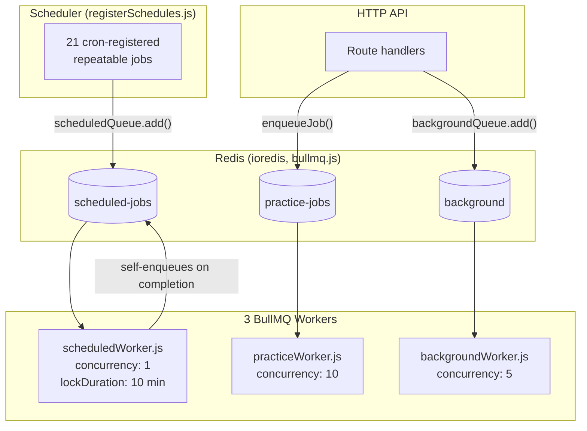
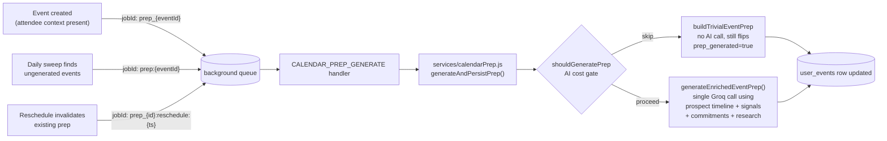
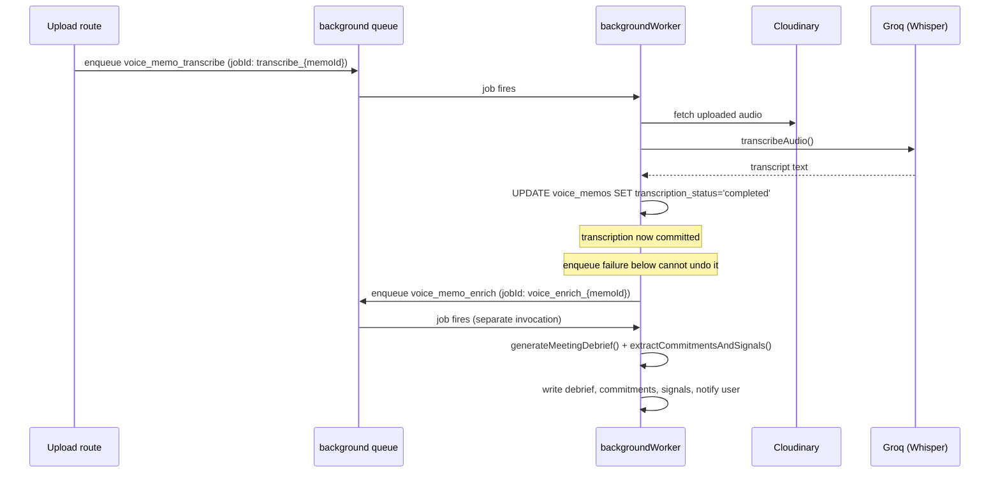

# Background Jobs & Asynchronous Processing

**Scope:** every queue, worker, scheduled task, and background AI pipeline in the backend.

---

## 1. Why This Layer Exists

A practice roleplay session alone can trigger four separate AI calls after the user has already moved on — skill scoring, coaching annotations, a two-hour-delayed playbook, and possibly a growth card. None of that can happen inline in the HTTP request that ended the session; the request would time out, and most of it isn't useful until later anyway (nobody needs a reusable playbook the instant a session ends — they need it before their *next* real conversation).

Three different shapes of "not right now" work exist here, deliberately handled by three separate BullMQ queues rather than one generic job table:

1. **Scheduled work** — daily tip generation, weekly pattern detection, nightly metrics rollups. Nothing triggers these except the clock.
2. **Event-driven, delayed follow-up work** — a practice session ends, and several downstream jobs need to fire at different delays so the UI can update progressively instead of blocking on the slowest one.
3. **Fire-and-forget-but-durable work triggered mid-request** — a calendar event gets created, prep generation needs to happen, but the event-creation response shouldn't wait on a Groq call. This used to be bare `.catch(() => {})` IIFEs scattered through route handlers; each was replaced with a real queued job so a Redis blip or a transient Groq failure doesn't silently drop the work with no retry and no trace.

---

## 2. Queue Topology

**Key structural fact:** every cron entry is registered *directly* on the queue its own worker consumes (`scheduled-jobs`) — there's no separate scheduler queue forwarding to an execution queue. `registerSchedules()` doesn't run anything itself; it makes sure the right repeatable job exists on the right queue, and BullMQ's own clock does the rest.

---

## 3. Infrastructure

### 3.1 Connection

All three queues share one `ioredis` connection (`config/bullmq.js`), configured with `maxRetriesPerRequest: null` and `enableReadyCheck: false` — both required by BullMQ, not optional tuning. The connection has its own bounded retry strategy: backs off up to 10 attempts (capped at 5s between attempts) before giving up and setting `bullmqConnectionState.status = 'failed'`, rather than retrying an unreachable Redis forever. TLS/SNI is handled explicitly for Upstash-style `rediss://` URLs, with `reconnectOnError` only forcing a reconnect for genuinely transient codes (`READONLY`, `ETIMEDOUT`, `ECONNRESET`).

### 3.2 Boot ordering

`app.js` starts the HTTP server **before** calling `startAllJobs()`. If Redis is unreachable at boot, the API still comes up and serves traffic — only background processing is degraded, logged via a per-step try/catch in `jobs/index.js` rather than crashing the whole process. Each of the four job-startup steps (schedule registration, scheduled worker, practice worker, background worker) is wrapped independently, so one failing doesn't prevent the others from starting.

### 3.3 Queue registry

Three `Queue` instances are constructed once in `jobs/queues.js`: `scheduledQueue`, `practiceQueue`, `backgroundQueue`. `backgroundQueue` alone carries a `defaultJobOptions` (`attempts: 3`, exponential backoff from 2000ms) so call sites that don't specify their own retry policy still get one rather than BullMQ's single-attempt default.

### 3.4 Monitoring

Bull Board is mounted at `/admin/jobs`, watching all three queues, gated behind a shared-secret header check (`x-admin-secret` matched against `ADMIN_SECRET`) plus its own rate limiter as defense-in-depth against secret-guessing traffic — the secret check is the real access control; the limiter exists so a leaked or guessed secret can't be hammered.

---

## 4. Queue 1 — `scheduled-jobs`

**Worker:** `jobs/scheduledWorker.js` · **Concurrency:** 1 · **Lock duration:** 10 minutes

This queue runs strictly one job at a time by design — these are aggregate scans over the whole user base, and running two concurrently risks double-counting or racing on the same rows. The 10-minute lock is set high relative to BullMQ's default because several jobs (pattern detection, skill progression) fan out AI calls across every eligible user sequentially with rate-limiting sleeps between batches, and a shorter lock would let BullMQ think the job stalled and reclaim it mid-run.

### 4.1 Registered schedule

**21 entries** in `jobs/registerSchedules.js`'s `SCHEDULES` array. On every boot, `registerSchedules()` clears every existing repeatable job on `scheduled-jobs` and re-registers this exact list — safe to call on every deploy without accumulating duplicate cron registrations, and it means the array **is** the schedule; there's no drift between "what's configured" and "what's running."

| Job name | Cron | Meaning | Handler |
|---|---|---|---|
| `memory_extraction` | `*/30 * * * *` | Every 30 min | `runMemoryExtractionJob` |
| `opportunity_fetch` | `0 */6 * * *` | Every 6 hours | `runOpportunityJob` |
| `feedback_prompts` | `0 * * * *` | Hourly | `runFeedbackPromptJob` |
| `calendar_reminder_scan` | `*/5 * * * *` | Every 5 min | `runCalendarReminderScan` |
| `performance_summary` | `0 2 * * *` | Daily 02:00 UTC | `runPerformanceSummaryJob` |
| `metrics_aggregation` | `0 3 * * *` | Daily 03:00 UTC | `runMetricsJob` |
| `daily_tip_generation` | `0 7 * * *` | Daily 07:00 UTC | `runDailyTipGeneration` |
| `calendar_prep` | `0 8 * * *` | Daily 08:00 UTC | `runCalendarPrepJob` |
| `calendar_debrief_digest` | `0 8 * * *` | Daily 08:00 UTC | `runCalendarDebriefDigest` |
| `morning_growth_push` | `0 9 * * *` | Daily 09:00 UTC | `runMorningGrowthPush` |
| `goal_nudge` | `5 9 * * *` | Daily 09:05 UTC | `runGoalNudgeJob` |
| `follow_up_check` | `0 10 * * *` | Daily 10:00 UTC | `runFollowupSequenceJob` |
| `check_in_scheduler` | `0 14 * * *` | Daily 14:00 UTC | `runCheckInScheduler` |
| `evening_growth_push` | `0 18 * * *` | Daily 18:00 UTC | `runEveningGrowthPush` |
| `weekly_plan` | `0 18 * * 0` | Sunday 18:00 UTC | `runWeeklyPlanGeneration` |
| `email_digest` | `0 18 * * 0` | Sunday 18:00 UTC | `runEmailDigestJob` |
| `pattern_detection` | `0 20 * * 0` | Sunday 20:00 UTC | `runPatternDetectionJob` |
| `skill_progression` | `0 21 * * 0` | Sunday 21:00 UTC | `runSkillProgressionJob` |
| `skill_profile_agg` | `0 22 * * 0` | Sunday 22:00 UTC | `runSkillProfileAggregationJob` |
| `adaptive_curriculum` | `0 23 * * 0` | Sunday 23:00 UTC | `runAdaptiveCurriculumJob` |
| `prospect_dedup_scan` | `0 3 * * 1` | Monday 03:00 UTC | `enqueueDedupScanForAllWorkspaces` |

Registration order matters for one reason: the Sunday pipeline (18:00 → 23:00 UTC) is deliberately staggered an hour apart end-to-end. Weekly plan generation and the email digest both read from performance/skill data that pattern detection, skill progression, and skill profile aggregation compute — running them in sequence means each later job sees fresher upstream data, not a guess about ordering.

### 4.2 Job-by-job detail

**`memory_extraction`** (every 30 min) — scans chats with `message_count >= 10` not re-extracted since their last message, per user's `memory_enabled` flag. Two-stage AI process per eligible chat: extract 2–5 new candidate facts from the last 20 messages, then (if the user already has stored facts) a second call decides per-candidate whether to skip (reinforce), replace, or insert. A 30-fact cap triggers priority-based eviction (reinforcement count, recency, source diversity) before any new insert.

**`opportunity_fetch`** (every 6 hours) — for every onboarded active-workspace user, runs the Exa-search-or-Groq-fallback discovery pipeline and pushes a notification if new opportunities were found.

**`feedback_prompts`** (hourly) — finds opportunities marked `sent` >48h ago with no feedback logged, groups per user, sends one push per user (not per opportunity).

**`calendar_reminder_scan`** (every 5 min) — finds events starting within `CALENDAR_REMINDER_WINDOW_MINUTES` (30) that haven't had a reminder sent. **Idempotency is a database-level compare-and-swap, not a BullMQ mechanism**: each event is claimed via `UPDATE user_events SET reminder_sent = true WHERE id = ? AND reminder_sent = false RETURNING id` — if another concurrent tick already claimed it, the update matches zero rows and the scan silently skips it. No per-event BullMQ job exists at all for reminders.

**`performance_summary`** (2am) — for every (user, workspace) pair whose `total_sent` grew by ≥5 since its last summary and has ≥10 total, regenerates `learned_patterns` — a short AI narrative plus derived best-platform/style/length fields computed from actual stats per dimension, then explained by the model rather than left for it to invent.

**`metrics_aggregation`** (3am) — rolls up the previous day's `daily_metrics` per active member: opportunities shown/viewed, links clicked, messages sent, outcomes, derived rates. Pure aggregation, no AI.

**`daily_tip_generation`** (7am) — for every onboarded user whose last tip is >20h stale, generates a fresh growth card using the full-context prompt (goals, recent check-ins, recent sent messages, recent practice sessions, recent conversation analyses).

**`calendar_prep`** (8am) — **does not call any AI model itself.** A thin scan-and-enqueue: finds events in the next 24 hours with `prep_generated = false AND prep_failed = false`, enqueues one `CALENDAR_PREP_GENERATE` job per event onto the `background` queue with a stable `jobId: prep:{eventId}`. This exists specifically so there's exactly one prep-generation code path in the system, shared by the on-creation trigger, the manual regenerate endpoint, and this daily sweep.

**`calendar_debrief_digest`** (8am) — counts overdue debriefs and overdue founder commitments per active member, sends one combined push if either count is non-zero and the relevant preference is enabled.

**`morning_growth_push` / `evening_growth_push`** (9am / 6pm) — each user gets at most one push per run, gated by a hard daily cap of 2 pushes (computed from UTC midnight, not server-local time) and a minimum 6-hour gap since their last push. Each run picks the single highest-priority thing to surface from a small decision tree rather than sending everything that's true at once.

**`goal_nudge`** (9:05am) — finds active goals approaching their target date within 7 days, or with no logged progress note in 5 days, nudges the user once per goal per 3-day window (tracked via `last_goal_nudge_at`).

**`follow_up_check`** (10am) — scans opportunities in `contacted`/`replied`/`call_demo` past a per-stage staleness threshold, generates an AI follow-up message, pushes a notification. Capped at 2 follow-ups per opportunity, won't regenerate within 5 days of the last one.

**`check_in_scheduler`** (2pm) — for every eligible user without an existing check-in row for today, generates 3 personalized questions and inserts the row. This is the question-generation half only; answers are processed synchronously in the check-in submission route.

**`weekly_plan`** (Sun 6pm) — one weekly growth-strategy card per user, skipped if a plan already exists for the current week (checked by row existence, not BullMQ dedup).

**`email_digest`** (Sun 6pm) — builds and sends a full HTML weekly brief per eligible user: week's stats, skill delta, winning-message pattern averages, detected patterns, and — for pro/enterprise tiers with quota — a live Exa-sourced market-intel paragraph. Sends via Gmail SMTP first, falling back to Resend, falling back to console logging in dev.

**`pattern_detection`** (Sun 8pm) — for every pair with ≥5 conversation analyses in the last 60 days, runs an AI pass comparing winning vs. losing message stats to produce 2–4 named communication patterns, upserted keyed on `(workspace_id, user_id, pattern_label)` so re-detecting the same pattern reinforces it rather than duplicating it. **On completion, this job self-enqueues a `pattern_insights` job back onto `scheduled-jobs`** — see §4.3.

**`skill_progression`** (Sun 9pm) — for every pair with conversation-analysis or practice activity in the last 7 days, computes a blended weekly skill snapshot (see [ARCHITECTURE.md §9](ARCHITECTURE.md#9-skill-scoring-model) for the normalization detail).

**`skill_profile_agg`** (Sun 10pm) — a denser rollup specifically over `practice_sessions.skill_scores` from the last 7 days, feeding both `skill_progression`'s blend and `adaptive_curriculum`.

**`adaptive_curriculum`** (Sun 11pm) — a personalized 3-session drill plan targeting the weakest axes, upserted keyed on `(user_id, workspace_id)` — always exactly one active curriculum per user per workspace.

**`prospect_dedup_scan`** (Mon 3am) — doesn't scan anything itself. Fans out one `PROSPECT_DEDUP_SCAN` background-queue job per active workspace, keeping this scheduled queue's single-concurrency lock short-lived.

### 4.3 Known gap: `pattern_insights`

`pattern_detection` (both on its early-return and normal-completion paths) enqueues a job named `pattern_insights` back onto `scheduled-jobs`. **No handler is registered for that job name in `scheduledWorker.js`'s `HANDLERS` map.** The real implementation this should route to — `runPatternInsightsJob` in `patternInsightsJob.js`, which generates weekly cross-conversation insights (stall detection, repeat-question clustering, timing alerts) — is imported into `scheduledWorker.js` but never wired into `HANDLERS`, deliberately left out per an inline comment noting the risk of double-registering it (once via direct cron, once via this self-enqueue) and needing to confirm which mechanism is real before picking one.

Today, neither mechanism fires it: the self-enqueued job hits the worker's `if (!handler) throw` branch, retries twice (BullMQ's default), and lands in the failed-job set — visible in Bull Board but otherwise silent. This is a known, scoped fix, not made yet because the two-mechanism ambiguity needs resolving deliberately: either delete the self-enqueue call and add a direct cron entry, or register the handler and remove the "not registered" comment.

---

## 5. Queue 2 — `practice-jobs`

**Worker:** `jobs/practiceWorker.js` · **Concurrency:** 10 · **Default retry:** 3 attempts, exponential backoff from 60s

The highest-concurrency queue, matching its job shape: short, independent, per-message or per-session tasks that genuinely benefit from parallel execution rather than one-at-a-time processing.

### 5.1 What runs here

| Job | Enqueued from | Delay | Purpose |
|---|---|---|---|
| `PRACTICE_DELIVERED` | practice message route | 500ms | Flips a chat message to `delivered` for UI ticks |
| `PRACTICE_SEEN` | practice message route | 1500ms | Flips to `seen` |
| `PRACTICE_SKILL_SCORES` | practice complete route | 2s | Scores the finished session across 6 axes |
| `PRACTICE_COACHING_ANNOTATIONS` | practice complete route | 5s | Per-message coaching callouts |
| `PRACTICE_PLAYBOOK` | practice complete route | 2 hours | Reusable playbook for this buyer archetype |
| `conversation_analysis` | feedback route, on final feedback | — | Scores a real sent message across 6 dimensions |

`PRACTICE_REPLY` and `PRACTICE_GHOST` are defined and still have working handlers in `messageQueueWorker.js`, but **nothing enqueues them anymore** — they were the original async-reply mechanism; that responsibility now lives entirely in the message route itself, calling the AI model inline (see [ARCHITECTURE.md §8](ARCHITECTURE.md#8-practice-simulation-engine)). Kept as a defensive fallback rather than deleted mid-migration.

### 5.2 Why delayed post-session jobs are staggered, not simultaneous

The 2-hour playbook delay is intentional: a playbook is a "keep this for your next real conversation" artifact — generating it immediately provides no more value than generating it 2 hours later, and delaying it means the AI spend only happens for sessions the user didn't immediately discard (the handler checks `session.playbook_generated` and exits early if somehow already processed).

### 5.3 The real-time reply path bypasses the queue

`generatePracticeProspectReplyV3` runs **synchronously inside the HTTP request**, not as a background job — a practice conversation needs to feel like a live chat, and queuing the reply would mean polling or a second round-trip just to fetch a reply the user is actively waiting for.

### 5.4 `conversation_analysis` — the one exception to the job-type-equals-queue-name pattern

`practiceWorker.js`'s processor special-cases `job.name === 'conversation_analysis'` and routes it to `runConversationAnalysis()` directly rather than through the generic `executeJob()` switch the other practice-queue jobs use. This scores a real (non-practice) sent message across 6 dimensions via one AI call, with word count and self-referential ratio pre-computed in code and handed to the model as grounding data. On negative outcomes with a note, it additionally classifies the objection type using **regex pattern matching against the note text, not an AI call** — objection categorization from a short note doesn't need a full model call, and the patterns (ghost/price/timing/trust/competition/fit, each with positive and negative signal regexes) are precise enough for the purpose.

---

## 6. Queue 3 — `background`

**Worker:** `jobs/backgroundWorker.js` · **Concurrency:** 5 · **Default retry:** 3 attempts, exponential backoff from 2s

The general-purpose durable queue — replacing "fire-and-forget IIFEs" scattered through route handlers, converted one at a time into real queued jobs so a transient failure gets BullMQ's retry machinery instead of silently vanishing.

### 6.1 Job catalog

| Job | Trigger | Retry override |
|---|---|---|
| `tip_card_generate` | Goal-note AI response flags `needs_tip_card` | default (3, 2s) |
| `archetype_detect` | Onboarding completion | default |
| `first_time_cards_generate` | First growth-feed call with zero cards | default |
| `seed_memory` | Onboarding completion / voice-profile rebuild | default |
| `checkin_tip_generate` | Check-in answer submission | default |
| `calendar_prep_generate` | Event creation, reschedule invalidation, or the daily sweep | 3, exponential 5s |
| `calendar_research_prospect` | Event creation with attendee context, or manual re-trigger | 3, exponential 5s |
| `calendar_extract_commitments_signals` | Debrief submission with raw notes | 3, exponential 5s |
| `calendar_update_prospect_health` | Debrief submission, if event has a linked prospect | 3, exponential 3s |
| `calendar_generate_followup` | Immediately after debrief submission | 3, exponential 5s |
| `prospect_dedup_scan` | Fanned out from the Monday scheduled job | 2, exponential 5s |
| `voice_memo_transcribe` | Voice memo upload | 3, exponential 5s |
| `voice_memo_enrich` | Chained after successful transcription | 3, exponential 5s |
| `chat_summarize` | Every 20 non-system messages in a long-running chat | default |

### 6.2 Calendar prep — one implementation, three trigger paths

Prep generation used to exist independently in three places (inline in a route, re-implemented in the background worker, and a third helper that was never actually called despite a comment claiming it was). All three now converge on `generateAndPersistPrep()`.

A second layer of idempotency exists independent of BullMQ's own `jobId` deduplication: the handler re-checks `event.prep_generated` against the database before doing any AI work, because `jobId` collisions only protect against duplicate *enqueues* under the same ID — they don't protect against two genuinely different job IDs (one from creation, one from the daily sweep) racing to generate prep for the same event on the same day.

On final job failure (after all retries exhausted), the worker's `failed` handler specifically checks for `CALENDAR_PREP_GENERATE` and writes `prep_failed: true` plus the failure reason back onto the event row — this is what stops the daily sweep from re-enqueueing a permanently broken event forever, and gives the frontend a real failure state instead of an indefinite loading spinner.

### 6.3 Voice memo pipeline — a job-ID bug and its fix

Voice memo processing is a two-stage chain: `voice_memo_transcribe` → (on success) `voice_memo_enrich`. The enrich stage was previously enqueued from *inside* the transcription job's `try` block, with a `jobId` containing a colon (`voice-enrich:{memoId}`). BullMQ rejects colons in custom job IDs outright — so every transcription that completed successfully then immediately threw on the enqueue call, which the surrounding `catch` mistook for a transcription failure and relabeled the whole job `failed`, retrying transcription from scratch up to 3 times per memo for a bug that had nothing to do with transcription at all.

The fix moved the enrich-stage enqueue to **after** the `try/catch` block entirely, with a colon-free job ID (`voice_enrich_{memoId}`), and changed its failure handling to a logged warning rather than a rethrow — so a failure to *schedule* enrichment can no longer retroactively mark a transcription that actually succeeded as failed.

### 6.4 Chat summarization — bounding context growth

Long-running chats replay their last 20 non-system messages verbatim into every AI call. Once a chat exceeds that window, `chat_summarize` folds everything older into a single rolling `chats.summary` field. The trigger is a count check on every assistant reply: once `(non-system message count) - (message count at last summary) >= 20`, a job is enqueued with `jobId: chat_summarize_{chatId}_{messageCount}` — the message count embedded in the job ID means a duplicate check on the same count is a safe BullMQ no-op. The handler itself re-verifies the fold-worthy count before spending an AI call, in case the check-and-enqueue happened twice in a race.

### 6.5 Prospect dedup — three-layer matching, deliberately never fully automatic

`PROSPECT_DEDUP_SCAN` doesn't do fuzzy matching itself — that happens synchronously at prospect creation, which already handles exact-identifier and normalized-name matches inline. What this job does is re-scan a workspace's existing prospects (up to 500) against a Postgres trigram-similarity RPC, writing any match above a conservative 0.45 threshold into a review table for **human review**, never auto-merging. Auto-merging two prospects with a similar name risks silently combining two different real people's histories — a worse failure mode than leaving a genuine duplicate unmerged for a few extra days.

---

## 7. Reliability Patterns

### 7.1 Job-level idempotency, by mechanism

| Mechanism | Used by |
|---|---|
| Stable `jobId` (BullMQ-level dedup) | Calendar prep, research, extraction, followup, health-update, transcription, dedup-scan |
| Database re-check before AI spend | Calendar prep handler, chat summarization |
| Atomic conditional `UPDATE ... WHERE flag = false` | Calendar reminder scan |
| Row-existence check before insert | Weekly plan (per-week), first-time cards (per-day), daily tip (per-day cutoff) |
| Upsert with a composite conflict key | Skill progression, communication patterns, adaptive curriculum |

No single mechanism is used everywhere — each job's idempotency strategy matches its own write shape rather than forcing every job through one generic dedup layer.

### 7.2 Failure visibility

Every worker attaches `completed`, `failed`, `error`, and (background worker only) `stalled` listeners, logging structured context (`jobId`, `jobName`, `attemptsMade`, `maxAttempts`, plus a small allowlist of safe identifying fields — never full payloads, to avoid dumping large free-text fields like raw meeting notes into logs). Failures on the background and practice queues are additionally reported to Sentry with tags identifying the source worker, job name, and job ID.

### 7.3 What happens when things fail permanently

There is no generic dead-letter queue or automated re-drive across all three queues. Failed jobs are retained in BullMQ's own failed-job state (bounded by `removeOnFail`, so this doesn't grow unbounded) and are inspectable/manually retryable through Bull Board. The one job type with a dedicated automated recovery path beyond its own retries is calendar prep, via the `prep_failed` flag (§6.2) — everything else relies on its own retry attempts plus, for scheduled jobs, simply running again on its next tick.

### 7.4 Graceful shutdown

Both `scheduledWorker.js` and `practiceWorker.js` register `SIGTERM`/`SIGINT` handlers that call `worker.close()`, letting in-flight jobs finish rather than killing them mid-execution. An earlier version of the scheduled-worker shutdown handler called `process.exit(0)` immediately after `worker.close()`, which killed the process before the practice worker's own shutdown handler could finish draining — that explicit exit call was removed so shutdown across workers in a combined process is cooperative rather than racing. The worker-only process (`workers/index.js`) additionally has its own top-level shutdown handler with a bounded 10-second force-exit as a last resort.

---

## 8. Operational Notes

### 8.1 Running the job system

Two ways to run the same job logic, both real and wired (see [ARCHITECTURE.md §11](ARCHITECTURE.md#11-scalability--deployment-topology)):

- **Combined process** (`app.js`) — the current default, starts HTTP API and all three workers together.
- **Split processes** (`server.js` + `workers/index.js`) — API and job processing scale independently. Fully implemented; not the default yet.

### 8.2 Debugging a failed job

1. Open Bull Board at `/admin/jobs` with the `x-admin-secret` header set.
2. Locate the queue and the failed job — Bull Board shows the stored payload and the stack trace from the last attempt.
3. Cross-reference the `jobId` and any logged identifying fields against application logs and Sentry.
4. For calendar prep specifically, check `user_events.prep_failed` / `prep_failure_reason` directly — authoritative independent of whether the BullMQ job is still inspectable in Bull Board's retention window.

### 8.3 Adding a new background job

1. Add the job-type string to the relevant enum in `config/constants.js`.
2. Write the business logic as its own function in `services/` — existing jobs follow the pattern of a thin worker-file handler calling into a service function, so the same logic is callable from a route if ever needed.
3. Register the handler in the relevant worker's dispatch map.
4. If scheduled, add one entry to `SCHEDULES` in `registerSchedules.js` — no separate registration step exists; the array **is** the source of truth.
