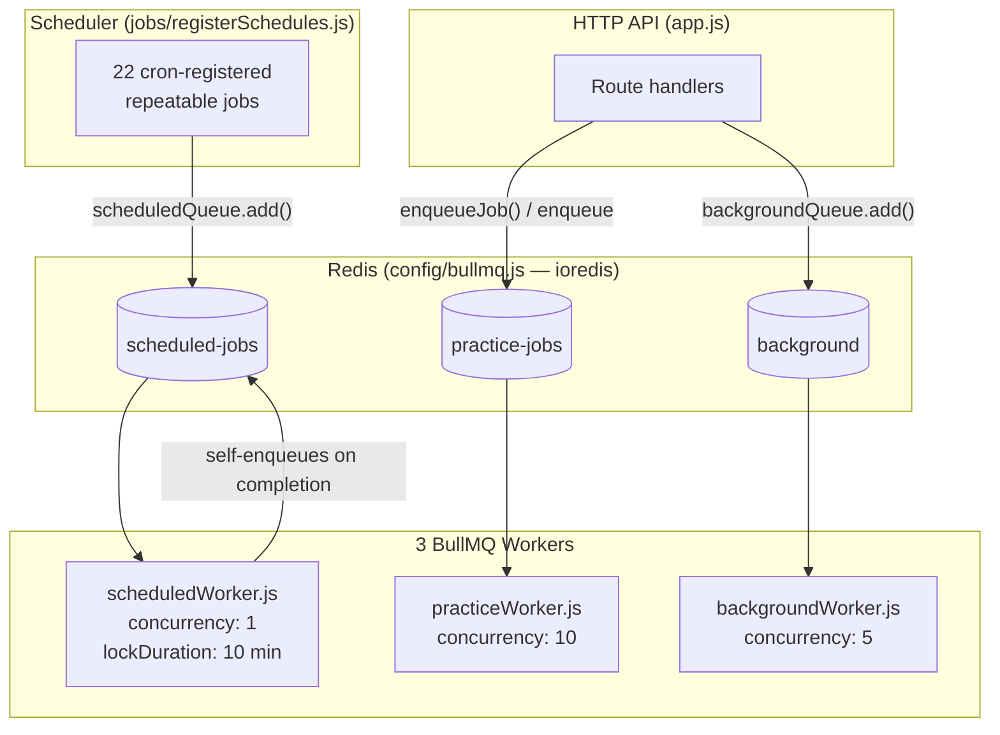
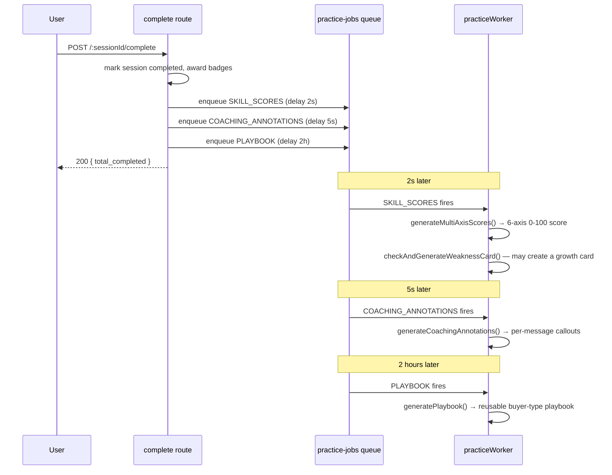
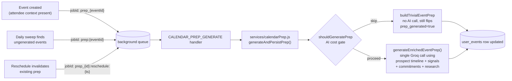

# Background Jobs & Asynchronous Processing

**Project:** FounderSales — AI Sales Coaching & Outreach Platform (backend codename: Clutch)
**Scope:** Every queue, worker, scheduled task, and background AI pipeline in the backend.
**Audience:** Anyone operating, extending, or reviewing this system.

---

## 1. Why This Layer Exists

FounderSales runs a lot of AI on a person's behalf without making them wait for it. A practice roleplay session alone can trigger four separate AI calls after the user has already moved on — skill scoring, coaching annotations, a two-hour-delayed playbook, and (if the outcome warrants it) a growth card. None of that can happen inline in the HTTP request that ended the session; the request would time out, and most of it isn't even useful until later anyway (nobody needs a playbook the instant a session ends — they need it before their next real conversation).

Three different shapes of "not right now" work exist in this codebase, and they're deliberately handled by three separate BullMQ queues rather than one generic job table:

1. **Scheduled work** — daily tip generation, weekly pattern detection, nightly metrics rollups. Nothing triggers these except the clock.
2. **Event-driven, delayed follow-up work** — a practice session ends, and five different downstream jobs need to fire at five different delays (500ms, 1.5s, 2s, 5s, 2 hours) so the UI can update progressively instead of blocking on the slowest one.
3. **Fire-and-forget-but-durable work triggered mid-request** — a calendar event gets created, and prep generation needs to happen, but the event-creation response shouldn't wait on a Groq call. This used to be done with bare `.catch(() => {})` IIFEs scattered through route handlers; every one of those was replaced with a real queued job specifically so a Redis blip or a transient Groq failure doesn't just silently drop the work with no retry and no trace.

This document covers all three.

---

## 2. Queue Topology



**Key structural fact:** unlike a design where a scheduler queue forwards work to a separate execution queue, every cron entry here is registered *directly* on the queue its own worker consumes (`scheduled-jobs`). `setupScheduler`-equivalent logic (`registerSchedules()`) doesn't run anything itself — it just makes sure the right repeatable job exists on the right queue name, and BullMQ's own clock does the rest.

---

## 3. Infrastructure

### 3.1 Connection

All three queues share one `ioredis` connection (`config/bullmq.js`), configured with `maxRetriesPerRequest: null` and `enableReadyCheck: false` — both required by BullMQ, not optional tuning. The connection has its own bounded retry strategy (`retryStrategy`): it backs off up to 10 attempts (capped at 5s between attempts) before giving up and setting `bullmqConnectionState.status = 'failed'`, rather than retrying an unreachable Redis forever and spamming logs. TLS/SNI is handled explicitly for Upstash-style `rediss://` URLs, including a `reconnectOnError` check that only forces a reconnect for genuinely transient codes (`READONLY`, `ETIMEDOUT`, `ECONNRESET`) rather than every error.

### 3.2 Boot ordering

`app.js` starts the HTTP server **before** calling `startAllJobs()`. This ordering is deliberate: if Redis is unreachable at boot, the API still comes up and serves traffic — only background processing is degraded, logged via `safeStart()`'s per-step try/catch in `jobs/index.js` rather than crashing the whole process. Each of the three job-startup steps (schedule registration, scheduled worker, practice worker, background worker) is wrapped independently, so one failing doesn't prevent the others from starting.

### 3.3 Queue registry

There is no dynamic queue-name allowlist here (unlike a system with dozens of queues) — three `Queue` instances are constructed once in `jobs/queues.js` and imported everywhere they're needed: `scheduledQueue`, `practiceQueue`, `backgroundQueue`. `backgroundQueue` alone carries a `defaultJobOptions` (`attempts: 3`, exponential backoff starting at 2000ms) so call sites that don't specify their own retry policy still get one rather than BullMQ's single-attempt default.

### 3.4 Monitoring

Bull Board (`@bull-board/express`) is mounted at `/admin/jobs` in `app.js`, watching all three queues via `BullMQAdapter`. It's gated behind a single shared-secret header check (`x-admin-secret` matched against `ADMIN_SECRET`) plus its own dedicated rate limiter (`LIMITERS.adminLimiter`) as defense-in-depth against secret-guessing traffic — the secret check is the real access control; the rate limiter exists so a leaked or guessed secret can't be hammered.

---

## 4. Queue 1 — `scheduled-jobs`

**Worker:** `jobs/scheduledWorker.js` · **Concurrency:** 1 · **Lock duration:** 10 minutes

This queue runs strictly one job at a time by design — these are aggregate scans over the whole user base (or whole workspace set), and running two concurrently risks double-counting or racing on the same rows. The 10-minute lock duration is set deliberately high relative to BullMQ's default, because several of these jobs (pattern detection, skill progression) fan out AI calls across every eligible user sequentially with rate-limiting sleeps between batches, and a shorter lock would let BullMQ think the job stalled and reclaim it mid-run.

### 4.1 Registered schedule

All 22 entries live in one array in `jobs/registerSchedules.js`. On every process boot, `registerSchedules()` clears every existing repeatable job on `scheduled-jobs` and re-registers this exact list — which makes it safe to call on every deploy without accumulating duplicate cron registrations, but also means the list below **is** the schedule; there's no drift between "what's configured" and "what's running."

| Job name | Cron | Meaning | Handler |
|---|---|---|---|
| `memory_extraction` | `*/30 * * * *` | Every 30 min | `runMemoryExtractionJob` |
| `opportunity_fetch` | `0 */6 * * *` | Every 6 hours | `runOpportunityJob` |
| `feedback_prompts` | `0 * * * *` | Hourly | `runFeedbackPromptJob` |
| `calendar_reminder_scan` | `*/5 * * * *` | Every 5 min | `runCalendarReminderScan` |
| `performance_summary` | `0 2 * * *` | Daily 02:00 UTC | `runPerformanceSummaryJob` |
| `metrics_aggregation` | `0 3 * * *` | Daily 03:00 UTC | `runMetricsJob` |
| `daily_tip_generation` | `0 7 * * *` | Daily 07:00 UTC | `runDailyTipGeneration` |
| `calendar_prep` | `0 8 * * *` | Daily 08:00 UTC | `runCalendarPrepJob` |
| `calendar_debrief_digest` | `0 8 * * *` | Daily 08:00 UTC | `runCalendarDebriefDigest` |
| `morning_growth_push` | `0 9 * * *` | Daily 09:00 UTC | `runMorningGrowthPush` |
| `goal_nudge` | `5 9 * * *` | Daily 09:05 UTC | `runGoalNudgeJob` |
| `follow_up_check` | `0 10 * * *` | Daily 10:00 UTC | `runFollowupSequenceJob` |
| `check_in_scheduler` | `0 14 * * *` | Daily 14:00 UTC | `runCheckInScheduler` |
| `evening_growth_push` | `0 18 * * *` | Daily 18:00 UTC | `runEveningGrowthPush` |
| `weekly_plan` | `0 18 * * 0` | Sunday 18:00 UTC | `runWeeklyPlanGeneration` |
| `email_digest` | `0 18 * * 0` | Sunday 18:00 UTC | `runEmailDigestJob` |
| `pattern_detection` | `0 20 * * 0` | Sunday 20:00 UTC | `runPatternDetectionJob` |
| `skill_progression` | `0 21 * * 0` | Sunday 21:00 UTC | `runSkillProgressionJob` |
| `skill_profile_agg` | `0 22 * * 0` | Sunday 22:00 UTC | `runSkillProfileAggregationJob` |
| `adaptive_curriculum` | `0 23 * * 0` | Sunday 23:00 UTC | `runAdaptiveCurriculumJob` |
| `prospect_dedup_scan` | `0 3 * * 1` | Monday 03:00 UTC | `enqueueDedupScanForAllWorkspaces` |

Registration order matters for one reason: the Sunday pipeline (18:00 → 23:00 UTC) is deliberately staggered an hour apart end-to-end. Weekly plan generation and the email digest both read from performance/skill data that pattern detection, skill progression, and skill profile aggregation compute — running them in sequence rather than all at once means each later job sees fresher upstream data, not a guess about ordering.

### 4.2 Job-by-job detail

#### `memory_extraction` — every 30 minutes
Scans chats with `message_count >= 10` that haven't been re-extracted since their last message, per user's `memory_enabled` flag. For each eligible chat, runs a two-stage AI process: extract 2–5 new candidate facts from the last 20 messages, then (if the user already has stored facts) a second AI call that decides per-candidate whether to skip (reinforce an existing fact), replace an outdated one, or insert genuinely new information — rather than blindly appending everything and letting duplicates accumulate. A 30-fact cap per user triggers priority-based eviction (`reinforcement_count`, recency, source diversity) before any new insert.

#### `opportunity_fetch` — every 6 hours
For every onboarded, active-workspace user, runs the Exa-search-or-Groq-fallback opportunity discovery pipeline (see §5 below) and pushes a notification if new opportunities were found.

#### `feedback_prompts` — hourly
Finds opportunities marked `sent` more than 48 hours ago with no feedback logged yet, groups them per user, and sends one push notification per user (not per opportunity) listing how many are awaiting feedback.

#### `calendar_reminder_scan` — every 5 minutes
Finds events starting within the next `CALENDAR_REMINDER_WINDOW_MINUTES` (30) that haven't had a reminder sent. **Idempotency is a database-level compare-and-swap, not a BullMQ mechanism**: each event is claimed via `UPDATE user_events SET reminder_sent = true WHERE id = ? AND reminder_sent = false RETURNING id` — if another concurrent scan tick already claimed it, the `UPDATE` matches zero rows and this scan silently skips it. This is why there's no per-event BullMQ job at all for reminders; the whole scan-and-claim happens inline in one job run every 5 minutes.

#### `performance_summary` — daily, 02:00 UTC
For every (user, workspace) pair whose `total_sent` has grown by at least `SUMMARIZE_EVERY_N_MESSAGES` (5) since its last summary and has at least `MIN_MESSAGES_FOR_SUMMARY` (10) total, regenerates `learned_patterns` — a short AI-written narrative plus derived `best_platform`/`best_message_style`/`best_message_length` fields computed from actual send/positive-rate stats per dimension (not just asked of the model; computed in code and then explained by the model).

#### `metrics_aggregation` — daily, 03:00 UTC
Rolls up the previous day's `daily_metrics` row per active member: opportunities shown/viewed, links clicked, messages sent, positive/negative outcomes, and derived execution/positive rates. Pure aggregation, no AI.

#### `daily_tip_generation` — daily, 07:00 UTC
For every onboarded user whose last tip is more than 20 hours stale, generates a fresh growth card using the full-context prompt (goals, recent check-ins, recent sent messages, recent practice sessions, recent conversation analyses) and optionally pushes a notification if `daily_tip` preference is enabled.

#### `calendar_prep` — daily, 08:00 UTC
**This job does not call any AI model itself.** It's a thin scan-and-enqueue: find events in the next `CALENDAR_PREP_HOURS_BEFORE` (24) hours with `prep_generated = false AND prep_failed = false`, and enqueue one `CALENDAR_PREP_GENERATE` job per event onto the `background` queue with a stable `jobId: prep:{eventId}`. This exists specifically so there's exactly one prep-generation code path in the entire system (`services/calendarPrep.js`) shared by the on-creation trigger, the manual "regenerate" endpoint, and this daily sweep — see §7.1 for why that consolidation mattered.

#### `calendar_debrief_digest` — daily, 08:00 UTC
For every active member, counts overdue debriefs (past events with no debrief) and overdue founder commitments, and sends one combined push notification if either count is non-zero and the relevant preference (`debrief_reminder` / `commitment_reminder`) is enabled.

#### `morning_growth_push` / `evening_growth_push` — daily, 09:00 / 18:00 UTC
Each user gets at most one push per run, gated by a hard daily cap of 2 pushes (`getDailyPushCount2`, computed from UTC midnight, not server-local time) and a minimum 6-hour gap since their last push. Each run picks the single highest-priority thing to surface from a small decision tree — a detected pattern, a waiting tip card, stale feedback, a streak milestone (morning), or a persistent skill weakness with no recent practice, an evening challenge card, a pending high-score opportunity (evening) — rather than sending everything that's true at once.

#### `goal_nudge` — daily, 09:05 UTC
Finds active goals either approaching their target date within 7 days, or with no logged progress note in the last 5 days, and nudges the user — but only once per goal per `nudgeCutoff` window (3 days), tracked via `last_goal_nudge_at` on the goal row itself.

#### `follow_up_check` — daily, 10:00 UTC
Scans opportunities sitting in `contacted`/`replied`/`call_demo` stages whose `last_stage_changed_at` exceeds a per-stage threshold (`FOLLOW_UP_THRESHOLDS`: 4/6/3 days respectively), generates an AI follow-up message per opportunity, and pushes a notification. Explicitly caps at 2 follow-ups per opportunity (`follow_up_count`) and won't re-generate within 5 days of the last one.

#### `check_in_scheduler` — daily, 14:00 UTC
For every eligible user without an existing check-in row for today, generates 3 personalized check-in questions (using recent chat titles as context) and inserts the row. This is the *question-generation* half; the user's actual answers are processed synchronously in the `POST /api/growth/checkin` route, not by a background job.

#### `weekly_plan` — Sunday, 18:00 UTC
Generates one weekly growth-strategy card per user from their goals, latest performance profile, and recent check-ins — skipped if a plan already exists for the current week (checked by `growth_cards` row existence, not by BullMQ dedup).

#### `email_digest` — Sunday, 18:00 UTC
Builds and sends a full HTML "Strategic Intelligence Brief" per eligible user (opted into `email_digest_enabled`, has an active workspace with a product description): week's message/analysis stats, current-vs-previous-week skill delta, winning-message pattern averages, detected communication patterns, and — for pro/enterprise tiers with quota available — a live Exa-sourced market-intelligence paragraph. Sends via Gmail SMTP first, falling back to Resend, falling back to console logging in dev.

#### `pattern_detection` — Sunday, 20:00 UTC
For every (user, workspace) pair with at least `MIN_ANALYSES_REQUIRED` (5) conversation analyses in the last 60 days, runs an AI pass comparing winning vs. losing message statistics (hook/personalization/word-count deltas, top failure categories) to produce 2–4 named communication patterns, stored via upsert keyed on `(workspace_id, user_id, pattern_label)` so re-detecting the same pattern reinforces it (`last_reinforced_at`) rather than duplicating it. Pro-tier users with 5+ losing messages additionally get a market-intelligence enrichment pass (rate-limited to one per user per 7 days via a `growth_cards` existence check). **On completion, this job self-enqueues a `pattern_insights` job back onto `scheduled-jobs`** — see §4.3 below for why that specific job currently has no effect.

#### `skill_progression` — Sunday, 21:00 UTC
For every (user, workspace) pair with conversation-analysis or practice activity in the last 7 days, computes a blended weekly skill snapshot: real-world conversation-analysis scores (hook/clarity/value_prop/personalization/cta/tone) averaged with practice-session skill scores (clarity/value/discovery/objection_handling/brevity/cta) per matching axis, all normalized onto the same 0–10 scale before blending. Composite delta is computed against the prior week's snapshot.

#### `skill_profile_agg` — Sunday, 22:00 UTC
A separate, denser rollup specifically over `practice_sessions.skill_scores` (0–100 scale) from the last 7 days — per-axis averages, weakest/strongest axis — feeding both `skill_progression`'s blend above and `adaptive_curriculum` below.

#### `adaptive_curriculum` — Sunday, 23:00 UTC
For every (user, workspace) pair with practice activity in the last 7 days, generates a personalized 3-session drill plan (session 1 targets the single weakest axis, session 2 combines the two weakest, session 3 is a full scenario) and upserts it keyed on `(user_id, workspace_id)` — always exactly one active curriculum per user per workspace, never accumulating history.

#### `prospect_dedup_scan` — Monday, 03:00 UTC
Doesn't scan anything itself. Fans out one `PROSPECT_DEDUP_SCAN` background-queue job per active, non-deleted workspace (`jobId: dedup-scan:{workspaceId}:{today}`), keeping this scheduled queue's single-concurrency lock short-lived rather than doing the actual fuzzy-matching work inline. See §7.3 for what the fanned-out job does.

### 4.3 Known gap: `pattern_insights`

`pattern_detection` (both on its "nothing to process" early-return path and its normal completion path) enqueues a job named `pattern_insights` back onto the `scheduled-jobs` queue. **No handler is registered for that job name in `scheduledWorker.js`'s `HANDLERS` map.** The real implementation this job name should route to — `runPatternInsightsJob` in `patternInsightsJob.js`, which generates weekly cross-conversation insights (stall detection, repeat-question clustering, timing alerts) — is imported into `scheduledWorker.js` but never wired into `HANDLERS`, deliberately left out per an inline comment noting the risk of double-registering it (once via direct cron, once via this self-enqueue) and needing to verify which mechanism is real before picking one. Today, neither mechanism fires it: the self-enqueued job hits the worker's `if (!handler) throw` branch, retries twice (BullMQ's default), and lands in the failed-job set, visible in Bull Board but otherwise silent. This is a known, scoped fix — either delete the self-enqueue call and add a direct cron entry, or register the handler and remove the "not registered" comment — not yet made because the two-mechanisms ambiguity needed resolving deliberately rather than by guessing which one the rest of the system assumes.

---

## 5. Queue 2 — `practice-jobs`

**Worker:** `jobs/practiceWorker.js` · **Concurrency:** 10 · **Default retry:** 3 attempts, exponential backoff from 60s (retries at ~1min, 2min, 4min)

This is the highest-concurrency queue in the system, matching its job shape: short, independent, per-message or per-session tasks that genuinely benefit from running in parallel rather than one queue's single-file processing.

### 5.1 What runs here

| Job (`QUEUE_JOB_TYPES`) | Enqueued from | Delay | Purpose |
|---|---|---|---|
| `PRACTICE_DELIVERED` | `practice.js` message route | 500ms | Flips a chat message to `delivered` status for UI ticks |
| `PRACTICE_SEEN` | `practice.js` message route | 1500ms | Flips to `seen` status |
| `PRACTICE_SKILL_SCORES` | `practice.js` complete route | 2s | Scores the finished session across 6 axes |
| `PRACTICE_COACHING_ANNOTATIONS` | `practice.js` complete route | 5s | Generates inline, message-level coaching callouts |
| `PRACTICE_PLAYBOOK` | `practice.js` complete route | 2 hours | Builds a reusable playbook for this buyer archetype |
| `conversation_analysis` | `feedback.js` (on final feedback) | — | Scores a real sent message across 6 dimensions |

**`PRACTICE_REPLY` and `PRACTICE_GHOST` are defined in `QUEUE_JOB_TYPES` and still have working handlers in `messageQueueWorker.js`, but nothing enqueues them anymore.** They were the original mechanism for generating a prospect's reply asynchronously; that responsibility now lives entirely in the `POST /:sessionId/message` route itself, which calls the AI model inline and returns the reply in the same HTTP response (see §6.1). The handlers are kept, not deleted, as a defensive fallback rather than dead weight removed prematurely.

### 5.2 Why delayed post-session jobs are staggered, not simultaneous

When a practice session ends (`POST /:sessionId/complete`), three jobs fire with deliberately different delays rather than all at 0ms:



The 2-hour playbook delay is intentional, not arbitrary: a playbook is a "keep this for your next real conversation with someone like this" artifact — generating it immediately provides no more value than generating it 2 hours later, and delaying it means the AI spend only happens for sessions the user didn't immediately discard, since `handlePlaybook`'s handler checks `session.playbook_generated` and exits early if the session was somehow already reprocessed.

### 5.3 The real-time reply path bypasses the queue

`generatePracticeProspectReplyV3` — the buyer-simulation AI call — runs **synchronously inside the HTTP request** in `practice.js`'s message route, not as a background job. This is deliberate: a practice conversation needs to feel like a live chat, and queuing the reply generation would mean either polling or a second round-trip just to fetch a reply the user is actively waiting for. The V3 call is a single bundled AI response containing the reply text, an internal monologue, a conversation-outcome classification, a goal-achieved flag, buyer state deltas, and an inline coaching tip — one model call instead of the four or five separate calls an earlier version of this system made per turn.

### 5.4 `conversation_analysis` — the one exception to the "job type = queue name" pattern

`practiceWorker.js`'s job processor special-cases `job.name === 'conversation_analysis'` and routes it to `runConversationAnalysis()` directly rather than through the generic `executeJob()` switch statement the other practice-queue jobs use. This job scores a real (non-practice) sent message the user got feedback on — hook/clarity/value-prop/personalization/CTA/tone, each 0–10, computed via a single AI call with word-count and self-referential-ratio pre-computed in code and handed to the model as grounding data rather than asked of it directly. On negative outcomes with a note, it additionally classifies the objection type using **regex-based pattern matching against the note text, not an AI call** — a deliberate cost optimization, since objection categorization from a short note doesn't need a full model call and the regex patterns (ghost/price/timing/trust/competition/fit, each with positive and negative signal patterns) are precise enough for this purpose.

---

## 6. Queue 3 — `background`

**Worker:** `jobs/backgroundWorker.js` · **Concurrency:** 5 · **Default retry:** 3 attempts, exponential backoff from 2s (unless overridden per call site)

This is the general-purpose durable queue — its own header comment describes it as replacing "fire-and-forget IIFEs," and that's literally what happened during one implementation pass: multiple `.catch(() => {})`-wrapped inline async calls in route handlers were converted into real queued jobs specifically so a transient failure gets BullMQ's retry machinery instead of silently vanishing.

### 6.1 Job catalog

| Job (`BACKGROUND_JOB_TYPES`) | Trigger | Retry override |
|---|---|---|
| `tip_card_generate` | Goal-note AI response flags `needs_tip_card` | default (3, 2s) |
| `opportunities_refresh` | (unused directly — see §5.1's `opportunity_fetch`) | default |
| `archetype_detect` | Onboarding completion | default |
| `first_time_cards_generate` | First `GET /growth/feed` call with zero cards | default |
| `seed_memory` | Onboarding completion / voice-profile rebuild | default |
| `checkin_tip_generate` | Check-in answer submission | default |
| `calendar_prep_generate` | Event creation, reschedule (if prep invalidated), or the daily sweep | 3, exponential 5s |
| `calendar_research_prospect` | Event creation with attendee context, or manual re-trigger | 3, exponential 5s |
| `calendar_extract_commitments_signals` | Debrief submission with raw notes | 3, exponential 5s |
| `calendar_update_prospect_health` | Debrief submission, if event has a linked prospect | 3, exponential 3s |
| `calendar_generate_followup` | Immediately after debrief submission | 3, exponential 5s |
| `prospect_dedup_scan` | Fanned out from the Monday scheduled job | 2, exponential 5s |
| `voice_memo_transcribe` | Voice memo upload | 3, exponential 5s |
| `voice_memo_enrich` | Chained after successful transcription | 3, exponential 5s |
| `chat_summarize` | Every N non-system messages in a long-running chat | default |

### 6.2 Calendar prep — one implementation, three trigger paths

Prep generation used to exist independently in three places: inline in the calendar route, re-implemented inline again in the background worker, and a third helper that was never actually called despite a comment claiming it was. All three now converge on one function, `generateAndPersistPrep()` in `services/calendarPrep.js`, called by exactly one job handler (`CALENDAR_PREP_GENERATE`) regardless of which of three things triggered it:



A second layer of idempotency exists independent of BullMQ's own `jobId` deduplication: the handler re-checks `event.prep_generated` against the database at the top of its own logic before doing any AI work, because `jobId` collisions only protect against duplicate *enqueues* under the same job ID — they don't protect against two genuinely different job IDs (one from creation, one from the daily sweep) racing to generate prep for the same event on the same day.

On final job failure (after all retries exhausted), the worker's `failed` event handler specifically checks for `CALENDAR_PREP_GENERATE` and writes `prep_failed: true` plus the failure reason back onto the event row — this is what stops the daily sweep from re-enqueueing a permanently broken event forever (`runCalendarPrepJob`'s query filters on `prep_failed = false`), and gives the frontend a real failure state to render instead of an indefinite loading spinner.

### 6.3 Voice memo pipeline — a job-ID bug and its fix

Voice memo processing is a two-stage chain: `voice_memo_transcribe` → (on success) `voice_memo_enrich`. The enrich stage was previously enqueued from *inside* the transcription job's `try` block, with a `jobId` containing a colon (`voice-enrich:{memoId}`). BullMQ rejects colons in custom job IDs outright — so every transcription that completed successfully then immediately threw on the enqueue call, which the surrounding `catch` mistook for a transcription failure and relabeled the whole job `failed`, retrying transcription from scratch up to 3 times per memo for a bug that had nothing to do with transcription at all. The fix moved the enrich-stage enqueue to **after** the `try/catch` block entirely, with a colon-free job ID (`voice_enrich_{memoId}`), and changed its failure handling to a logged warning rather than a rethrow — so a failure to *schedule* enrichment can no longer retroactively mark a transcription that actually succeeded as failed.

```mermaid
sequenceDiagram
    participant U as Upload route
    participant Q as background queue
    participant W as backgroundWorker
    participant C as Cloudinary
    participant G as Groq (Whisper)

    U->>Q: enqueue voice_memo_transcribe (jobId: transcribe_{memoId})
    Q->>W: job fires
    W->>C: fetch uploaded audio
    W->>G: transcribeAudio()
    G-->>W: transcript text
    W->>W: UPDATE voice_memos SET transcription_status='completed'
    Note over W: transcription is now fully committed —<br/>enrichment enqueue failure below can't undo it
    W->>Q: enqueue voice_memo_enrich (jobId: voice_enrich_{memoId})
    Q->>W: job fires (separate invocation)
    W->>W: generateMeetingDebrief() + extractCommitmentsAndSignals()
    W->>W: write debrief, commitments, signals; notify user
```

### 6.4 Chat summarization — bounding context growth

Long-running chats replay their last `CHAT_HISTORY_WINDOW` (20) non-system messages verbatim into every AI call. Once a chat exceeds that window, `chat_summarize` folds everything older into a single rolling `chats.summary` field so context isn't silently truncated, and isn't resent in full on every turn either. The trigger is a **count check performed on every assistant reply** (`maybeEnqueueSummarization()`, fire-and-forget from `chat.js`): once `(non-system message count) - (message count at last summary) >= CHAT_SUMMARIZE_EVERY_N_MESSAGES` (20), a job is enqueued with `jobId: chat_summarize_{chatId}_{messageCount}` — the message count embedded in the job ID means a duplicate check on the same count is a safe BullMQ no-op rather than a real duplicate enqueue. The handler itself re-verifies `toSummarize.length > chat.last_summarized_message_count` before spending an AI call, in case the check-and-enqueue happened twice in a race.

### 6.5 Prospect dedup — three-layer matching, deliberately never fully automatic

`PROSPECT_DEDUP_SCAN` doesn't itself do fuzzy matching — that happens synchronously at creation time in `resolveOrCreateProspect()` (see §7.3), which already handles exact-identifier and normalized-name matches inline. What this job does is re-scan a workspace's existing prospects (up to 500) against `find_similar_prospects` — a Postgres RPC using trigram similarity — and write any match above a conservative 0.45 threshold into a `prospect_merge_candidates` table for **human review**, never auto-merging. This is a deliberate ceiling: auto-merging two prospects who share a similar name risks silently combining two different real people's histories, which is a worse failure mode than leaving a genuine duplicate unmerged for a few extra days.

---

## 7. Reliability Patterns

### 7.1 Job-level idempotency, by mechanism

| Mechanism | Used by |
|---|---|
| Stable `jobId` (BullMQ-level dedup) | Calendar prep, research, extraction, followup, health-update, transcription, dedup-scan |
| Database re-check before AI spend | Calendar prep handler, chat summarization |
| Atomic conditional `UPDATE ... WHERE flag = false` | Calendar reminder scan |
| Row-existence check before insert | Weekly plan (per-week), first-time cards (per-day), daily tip (per-day cutoff) |
| Upsert with a composite conflict key | Skill progression (`workspace_id, user_id, week_start`), communication patterns (`workspace_id, user_id, pattern_label`), adaptive curriculum (`user_id, workspace_id`) |

No single mechanism is used everywhere — each job's idempotency strategy matches its own write shape rather than forcing every job through one generic dedup layer.

### 7.2 Failure visibility

Every worker attaches `completed`, `failed`, `error`, and (background worker only) `stalled` listeners, logging structured context (`jobId`, `jobName`, `attemptsMade`, `maxAttempts`, plus a small allowlist of safe identifying fields via `pickIds()` — never full payloads, to avoid dumping large free-text fields like raw meeting notes into logs). Job failures on the background and practice queues are additionally reported to Sentry with tags identifying the source worker, job name, and job ID, so a failure has external visibility beyond whatever's currently watching server logs.

### 7.3 What happens when things fail permanently

There is no generic dead-letter queue or automated re-drive across all three queues. Failed jobs are retained in BullMQ's own failed-job state (bounded by `removeOnFail: { count: N }` per queue, so this doesn't grow unbounded) and are inspectable/manually retryable through Bull Board. The one job type with a dedicated automated recovery path beyond its own retries is calendar prep, via the `prep_failed` flag described in §6.2 — everything else relies on its own retry attempts plus, for scheduled jobs, simply running again on its next scheduled tick.

### 7.4 Graceful shutdown

Both `scheduledWorker.js` and `practiceWorker.js` register `SIGTERM`/`SIGINT` handlers that call `worker.close()`, letting in-flight jobs finish rather than killing them mid-execution. An earlier version of the scheduled-worker shutdown handler called `process.exit(0)` immediately after `worker.close()`, which killed the process before the practice worker's own shutdown handler could finish draining — that explicit exit call was removed so shutdown across all workers in a combined process is cooperative rather than racing.

---

## 8. Operational Notes

### 8.1 Running the job system today

The codebase currently starts everything — HTTP API and all three job workers — in a single process (`src/app.js`, `startAllJobs()`). This is convenient for local development and small deployments, but couples API scaling to worker scaling: a burst of AI-heavy background jobs can compete with the same process's event loop for request-handling capacity.

**A split-process topology (`server.js` for the API, `workers/index.js` for scheduler + all three workers) is planned but not yet built** — see the repository root for `server.js`/`workers/index.js` if present; if not yet added, `app.js` remains the single entry point for both halves. The split is a structural change (separating boot sequences, not rewriting job logic), since every worker factory function is already self-contained and importable independently of `app.js`'s HTTP setup.

### 8.2 Debugging a failed job

1. Open Bull Board at `/admin/jobs` with the `x-admin-secret` header set.
2. Locate the queue (`scheduled-jobs`, `practice-jobs`, or `background`) and the failed job — Bull Board shows the stored payload and the stack trace from the last attempt.
3. Cross-reference the `jobId` and any logged identifying fields (`sessionId`, `eventId`, `memoId`, etc.) against application logs and Sentry.
4. For calendar prep specifically, check `user_events.prep_failed` / `prep_failure_reason` directly — this is the authoritative record independent of whether the BullMQ job itself is still inspectable in Bull Board's retention window.

### 8.3 Adding a new background job

1. Add the job-type string to the relevant enum in `config/constants.js` (`BACKGROUND_JOB_TYPES` for the general queue, `QUEUE_JOB_TYPES` for practice-adjacent work).
2. Write the business logic as its own function — existing jobs follow the pattern of a thin handler in the worker file calling into a `services/*.js` function that does the real work, so the same logic is callable from a route if ever needed.
3. Register the handler in the relevant worker's dispatch (`HANDLERS` map for scheduled jobs, the `switch`/`if` in `practiceWorker.js` or `backgroundWorker.js`'s `handlers` object for the other two).
4. If scheduled, add one entry to `SCHEDULES` in `registerSchedules.js` — no separate registration step exists; the array **is** the source of truth.

---

*This document reflects the background-processing system as currently implemented, including the one known gap (`pattern_insights`, §4.3) and the planned split-process topology (§8.1) not yet built.*
