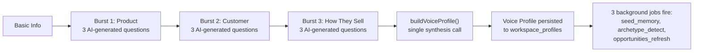
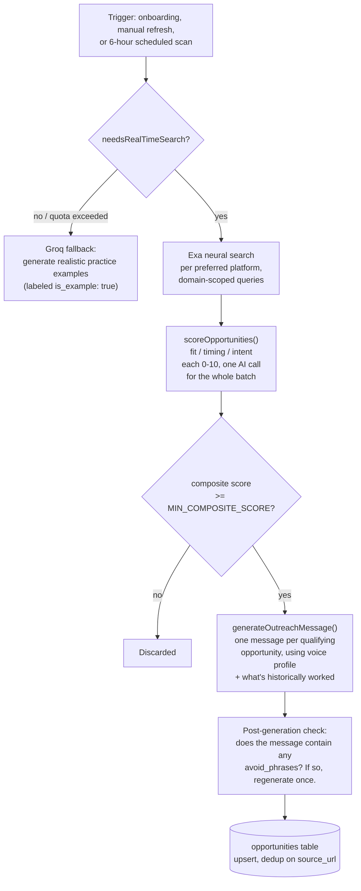

# PRODUCT_OVERVIEW.md
### The Complete Product Reference for FounderSales

> **Purpose:** Not an API reference or an architecture document — the definitive explanation of what FounderSales does, why each feature exists, and how a person actually experiences it, end to end.

---

## Table of Contents

1. [Executive Summary](#1-executive-summary)
2. [Core Concepts](#2-core-concepts)
3. [Identity, Workspaces & Membership](#3-identity-workspaces--membership)
4. [Onboarding — Building a Voice Profile](#4-onboarding--building-a-voice-profile)
5. [Opportunity Discovery](#5-opportunity-discovery)
6. [Pipeline Management](#6-pipeline-management)
7. [Feedback & Message Analysis](#7-feedback--message-analysis)
8. [Practice — AI Roleplay Simulation](#8-practice--ai-roleplay-simulation)
9. [Calendar Intelligence](#9-calendar-intelligence)
10. [Prospect Relationship Tracking](#10-prospect-relationship-tracking)
11. [Growth & Daily Coaching](#11-growth--daily-coaching)
12. [Insights & Metrics](#12-insights--metrics)
13. [AI Chat Coach](#13-ai-chat-coach)
14. [Goals & Commitments](#14-goals--commitments)
15. [Notifications](#15-notifications)
16. [File & Voice Uploads](#16-file--voice-uploads)
17. [Team Features (Manager+)](#17-team-features-manager)
18. [Business Rules Reference](#18-business-rules-reference)
19. [Complete User Flows](#19-complete-user-flows)
20. [Appendix — Glossary](#20-appendix--glossary)

---

## 1. Executive Summary

Most sales tools assume you already know how to sell and just need somewhere to track it. FounderSales assumes the opposite starting point: a founder, freelancer, or early-stage seller who has a product worth selling but hasn't necessarily done outbound sales before, and needs a system that actively teaches them while it works alongside them — not just a CRM with a chatbot bolted on.

The product is organized around one idea: everything FounderSales generates for a user — the opportunities it surfaces, the messages it drafts, the buyer it simulates in practice mode, the meeting prep it writes — draws from the *same* underlying representation of who that person is and what they're selling. That representation isn't a form field. It's a synthesized **voice profile**, built during onboarding from a structured interview and continuously informed by what actually happens afterward: which messages get replies, which practice sessions reveal a real weakness, which meetings go well.

The AI layer that does this work is branded to the user as **Clutch** — FounderSales' AI sales companion. Wherever this document says "the AI," it's the same underlying system the product presents to users as Clutch.

Four pillars make up the product surface:

- **Discovery & Outreach** — finding real conversations happening online where FounderSales' product would genuinely help, and drafting a message that doesn't read like a template.
- **Practice** — a realistic simulated buyer with a persistent personality, hidden motivations, and a private internal monologue, so a user can rehearse a hard conversation before having it for real.
- **Calendar Intelligence** — meeting prep, prospect research, and post-meeting debriefs that turn a scheduled call into something the user walks into prepared and walks out of with a clear next step.
- **Coaching** — daily check-ins, growth cards, pattern detection across real outreach history, and a skill-scoring system that blends real-world results with practice performance onto one comparable scale.

---

## 2. Core Concepts

| Concept | What it is | Real-world analogy |
|---|---|---|
| **Workspace** | A tenant boundary — a company, a personal sales practice, or a team. A person can belong to several. | The "org" a person is currently operating inside. |
| **Workspace Profile** | The AI's synthesized understanding of this person's product, audience, and voice — one per (user, workspace) pair, not one per user globally. | A sales rep's onboarding file, but AI-written and continuously updated. |
| **Opportunity** | A real, specific place online where someone is expressing the problem this product solves — a Reddit post, a LinkedIn comment, a forum thread. | A qualified lead, sourced rather than manually found. |
| **Practice Session** | A simulated conversation with an AI-generated buyer persona, scored across multiple skill axes. | A sales roleplay with a coach playing the prospect. |
| **Prospect** | A real person the user is building a relationship with — distinct from an Opportunity, which is the *source* that may or may not become a tracked Prospect. | A contact in a CRM, but auto-deduplicated. |
| **Growth Card** | A single, dismissible, prioritized coaching artifact — a tip, a challenge, a detected pattern, a weekly plan. | A personalized "today's focus" notification. |

**How they connect:**

```
User (one account)
 │
 ├── Workspace A ("My SaaS")
 │     ├── Workspace Profile (voice, ICP, differentiator — specific to this workspace)
 │     ├── Opportunities (discovered, scored, drafted)
 │     ├── Pipeline (opportunities that got a reply → stages → won/lost)
 │     ├── Practice Sessions (scored, contribute to skill_progression)
 │     ├── Prospects (real people, deduplicated, health-scored)
 │     │     └── Calendar Events (meetings, prep, debriefs, voice memos)
 │     ├── Growth Cards (daily tips, weekly plans, detected patterns)
 │     └── Chats (AI coach conversations, meeting-notes mode, growth-card discussions)
 │
 └── Workspace B ("Advising a friend's startup")
       └── (entirely separate profile, opportunities, practice history)
```

---

## 3. Identity, Workspaces & Membership

### Why it exists
A person needs one account but often more than one distinct selling context — their own company and a company they're advising have completely different products, audiences, and voices, and shouldn't share a practice history or a voice profile.

### Sign-up and identity
Email/password (Supabase Auth) or Google OAuth. Both paths converge on the same profile-creation logic (`create_workspace_for_user` RPC) — a new account gets a workspace, a founding owner membership, and an empty profile created atomically, so there's no possible intermediate state where a user exists with no workspace to operate inside. `has_password` is tracked explicitly via user metadata (not inferred from identity presence), because Supabase auto-creates an email identity for Google-OAuth users too — identity presence alone can't distinguish "this user has a password" from "this user only ever used Google."

### Roles
Four ranked roles: `owner > admin > manager > member`. Role checks (`requirePermission(minRole)`) compare rank, not exact match, so a route requiring `'manager'` is satisfied by a manager, admin, or owner. The workspace **owner** is a distinct concept from admin — there's exactly one owner per workspace, it can't be changed by demotion (only by an explicit `transfer_workspace_ownership` RPC call), and an owner cannot remove themselves or leave without transferring ownership first.

### Invitations
Admin-generated, cryptographically random 32-byte tokens (SHA-256 hashed before storage — the plaintext token is never persisted), 7-day expiry, single-use. Accepting an invite creates the membership *and* seeds the new member's workspace profile from the workspace owner's own profile as a starting template (preferred platforms, product description, voice profile) — specifically so a newly-invited team member isn't dropped into onboarding from zero when the workspace already has an established voice.

### Multi-workspace switching
`POST /api/user/switch-workspace` changes `active_workspace_id` and explicitly invalidates cached membership context for both the old and new workspace, so a switch is immediately effective rather than waiting out the 30-second cache window described in `ARCHITECTURE.md` §5.2.

---

## 4. Onboarding — Building a Voice Profile

### Why it exists
A generic AI sales assistant gives generic advice. Everything downstream in this product — opportunity scoring, message drafting, the practice buyer's reactions, calendar prep — is only as good as the system's understanding of *this specific person's* product, audience, and how they naturally talk. Onboarding is where that understanding gets built.

### The three-burst interview

Onboarding is not one long form. It's three short, sequential bursts of AI-generated questions, each building on the last:

1. **Basic info** (`POST /api/onboarding/basic`) — business name, product description, target audience, role, industry, experience level, preferred platforms, business stage, primary goal. This is the only structured-input step; everything after it is conversational.
2. **Burst 1 — The Product** (`generateBurst1Questions`) — three AI-generated questions probing what customers love most, when people actually decide to buy, and which channel has produced the best response so far. If the basic-info product description is too thin or absent, one of the three questions instead asks directly what the person is building — the system detects this and adapts the burst rather than asking a redundant "what does your product do" when it already has an answer.
3. **Burst 2 — The Customer** (`generateNextBurst`, burst 2) — the real trigger moment that makes someone start looking for a solution, what makes them hesitate, and what finally convinces them to buy. Deliberately asks for concrete situations ("missed deadline," "Friday reporting scramble") rather than abstract psychology, because most users answer real-life questions more specifically than strategic ones.
4. **Burst 3 — How They Sell** (`generateNextBurst`, burst 3) — how they actually write to customers, what they say in a demo that lands, and what they do when someone goes quiet.

Each burst's questions are generated fresh by AI, informed by every answer given so far, and **persisted** (`workspace_profiles.onboarding_questions`) so a user who leaves mid-onboarding and returns sees the exact same questions again rather than a newly regenerated set.



### From answers to voice profile

`buildVoiceProfile()` is the synthesis step — one AI call that takes every raw answer from all three bursts and produces a structured profile with explicit instructions to **upgrade, not repeat** the user's own words: a number stays a number, a direct quote stays a quote, but a vague answer gets sharpened into something specific and usable. The resulting profile includes:

- `unique_value_prop`, `icp_trigger`, `target_customer_description`
- `main_objection` and a ready-to-use `objection_reframe`
- `best_proof_point` — formatted to preserve real numbers and names
- `opening_hooks` — three ready-to-use cold-outreach first lines
- `channel_tone_map` — a distinct tone description per platform (cold email vs. LinkedIn vs. Reddit vs. X)
- `story_vault` — 2–3 extractable customer stories with quote, outcome, and which channel each fits
- `avoid_phrases` — a personalized list of spammy/corporate phrases to never use, seeded with generic defaults ("just checking in," "leverage," "excited to announce") plus anything the model infers this person would find inauthentic

This profile isn't static after onboarding — `PUT /api/onboarding/voice-profile` supports direct manual editing (deep-merged against the existing profile, arrays replaced rather than appended), and `POST /api/onboarding/rebuild-voice-profile` regenerates it from scratch against the original onboarding answers if a user wants a fresh synthesis without redoing the interview.

### What fires immediately after

Three background jobs run right after onboarding completes: memory seeding (extracting 8–10 standalone facts from the onboarding transcript into long-term AI memory, so future coaching conversations can reference specifics without re-reading the whole profile every time), archetype detection (classifying the user as seller/builder/freelancer/creator/professional/learner — this shapes which growth-card content and coaching tone they get), and an immediate opportunity-discovery refresh, so a new user sees real discovered opportunities within moments of finishing onboarding rather than waiting for the next 6-hour scheduled scan.

### The "wow moment"

`POST /api/onboarding/sample-message` generates one live outreach message using the just-built voice profile — grounded in a real discovered opportunity if one already exists, or a realistic hypothetical otherwise — specifically as the first tangible proof to a new user that the system actually learned something about them, rather than asking them to trust an abstract profile they can't yet see in action.

---

## 5. Opportunity Discovery

### Why it exists
Cold outreach usually starts with "who do I even message?" — this feature answers that by finding real people, in real conversations, expressing the exact problem the user's product solves, rather than requiring the user to manually search.

### How it decides whether to search at all

Before spending an Exa search credit, `needsRealTimeSearch()` runs a cheap AI pass judging whether a live search right now has a *good chance* of finding anything relevant — checking profile completeness (a thin product description or missing target audience skips straight to a fallback) and whether the ICP trigger and preferred platforms give the search something specific to look for. If the router says no, or the workspace's daily Exa quota (tiered: 5/50/200 by plan) is exhausted, the system falls back to Groq-generated realistic practice examples instead — clearly labeled as practice, never presented as real leads.

### Discovery and scoring



Every scored opportunity gets its own drafted outreach message before the user ever sees it — the product's premise is "here's who to message and exactly what to say," not "here's a lead, go write something." Message generation additionally factors in the workspace's own `learned_patterns` (see §7) when available, so drafts lean toward whatever message length and style has actually produced replies for this specific user before.

### Avoid-phrase enforcement

After a message is generated, it's checked against the voice profile's `avoid_phrases` list. If a violation is found, the system regenerates once with an explicit instruction naming exactly which forbidden phrases appeared — a real self-correction step, not just a static instruction hoped to be followed the first time.

---

## 6. Pipeline Management

### Why it exists
Once an opportunity gets a reply, it stops being a discovery-feed item and becomes a deal to actually manage — stage, value, next steps, assignment.

### Stages
`new → contacted → replied → call_demo → closed_won / closed_lost`. Stage advancement is partly automatic: logging positive feedback on a `new` opportunity auto-advances it to `contacted`; positive feedback on `contacted` advances to `replied`. Every other transition (into `call_demo`, `closed_won`, `closed_lost`) is explicit.

### First-sent timestamping
The first time a deal enters `contacted` or any later stage, `marked_sent_at` is stamped and — deliberately — **never overwritten** afterward, even if the deal cycles through stages multiple times, because it's meant to answer "when did outreach actually start," not "when did the most recent stage change happen."

### Team assignment
Manager+ can assign any deal in the workspace to any active member (`PUT /:id/assign`), which fires three independent side effects in parallel: a push notification to the assignee, an email via Resend/SMTP, and a `workspace_activity` log entry — each wrapped so a failure in one (e.g. the assignee has no email on file) never blocks the others or the core assignment write.

### Calendar handoff
Moving a deal into `call_demo` returns a `calendar_prompt` object in the response — a ready-made suggested event title and type — giving the frontend everything it needs to offer "add this call to your calendar" as a one-tap action rather than a separate manual step.

---

## 7. Feedback & Message Analysis

### Why it exists
This is how the system learns what actually works for a specific person, rather than giving generic advice forever. Every logged outcome on a sent message becomes training signal for future message generation, pattern detection, and skill scoring.

### Logging an outcome
`POST /api/feedback` accepts an outcome (positive/negative/pending), an optional note, and optional deal value / scheduled-call info. On a *final* positive or negative outcome, this triggers `increment_performance_stats` (an atomic RPC updating the user's running send/positive/negative counters) and enqueues a `conversation_analysis` background job.

### What conversation analysis actually scores
The queued job scores the original sent message across six dimensions (hook, clarity, value proposition, personalization, CTA, tone — each 0–10), with word count and a computed self-referential-word ratio (how much of the message is "I/we/our" versus about the recipient) pre-calculated in code and handed to the model as grounding data rather than left for the model to eyeball. On a negative outcome with a note, the note is additionally classified into an objection type — `ghost`/`price`/`timing`/`trust`/`competition`/`fit` — using regex pattern matching against the note text rather than a second AI call, since short free-text objection notes don't need a full model call to categorize reliably.

### Pending confirmations
`GET /api/feedback/pending` surfaces opportunities marked `viewed` with no feedback logged yet — a single left-join query (`feedback!left(opportunity_id)` filtered to null matches) rather than the original three-round-trip client-side-filter approach it replaced, which meant this endpoint scaled linearly with lead volume before the fix.

---

## 8. Practice — AI Roleplay Simulation

### Why it exists
The best time to make a mistake with a difficult prospect is in a simulation, not on a real call. Practice mode gives a user a persistent, realistic buyer to rehearse against — one with a private internal state the user can't see in real time but gets to review afterward, which is what makes the post-session debrief genuinely instructive rather than just a score.

### Starting a session
Six weighted scenario types exist — `interested` (25%), `polite_decline` (25%), `ghost` (20%), `skeptical` (15%), `price_objection` (10%), `not_right_time` (5%) — either randomly selected by weight or explicitly chosen. A full buyer persona is generated per session: name, role, company context, specific pain, what they're skeptical about, current tools/alternatives, decision authority, time pressure, and — critically — **hidden motivations the user has to discover through questioning**, not read off the persona directly. Difficulty auto-calibrates from the user's own history (`beginner` under 5 completed sessions, scaling to `expert` past 30 with a sub-30% reply rate), and an optional pressure modifier (aggressive buyer, decision-maker watching, competitor mentioned, compliance concern) can be layered on for a harder variant of the same scenario.

### The conversation
Every reply — see `ARCHITECTURE.md` §6 for the full mechanism — is one bundled AI call returning the in-character reply, the buyer's real private thought (their internal monologue, which may directly contradict the tone of their actual reply), a running interest/trust/confusion state that shifts message-by-message, an outcome classification once the conversation reaches a natural endpoint, and an inline coaching tip. Ghost scenarios have their own quality-gated exception: a strong enough message can make an otherwise-silent buyer respond (see `ARCHITECTURE.md` §6.3).

### After the session ends
Completing a session (`POST /:sessionId/complete`) triggers badge evaluation (nine possible badges — first session, first rejection survived, ghostbuster, session-count milestones, price-objection handled, advanced-difficulty reached) and three staggered background jobs: multi-axis skill scoring at 2 seconds, message-level coaching annotations at 5 seconds, and a full reusable playbook at 2 hours (see `ARCHITECTURE.md` §5.2 for why the delays differ).

### Retry
`POST /:sessionId/retry` starts a fresh session against the *same scenario type* with a newly-generated buyer persona (not the same buyer replayed) — the point is repeated practice at the same kind of hard conversation, not a literal do-over of one specific exchange. If the retry is scored, `generateRetryComparison()` produces a structured before/after diff against the original attempt.

### The internal monologue as a teaching tool
Post-session, `internal_monologues` are surfaced separately from the transcript — every moment the buyer said one thing but privately thought something meaningfully different is a specific, reviewable teaching moment ("you asked a good question here, but the buyer's private reaction was still skeptical — here's why"), which is a distinctly different kind of feedback than a plain transcript replay would give.

---

## 9. Calendar Intelligence

### Why it exists
A meeting a user walks into unprepared is a wasted opportunity; a meeting they walk out of with no clear next step is nearly as wasted. This feature turns a scheduled calendar event into a system-supported process: research before, structured capture during, and a follow-up drafted immediately after.

### Before the meeting
Creating an event with attendee context automatically triggers two background jobs (see `ARCHITECTURE.md` §7): prospect research (an Exa search synthesized into a structured brief by AI, reused across meetings with the same prospect within a 14-day window) and prep generation — an AI-written brief combining that research with the prospect's full relationship history (past meeting outcomes, open commitments the user owes them, prior detected signals) into an opening line, talking points, the single best question to ask, an anticipated objection with a ready response, and pre/post-meeting message templates. Every one of these AI calls is gated by `services/calendarAiGate.js` before it runs — see `ARCHITECTURE.md` §7.1 for the full decision tree.

### During the meeting
Two capture methods exist, both feeding the exact same downstream pipeline:

- **Meeting-notes chat mode** — a dedicated live chat (`chat_mode: 'meeting_notes'`) where the AI acts as a silent partner: confirming what it captured, asking one sharp follow-up question, or flagging something worth noting (a number, a competitor mention, a buying signal) — never lecturing, never breaking into long responses. Typing "done"/"end" triggers a one-sentence outcome summary and closes the session.
- **Voice memos** — record in-app or upload an existing audio file; both flow through the identical pipeline (transcription via Groq Whisper, then debrief synthesis) distinguished only by a `source` field. See `ARCHITECTURE.md` §6.3 for the job-chain mechanics.

### After the meeting
A debrief (raw notes plus an outcome rating) triggers, in parallel: a structured AI summary (what worked, what to improve, the single most memorable coachable moment, a recommended next step), a **single merged AI call** extracting both commitments and signals from the same notes text (see `ARCHITECTURE.md` §7.2), a prospect relationship-health recompute, and — immediately, not on a delay — three follow-up message variants (brief, substantive, re-engagement) gated by whether a follow-up is even warranted for this outcome (a `dead` outcome with no clear next step skips follow-up generation entirely rather than manufacturing one).

### Relationship health scoring
Computed deterministically, not by AI: a base score of 50, adjusted by recency of last contact (+20 within 3 days, −30 past 30 days), the last meeting's logged outcome (+20 hot, −30 dead), recent buying signals (+8 each) and risk signals (−10 each), and overdue founder commitments (−12 each), clamped to 0–100. Using arithmetic here rather than an AI judgment call makes the score consistent and explainable — a user can see exactly why a relationship's health moved.

### Prospect deduplication
Creating an event with an attendee name resolves against existing prospects through a three-layer match (exact email/LinkedIn identifier → normalized-name exact match → fuzzy trigram similarity flagged for human review, never auto-merged) — see `ARCHITECTURE.md` §6.5 and `BACKGROUND_JOBS.md` §6.5 for the full mechanism and why auto-merging fuzzy matches is deliberately never done.

---

## 10. Prospect Relationship Tracking

### Why it exists
An opportunity is a discovery-feed item; a prospect is a person the user has an ongoing relationship with, worth tracking independent of any single deal or meeting.

### What's tracked per prospect
Contact info, a relationship health score (§9), an AI-generated narrative summary of the relationship refreshed on a 7-day staleness cutoff, and a merged timeline combining every meeting, chat, and detected signal associated with them — sorted chronologically regardless of source type.

### Merge candidate review
`GET /api/prospects/merge-candidates` and its resolve endpoint expose the human-review side of the dedup engine described in §9 — a manager or the user can review a flagged pair, merge (which repoints every foreign-key reference from the duplicate onto the canonical record across four tables before deleting the duplicate) or dismiss it as a false match.

---

## 11. Growth & Daily Coaching

### Why it exists
Improvement compounds from small, consistent actions more than from occasional deep dives — this is the layer that keeps a user engaged day-to-day rather than only when they remember to check in.

### The daily check-in loop
Each afternoon, personalized check-in questions are generated referencing whatever the AI coach most recently discussed with this user, plus goal progress. The user's answers (submitted once per day — a second attempt on the same day returns a 409, not a silent overwrite) get a response that explicitly cross-references mood against goal progress: a low mood day gets warmth and one small easy action rather than a task list; a goal that's meaningfully behind schedule with an approaching deadline gets gently surfaced rather than ignored. A running streak is computed from actual check-in history, not a separate counter that can drift from the real data.

### Growth cards
Seven card types (tip, strategy, resource, reflection, challenge, community, insight) generated from six distinct sources: daily generation, weekly plans, check-in responses, detected communication patterns, practice-weakness detection, and one-off goal-note coaching moments. Every card carries a priority and expiry, and the feed (`GET /api/growth/feed`) auto-triggers first-time card generation for a genuinely new user with zero cards rather than showing an empty state.

### Persistent weakness detection
`checkAndGenerateWeaknessCard()` — triggered after every scored practice session — only fires once a weakness is *persistent*: at least 5 recent sessions, an axis averaging below 55/100 across all of them. A single bad session never triggers a card; a real pattern does. A 14-day cooldown per axis prevents the same weakness from generating a new card before the user's had a fair chance to act on the last one.

---

## 12. Insights & Metrics

### Why it exists
Raw activity data is only useful once it's been turned into an answer to a real question — "why am I losing," "is practice actually helping," "what's about to go quiet without me noticing." This is genuinely the deepest analytical surface in the product — over 40 distinct endpoints across two files, grouped here by the question each answers rather than listed exhaustively.

### Diagnostic reports
- **Why You're Losing Sales** (personal and, manager+, workspace-wide) — an AI-synthesized diagnosis comparing winning vs. losing message statistics, detected patterns, and top objections into one prioritized root cause plus an immediate fix.
- **Coaching Report** — persistent strengths/weaknesses across recent practice sessions plus a prioritized drill plan, distinct from the always-on weakness-card mechanism in that it's a full on-demand report rather than a triggered nudge.
- **Executive Report** (owner-only) — a monthly AI-written business review synthesizing team pipeline, skill trends, shared weaknesses, and top objections into a single narrative brief.

### Correlation & trend analysis (deterministic, not AI-judged)
- **Mood vs. performance** — Pearson correlation between daily mood score and same-day positive reply rate, requiring at least 5 active days before surfacing a result rather than drawing a conclusion from noise.
- **Practice ROI** — compares positive-outcome rate on weeks with practice sessions against weeks without, requiring 3+ weeks in each bucket.
- **Buyer-state trajectory** — averages interest/trust scores across every practice session by exchange index, identifying the typical point where interest peaks and where it meaningfully drops off afterward.
- **Prep effectiveness** — compares real-meeting outcome rates between prepped and unprepped meetings.
- **Skill persistence** — classifies a recurring weakest-skill signal as genuinely "persistent" (3+ consecutive weeks) versus "noisy" (changes too often to be a real pattern, likely a small-sample artifact) — an explicit honesty check against over-interpreting thin data.

### Forward-looking risk detection
- **Silent pipeline risk** — flags deals that *look* healthy by stage but carry two or more of: recent negative signals, overdue founder commitments, or a low prospect health score — the "about to go cold without anyone noticing" view.
- **Lost-reason breakdown** — separates *most frequent* loss reason from *most costly* loss reason (by logged deal value), since they're sometimes different things and only one of them tells you where to actually focus.

### Team-level (manager+/owner)
Leaderboard (weighted composite of outreach volume, reply quality, deals closed, skill level, goal progress), a coaching queue (flags reps hitting two or more risk signals: no outreach in 7 days, no practice in 7 days, declining skill score, low skill score, low average prospect health), team objection divergence (distinguishes a shared, product-level objection everyone's hitting from an individual rep's specific gap worth a 1:1), and a skill matrix across the whole team.

---

## 13. AI Chat Coach

### Why it exists
Not every question fits a structured feature — sometimes a user just needs to talk through a situation with the same AI that knows their business context.

### Modes
Four distinct chat modes, each with its own system-prompt instructions layered onto the same base coaching persona: `general` (open-ended coaching), `prep` (meeting preparation, ends by asking what single outcome they need), `followup_coach` (drafts/critiques a specific follow-up message, explicitly forbidding "just checking in" as an opener), and `meeting_notes` (the live capture mode described in §9).

### Context injection
Every turn re-injects fresh growth-card or opportunity context (if the chat was started from one) rather than relying on a single copy planted at chat creation and left to fall out of the model's context window after a few turns — a fix for a real gap where opportunity context in particular previously had no re-injection mechanism at all. Long chats get a rolling AI-written summary once they exceed the live history window, folding older messages into `chats.summary` rather than either silently truncating them or re-sending the entire history on every turn (see `BACKGROUND_JOBS.md` §6.4).

### Web search
An explicit toggle (`force_search`), not automatic — a deliberate product decision to keep search cost predictable and give the user control over when the AI reaches outside the conversation, rather than the system silently deciding a search was warranted.

### Export
Any chat can be exported as Markdown (`GET /:chatId/export`) — deliberately markdown-only, with PDF generation left to the client's own print-to-PDF rather than the backend maintaining a second rendering pipeline for a format the browser already handles.

---

## 14. Goals & Commitments

### Goals
Free-text goals with an optional numeric target, tracked via atomic progress increments (`increment_goal_progress` RPC) rather than read-modify-write from the client, so concurrent updates from multiple tabs or devices can't silently clobber each other. Logging a note against a goal gets an AI coaching response *and* an inferred progress delta in the same call — the user doesn't have to separately narrate their progress and then manually update a number.

### Commitments (from calendar debriefs)
Promises extracted from meeting notes — "I'll send the proposal by Friday" — tracked with an owner (founder or prospect), a due date, and status (pending/done/overdue/ignored). These feed directly into calendar prep (a founder's outstanding promise to a specific prospect is surfaced in that prospect's next meeting prep) and the daily debrief digest notification.

---

## 15. Notifications

### Delivery
Push-only via Firebase Cloud Messaging — no in-app notification inbox table separate from the push mechanism itself. Failed/expired tokens are detected from FCM's own error codes and proactively cleared from the user record, so a stale token doesn't silently fail forever.

### What triggers a push
New opportunities discovered, feedback prompts for stale sent messages, practice replies/ghosts, streak milestones, daily tips, check-in prompts, weekly plans, goal nudges, calendar prep/follow-up/voice-memo-summary readiness, meeting reminders, team assignment, and the combined morning/evening growth-coaching decision tree described in §11. Every notification type respects a per-type user preference toggle (`notification_preferences`), and the morning/evening pushes additionally respect a hard daily cap and minimum gap regardless of how many things are simultaneously true (see `BACKGROUND_JOBS.md` §4.2).

---

## 16. File & Voice Uploads

### General file uploads
Images, PDFs, and documents up to 10MB via Cloudinary, with MIME-type validated both client-side (multer `fileFilter`) and against the actual upload. Chat attachments get type-specific preprocessing before reaching the AI: images are base64-encoded for vision-capable models specifically (not sent as raw binary to every model — see `ARCHITECTURE.md` §4.4), PDFs get text-extracted via `pdf-parse`, and both are capped by an aggregate 16,000-character budget across all attachments in a single message so a large attachment can't silently balloon the prompt sent to the AI.

### Voice memos
Up to 20 minutes, 25MB (matching Groq Whisper's own ceiling), a fixed set of common audio MIME types. Both recording in-app and uploading an existing file converge on the identical pipeline — see §9 and `ARCHITECTURE.md` §6.3 for the transcription → enrichment chain.

---

## 17. Team Features (Manager+)

- **Team pipeline view** — every deal in the workspace regardless of owner, gated behind a manager-role check on the same endpoint that serves the individual view.
- **Team calendar view** — every member's events in a date range with per-member debrief-completion counts.
- **Assignment** — reassigning deals to any active member with automatic notification.
- **Workspace activity feed** — a chronological log of consequential events (opportunity created, deal closed, goal reached, member joined, deal assigned, nudge sent), manager-gated since it surfaces every member's individual actions.
- **Nudges** — a manager can send a direct message-as-push-notification to a specific member, logged to the activity feed.
- **Analytics** — a 30-day per-member breakdown (opportunities, sent messages, positive outcomes, execution/positive rates, current skill composite and delta, top weakness/strength) across the whole team in one call.

---

## 18. Business Rules Reference

**Ownership & workspace integrity**
- A workspace cannot exist without an owning member (atomic creation).
- The workspace owner cannot be demoted, removed, or leave without first transferring ownership.
- Only an active member of a workspace matching the caller's own membership can access workspace-scoped resources.

**Practice & scoring**
- Difficulty auto-calibrates from session history; a brand-new user always starts at `beginner`.
- A ghost scenario can still be broken by a message scoring 40+ on the quality gate — silence is never unconditional.
- Completed practice sessions cannot be deleted (they feed skill-progression aggregation); only incomplete sessions can be cancelled.
- A retry starts a genuinely new session against a new buyer persona of the same scenario type — never a replay of the original conversation.

**Calendar & prospects**
- Prospect research is reused across meetings with the same prospect within 14 days rather than re-run per meeting.
- Prospect merging is never fully automatic — fuzzy name matches are always flagged for human review, never silently combined.
- A follow-up is not generated for a `dead` meeting outcome that already has a clear next-step recommendation captured elsewhere.

**Feedback & analysis**
- Conversation analysis only runs on a *final* logged outcome, not on a `pending` placeholder.
- The same opportunity's feedback is upserted, not duplicated, on repeated submission (`onConflict: 'opportunity_id'`).

**Growth & coaching**
- A weakness card requires persistence (5+ sessions, sustained sub-55 average) — one bad session is never sufficient.
- At most 2 pushes per user per UTC day from the growth-coaching system, with a minimum 6-hour gap between them, regardless of how many things are simultaneously true.
- A daily check-in can only be submitted once per calendar day.

**Rate limits (representative)**
- Chat messages: 40/minute/user (every message triggers an AI call).
- Practice messages: 30/minute/user.
- Calendar AI actions (debrief, prep, research, follow-up): 10 per 5 minutes/user.
- Opportunity refresh: 5/hour/user (a full discovery pass is expensive).
- File uploads: 20 per 15 minutes/user.
- Auth endpoints: 10 per 15 minutes/IP (excluding silent token refresh).

---

## 19. Complete User Flows

### Flow: A new user's first day
1. Signs up → atomic workspace + owner membership created.
2. Completes basic info, then three AI-generated question bursts.
3. Voice profile synthesized; memory seeded, archetype detected, opportunity discovery immediately refreshed in the background.
4. Sees a sample outreach message generated from their brand-new profile — the first proof it actually learned something.
5. Opens the discovery feed: real, scored opportunities with drafted messages already waiting.
6. Optionally starts a practice session to rehearse before sending anything for real.

### Flow: Sending a message and closing the loop
1. User copies a drafted message, sends it externally, marks it sent.
2. Days later, logs feedback (positive/negative + note).
3. On a final outcome: performance stats increment atomically; a conversation-analysis job scores the actual message across 6 dimensions.
4. If negative with a note: an objection type is classified and tracked, feeding both the objection-trends view and the weekly pattern-detection job.
5. If positive on a `new` deal: the pipeline stage auto-advances to `contacted`.

### Flow: A calendar meeting end-to-end
1. Event created with attendee context → prospect resolved/created via dedup matching → research and prep jobs enqueued.
2. User opens prep before the call: opening line, talking points, anticipated objection, relationship-history brief.
3. During the call, either meeting-notes chat mode or a voice memo captures raw notes.
4. Debrief triggers, in parallel: AI summary, merged commitment+signal extraction, relationship-health recompute, and three follow-up variants ready to send — unless the gate determines follow-up isn't warranted for this outcome.

### Flow: A practice session and its aftermath
1. Scenario selected (or randomly weighted), buyer persona generated, difficulty auto-calibrated.
2. Conversation proceeds turn-by-turn, each reply bundling text + private monologue + shifting state + outcome detection.
3. Session completed → badges evaluated → three staggered jobs fire (scores at 2s, annotations at 5s, playbook at 2h).
4. If this session reveals a persistent (not one-off) weakness across the last 5+ sessions, a targeted growth card appears.
5. The week's blended skill snapshot (real messages + this session, normalized onto one scale) updates on the next Sunday aggregation run.

---

## 20. Appendix — Glossary

| Term | Meaning |
|---|---|
| **Clutch** | The AI companion's product name, as presented to the user — the same underlying multi-provider AI system this document otherwise refers to as "the AI." |
| **Workspace** | A tenant boundary a user operates inside; one person can belong to several. |
| **Workspace Profile** | The synthesized voice/product/audience representation built from onboarding, specific to one (user, workspace) pair. |
| **Voice Profile** | Shorthand for the same concept — how a specific person's product, differentiator, and communication style get represented to the AI. |
| **Opportunity** | A discovered, scored, real-world conversation matching the user's product, with a drafted outreach message attached. |
| **Prospect** | A tracked real person, distinct from the raw opportunity that may have sourced them, deduplicated across mentions. |
| **Practice Session** | A scored, simulated buyer conversation used to rehearse before a real one. |
| **Buyer Persona** | The AI-generated character a practice session is played against — name, role, pain, hidden motivations, starting emotional state. |
| **Internal Monologue** | The buyer persona's private, unfiltered reaction, distinct from and sometimes contradicting their spoken reply — surfaced to the user only after the session. |
| **Archetype** | A user-level classification (seller/builder/freelancer/creator/professional/learner) shaping coaching tone and content. |
| **Growth Card** | A single prioritized, dismissible coaching artifact surfaced to the user. |
| **Signal** | A detected buying/risk/timing/engagement cue extracted from meeting notes or conversation text. |
| **Commitment** | A promise (by either party) extracted from meeting notes, tracked to completion. |
| **Skill Progression** | The weekly blended snapshot reconciling real-message scoring and practice-session scoring onto one scale. |

---

*This document reflects the FounderSales feature set as currently implemented in the backend, including the one feature (public booking pages) that exists at the schema level but isn't yet wired to any route — see `ARCHITECTURE.md` §13.*
