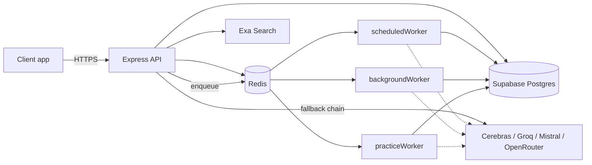

# FounderSales — Backend

AI sales coaching for people selling without a sales team. Real outreach outcomes and AI roleplay practice are scored on the same rubric and feed the same coaching loop, so what you practice next is based on what's actually failing in your outbound.

This repository contains both the **backend API and job system** (`backend/`) and the **frontend** (`frontend/`), built with React.

---

## What this actually does

Most sales tools do one of: outbound lead generation, a CRM/pipeline, roleplay practice, or meeting notes. This backend runs all four against the same data, so they inform each other:

- A founder logs the outcome of a real message → an AI pass scores it across 6 dimensions (hook, clarity, value prop, personalization, CTA, tone) → a weekly job compares winning vs. losing messages and writes specific, evidenced patterns (not generic tips).
- Practice sessions run against an AI buyer with a real psychology model — starting interest/trust scores, hidden motivations the founder has to draw out through discovery questions, and a "ghost" scenario gated by a live message-quality check rather than a fixed script — scored on the *same* rubric as real outreach.
- Meeting prep, live meeting notes, and voice-memo debriefs all converge on one extraction pipeline (commitments, buying/risk signals, structured summary) regardless of which input produced the raw text.
- Everything the AI generates — outreach messages, buyer personas, coaching cards, follow-up drafts — is written against a "voice profile" synthesized from the founder's own onboarding answers, not a template.

Full product walkthrough: [`PRODUCT_OVERVIEW.md`](PRODUCT_OVERVIEW.md)
Full system design: [`ARCHITECTURE.md`](ARCHITECTURE.md)

---

## Engineering highlights

Concrete things worth actually looking at, with where to find them:

- **Four-provider LLM fallback with structured error classification.** Cerebras → Groq → Mistral → OpenRouter, each with its own key pool. Failures are classified by real HTTP status/parsed body (`KEY_FAULT`, `PROVIDER_TRANSIENT`, `BAD_MODEL`, `NON_RETRYABLE`), not string-matched — a 429 cools that specific key for an hour; a provider-wide 503 doesn't penalize the key at all. Key cooldown and model discovery are Redis-backed and shared across instances, with a documented in-memory kill switch for instant rollback. → `src/services/multiProvider.js`
- **AI buyer psychology, not a script.** Each practice session generates a persona with hidden motivations, and every message shifts tracked interest/trust/confusion scores that drive the buyer's tone in real time. A ghost scenario is gated by a live quality check that decides whether *this specific message* earns a reply from someone who wasn't going to respond. → `src/services/groq-practice.js`
- **Two-layer idempotency for meeting prep**, closing a real race between three independent triggers (event creation, manual regenerate, nightly sweep): BullMQ jobId dedup for same-trigger races, plus a DB-state re-check inside the handler for cross-trigger races. → `src/jobs/backgroundWorker.js`, `src/services/calendarPrep.js`
- **A cost gate in front of every AI-triggering calendar action** — skip prep on a low-context event, reuse research from the last 14 days instead of re-searching, skip extraction on notes under 20 characters — with every decision logged and queryable. → `src/services/calendarAiGate.js`
- **Three-layer prospect deduplication**, where the two unambiguous layers (exact identifier, normalized-name match) auto-merge and the fuzzy layer (trigram similarity) deliberately never does — only flags a merge candidate for a human to confirm. → `src/services/prospectDedup.js`
- **Rolling chat summarization** so token cost per turn doesn't grow linearly with conversation length — the last 20 messages replay raw; anything older folds into a running summary once a chat crosses a message threshold. → `src/routes/chat.js`, `src/jobs/backgroundWorker.js`
- **Namespaced, Redis-backed rate limiting**, one limiter per route sized to that route's actual AI cost — not a single blanket limit — after a real bug where several limiters silently shared one Redis key prefix and merged their counters. → `src/config/limiters.js`

---

## Tech stack

| Layer | Technology |
|---|---|
| Runtime | Node.js, Express 4 |
| Database | Supabase (Postgres), via `@supabase/supabase-js` |
| Auth | Supabase Auth (JWT bearer), workspace-scoped RBAC on top |
| Cache / job backing store | Redis (`redis` + `ioredis`) |
| Background jobs | BullMQ — 3 workers, cron + on-demand |
| AI providers | Cerebras, Groq, Mistral, OpenRouter (chat completions) + Exa (search) |
| Transcription | Groq Whisper-compatible endpoint |
| File storage | Cloudinary (uploads, voice memo audio) |
| Validation | Zod (request bodies *and* AI output schemas) |
| Email | Resend / Nodemailer (console fallback in dev) |
| Push notifications | Firebase Cloud Messaging |
| Error tracking | Sentry (optional, no-op if unconfigured) |
| Queue monitoring | Bull Board (`/admin/jobs`, secret-header gated) |

---

## Architecture at a glance



Full diagrams (request lifecycle, provider fallback, voice-memo pipeline, job dispatch) are in [`ARCHITECTURE.md`](ARCHITECTURE.md).

Layer boundaries: `routes/` are thin HTTP adapters; all business logic and every AI prompt live in `services/`; `jobs/` holds three BullMQ workers plus every job handler; `schemas/` validates AI *output* against Zod schemas with a fallback object, so a malformed model response degrades gracefully instead of crashing a route.

---

## Security & reliability notes

- Every route resolves workspace membership (`authenticate` → `resolveWorkspace` → `requirePermission(role)`) before touching data; update endpoints use `.strict()` Zod schemas so a client can't smuggle `workspace_id`/`user_id` into a request body.
- Invite tokens are hashed before storage and never logged in plaintext.
- Every Redis-backed feature (caching, rate limiting, AI provider state) fails open — a Redis outage degrades precision, never blocks a request.
- Prospect fuzzy-matching never auto-merges on name similarity alone; it only ever flags a candidate for human review.
- Structured logging with per-request trace IDs (`X-Trace-Id`), namespaced per module.

---

## Repository structure

```
backend/
├── app.js              # Express assembly, middleware chain, route mounting
├── config/               # DB/Redis/Cloudinary/Firebase clients, rate limiter registry, env validation
├── middleware/             # auth, workspace resolution, validation, error handling
├── routes/                  # One router per resource (chat, calendar, practice, opportunities, ...)
├── services/                  # Business logic, AI prompts, provider fallback, external integrations
├── schemas/                     # Zod schemas validating AI output
├── validators/                    # Zod schemas validating request bodies
├── jobs/                            # Queue defs, 3 workers, every job handler
└── utils/                             # Logging, pagination, parsing, provider error classification

frontend/
└── ...                  # React client app
```

---

## Running locally

Backend:

```bash
cd backend
npm install
cp .env.example .env   # see Configuration below
npm run dev             # nodemon src/app.js
```

Frontend:

```bash
cd frontend
npm install
npm run dev
```

`npm start` (backend) runs the same entry point without file-watching. There's no separate worker process to start — `startAllJobs()` runs in-process alongside the API on boot, so a Redis/queue failure at startup is logged and skipped rather than crashing the API's ability to serve HTTP traffic.

`GET /health` reports basic liveness. Bull Board (`/admin/jobs`) exposes live queue state, gated behind an `x-admin-secret` header and its own rate limiter.

### Configuration

Required at boot (the process exits with a clear per-variable message if any are missing — see `src/config/validateEnv.js`):

- `SUPABASE_URL`, `SUPABASE_SERVICE_KEY`
- `GROQ_API_KEY` (at minimum one AI provider key)
- `ADMIN_SECRET` (Bull Board)

Optional, feature-gating (the app boots without these, degraded):

- `REDIS_URL` — workspace/profile caching and background jobs are skipped without it
- `EXA_API_KEY` — opportunity discovery falls back to AI-generated practice examples
- `FIREBASE_PROJECT_ID` — push notifications disabled
- `CEREBRAS_API_KEY`, `MISTRAL_API_KEY`, `OPENROUTER_API_KEY` — additional fallback providers
- `CLOUDINARY_CLOUD_NAME` / `CLOUDINARY_API_KEY` / `CLOUDINARY_API_SECRET` — file/voice-memo uploads
- `SENTRY_DSN` — error tracking, fully optional
- `FRONTEND_URL` — CORS allow-list

Database schema, including the Postgres RPCs the app relies on for atomic operations (invite acceptance, ownership transfer, fuzzy prospect matching), is maintained as `schema.sql`, applied directly against the target Supabase project.

---

## Status

This is a working backend without an automated test suite yet — it hasn't been through a production deployment cycle. The architecture and data model are stable; test coverage is a known next step, not an oversight.

## License

MIT — see [`LICENSE`](LICENSE).
