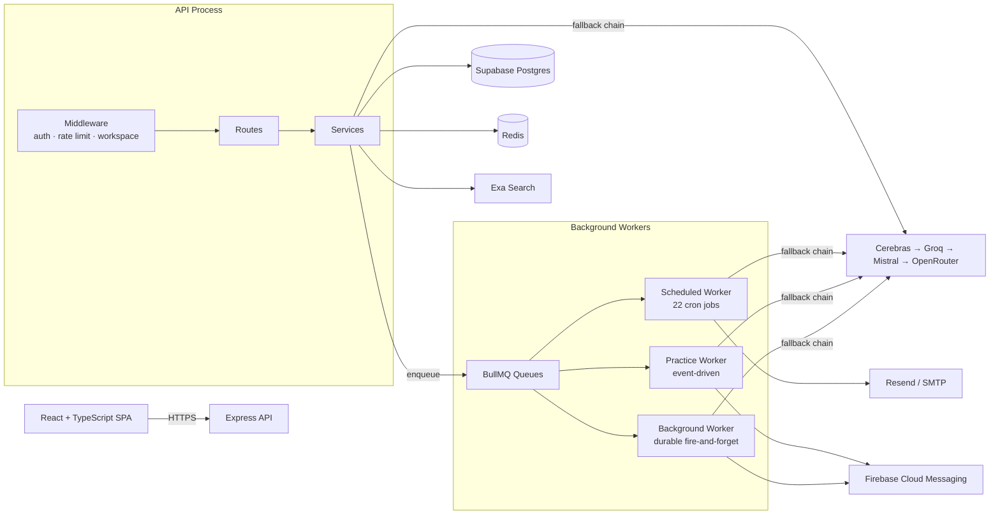

# FounderSales

AI-powered sales coaching and outreach platform for founders, freelancers, and early-stage sellers — built for people who have a product worth selling but haven't necessarily done outbound sales before.

This is a monorepo with two apps:

- **`backend/`** — a Node.js/Express API and background job system (Supabase, Redis, BullMQ, a four-provider AI fallback chain).
- **`frontend/`** — a React + TypeScript single-page app that consumes the API.

Most of this README covers the backend, since that's where the engineering depth lives — see [Frontend](#frontend) near the end for what's currently documented about the client.

## Why I Built This

Most sales tools assume you already know how to sell and just need somewhere to log activity. That assumption doesn't hold for the person this product is actually for — a founder or early-stage seller who has never done cold outreach, doesn't know what a good message sounds like, and has no one to rehearse a hard sales conversation against before having it for real.

FounderSales is built around a different premise: everything the platform generates for a user should come from the *same* understanding of who they are and what they're selling, and that understanding should get sharper the longer they use it. A voice profile built during onboarding drives opportunity scoring, outreach drafting, the personality of the simulated buyer in practice mode, and calendar meeting prep — not four separate AI features that happen to share a login.

I used this project to go deep on the parts of building an AI product that don't show up in a "call an LLM API" tutorial: a four-provider fallback chain with structured error classification and cross-instance Redis-coordinated key cooldowns, a cost-gating layer that decides whether an AI call is worth making *before* making it, a single-request buyer simulation that bundles reply generation, a private internal monologue, and outcome detection into one model call instead of four, and a background-job system with real idempotency guarantees rather than "hope it doesn't run twice." It's also where I documented real trade-offs and one known gap honestly rather than pretending the system has none — see `ARCHITECTURE.md` §13.

## What It Does

**AI-branded companion.** The AI layer is presented to users as **Clutch**, FounderSales' sales companion — the same underlying multi-provider system throughout this document, just given a consistent identity in the product.

**Onboarding that builds a real voice profile.** A three-burst AI-driven interview (product, customer, communication style) synthesizes a structured profile — differentiator, ICP trigger, objection handling, ready-to-use opening hooks, a personalized list of phrases to avoid — that every other AI feature reads from. See `PRODUCT_OVERVIEW.md` §4.

**Opportunity discovery with drafted outreach attached.** Finds real conversations online matching a user's product (Exa neural search, with an AI router deciding whether a search is even worth the cost first), scores them, and drafts a message for every qualifying result — checked against the user's own avoid-phrase list, with an automatic one-shot regeneration if a violation slips through.

**Practice mode with a buyer who has a private opinion.** A simulated buyer persona with hidden motivations the user has to discover through questioning, scored across skill axes, with a persistent state that shifts turn-by-turn. Every reply is one bundled AI call returning the reply text, the buyer's real internal monologue (which can contradict what they actually said), a conversation-outcome classification, and inline coaching — not four sequential calls. See `ARCHITECTURE.md` §6.

**Calendar intelligence that gates its own AI spend.** Meeting prep, prospect research (reused across meetings with the same prospect within a 14-day window, not re-run every time), live meeting-notes capture, voice-memo transcription, and post-meeting debriefs that extract commitments and signals from one AI call instead of two. Every trigger point passes through a dedicated cost gate that logs its own proceed/skip decisions to an audit table — see `ARCHITECTURE.md` §7.

**Coaching driven by blended real + simulated data.** A weekly job reconciles skill scores from real sent-message analysis (0–10 scale) with practice-session scores (0–100 scale, normalized down) onto one comparable trend line, feeding persistent-weakness detection, an adaptive 3-session drill curriculum, and 40+ analytical endpoints — correlation and trend detection, silent-pipeline-risk flagging, team-level coaching queues — covered in `PRODUCT_OVERVIEW.md` §12.

## Engineering Highlights

**A real multi-provider AI fallback chain, not a single API call with a try/catch.** Four providers (Cerebras → Groq → Mistral → OpenRouter), each with its own key pool, tried in priority order until one succeeds. Failures are classified by *structured status code and error body*, not string-matched against a formatted message — a 429 cools the specific key; a 500 doesn't, because it's the provider's fault, not the key's; a "model not found" response evicts the model from a shared discovery cache without touching the key at all; anything else aborts the whole chain immediately and reports to Sentry, on the reasoning that retrying a malformed request against three more providers just wastes time reproducing the same bug. See `ARCHITECTURE.md` §4.

**Cross-instance coordination via Redis, with a documented rollback switch.** Key cooldown state, model-discovery caching, and rate-limit counters are all Redis-shared specifically so a horizontally-scaled deployment behaves correctly — one instance discovering a bad key means every instance knows immediately, not eventually. Every one of these systems has a working in-memory fallback and a single environment-variable kill switch to revert to it without a deploy, because this is the single highest-traffic code path in the service.

**Selective vision routing.** Only 2 of roughly 13 models across the whole provider priority list can actually interpret images. Rather than sending a multi-part payload to every model regardless, the system checks the *specific* model about to be called on *this specific attempt* and only restructures the request when that model can use it — every other model in the fallback queue gets the same plain-text request it always would.

**A cost gate that runs before the AI call, not after.** `calendarAiGate.js` decides — cooldown reuse, low-stakes skip, quota-aware degradation — whether a calendar AI call is worth making, and logs every decision (proceed, skip, or reused-cache, with the specific reason) to an audit table. This makes "we optimized AI cost here" a checkable query, not an assertion.

**Real background-job idempotency, matched per job to its own write shape.** Stable BullMQ job IDs for most durable work; an atomic conditional `UPDATE ... WHERE flag = false` for the calendar reminder scan (no per-event job needed at all); upserts on composite conflict keys for weekly aggregates; a database re-check before spending an AI call on calendar prep, specifically because BullMQ's own job-ID dedup only protects against duplicate *enqueues*, not two genuinely different job IDs racing to do the same work. See `BACKGROUND_JOBS.md` §7.1.

**A documented, real known gap.** A self-enqueued weekly job (`pattern_insights`) currently has no registered handler and fails on every run — left as a deliberately scoped, honestly documented issue rather than silently patched over or hidden. See `BACKGROUND_JOBS.md` §4.3.

**Deterministic scoring where it belongs, AI where it doesn't.** Relationship health is plain arithmetic (recency, outcome, signal counts, clamped 0–100) precisely so it stays explainable; objection classification on short feedback notes uses regex pattern matching, not a second model call, because a full AI call for a two-sentence note isn't worth the cost or the latency.

## Architecture

The API follows a layered **routes → middleware → services → Supabase** structure. Route handlers are thin — parse the request, call a service, shape the response. Business logic, AI orchestration, and database access all live in `services/`, deliberately written to accept plain parameters rather than Express `req`/`res` objects, so the exact same functions are callable from an HTTP route or a background worker.



The codebase currently runs as a single process (`src/app.js` starts the HTTP server and boots all three background workers in-process). **A split-process topology — a dedicated API process and a dedicated worker process, run and deployed independently — is included in this repository** (`src/server.js` and `src/workers/index.js`), decoupling API request-handling capacity from background-job throughput. See `ARCHITECTURE.md` §11 for the full reasoning and `BACKGROUND_JOBS.md` §8.1 for running it.

Full request-lifecycle diagrams, the AI provider fallback architecture, the database schema, and every documented trade-off are in [ARCHITECTURE.md](ARCHITECTURE.md).

### Domain Model

```
Workspace (a tenant — a company, or a personal sales practice)
 ├─ Workspace Profile (AI-synthesized voice/product/audience — one per user per workspace)
 ├─ Opportunities (discovered, scored, drafted outreach attached)
 │   └─ Pipeline (stage progression → feedback → conversation analysis)
 ├─ Practice Sessions (buyer persona, scored, feeds skill progression)
 ├─ Prospects (deduplicated real people)
 │   └─ Calendar Events (prep, debriefs, voice memos, commitments, signals)
 ├─ Growth Cards (tips, plans, detected patterns, weakness alerts)
 └─ Chats (AI coach, meeting-notes mode, growth-card discussion)
```

Full feature-by-feature detail, including every business rule and edge case, is in [PRODUCT_OVERVIEW.md](PRODUCT_OVERVIEW.md).

## Background Jobs

Three BullMQ queues, each shaped for a different kind of "not right now" work:

| Queue | Concurrency | Handles |
|---|---|---|
| `scheduled-jobs` | 1 | 22 cron-driven jobs — daily tips, weekly pattern detection, nightly metrics, calendar sweeps |
| `practice-jobs` | 10 | Post-session scoring, coaching annotations, playbook generation, real conversation analysis |
| `background` | 5 | Calendar prep/research/extraction, voice memo transcription, chat summarization, prospect dedup |

Every job's trigger, idempotency mechanism, retry policy, and failure-handling behavior — including the one job currently failing on every run and why — is documented in [BACKGROUND_JOBS.md](BACKGROUND_JOBS.md).

## Security Highlights

- JWT verification (Supabase Auth) with a 30-second Redis-cached profile lookup, deliberately never attaching the raw token itself to the request object.
- Workspace membership resolved and cached per-request with explicit invalidation on role changes and workspace switches, not left to expire silently.
- 19 independently-namespaced Redis-backed rate limiters, each sized to its own actual cost profile — a fix for a real prior bug where several limiters silently shared one Redis key space and merged unrelated counters.
- Invite tokens are 32-byte random values, SHA-256 hashed before storage — the plaintext token is never persisted.
- File uploads are MIME-validated both client-side and against the actual bytes received; chat image/PDF attachments are capped by an aggregate character budget so a large attachment can't silently balloon what gets sent to the AI.
- Prospect deduplication never auto-merges a fuzzy match — only exact identifiers or normalized-name exact matches merge automatically; anything else is flagged for human review.
- The service-role Supabase client bypasses Row-Level Security; the middleware chain (auth → workspace membership → rate limit) is the actual enforcement boundary, not RLS. That's a deliberate trade-off, documented plainly in `ARCHITECTURE.md` §9.1 rather than glossed over.

## Backend Tech Stack

| Layer | Technology |
|---|---|
| Runtime | Node.js, Express 4, ESM (`"type": "module"`) |
| Database | Supabase (managed Postgres), via `@supabase/supabase-js` |
| Auth | Supabase Auth (email/password + Google OAuth), JWT bearer tokens |
| Cache / Queue backing store | Redis (`ioredis` for BullMQ, `redis` for caching/coordination) |
| Background jobs | BullMQ (3 queues, 3 dedicated workers), `rate-limit-redis` |
| AI providers | Cerebras, Groq (chat + Whisper transcription), Mistral, OpenRouter — multi-provider fallback chain |
| Web search | Exa (neural search), with an AI router and quota-aware Groq fallback |
| File storage | Cloudinary (images, PDFs, audio) |
| Validation | Zod |
| Push notifications | Firebase Admin SDK (FCM) |
| Transactional email | Resend, with SMTP (nodemailer) and console-log fallback |
| Security middleware | Helmet, CORS, `express-rate-limit` |
| Error tracking (optional) | Sentry (`@sentry/node`) |
| Queue monitoring (optional) | Bull Board, gated behind a shared-secret header + dedicated rate limiter |

## Getting Started

### Prerequisites

- Node.js ≥ 18
- A Supabase project (Postgres + Auth)
- A Redis instance
- At minimum, a Groq API key (required — every AI feature depends on it as part of the fallback chain)

### Installation

```bash
git clone <this-repo>
cd <this-repo>

# Backend
cd backend
npm install
cp .env.example .env   # if present — otherwise see Configuration below
cd ..

# Frontend
cd frontend
npm install
cp .env.example .env
cd ..
```

### Running the app

From `backend/`:

```bash
# Combined process — API + all background workers (current default)
npm run dev     # nodemon
npm start        # node

# Or as separate processes (recommended for anything beyond local dev):
node src/server.js          # API only
node src/workers/index.js   # scheduler + all 3 workers only
```

To run the frontend alongside it, in a second terminal:

```bash
cd frontend
npm run dev
```

`GET /health` reports basic process status and is suitable for a load-balancer health check.

### Database

The schema is a single file, `schema.sql`, applied directly to the target Supabase project's SQL editor — it also defines every atomic Postgres RPC the app relies on (`create_workspace_for_user`, `accept_workspace_invite`, `increment_chat_stats`, `record_ai_usage`, and others — see `ARCHITECTURE.md` §9.3 for the full list and what each one prevents).

## Configuration

Required at startup (the process exits immediately with a clear per-variable message if any are missing):

- `SUPABASE_URL`
- `SUPABASE_SERVICE_KEY`
- `GROQ_API_KEY`
- `ADMIN_SECRET` (gates the Bull Board dashboard at `/admin/jobs`)

Optional, feature-gating (the app boots without these, with a startup warning, but the corresponding feature is disabled or degraded):

- `REDIS_URL` — without it, workspace/profile caching and all background job processing are skipped
- `EXA_API_KEY` — without it, opportunity discovery always uses the Groq-generated practice-example fallback
- `FIREBASE_PROJECT_ID` (+ associated service account config) — without it, push notifications are disabled
- `FRONTEND_URL` — the allowed CORS origin
- Additional provider keys (`CEREBRAS_API_KEY`, `MISTRAL_API_KEY`, `OPENROUTER_API_KEY`, numbered `_1` through `_N` variants for multi-key pools per provider) — the fallback chain degrades gracefully to whichever providers have keys configured
- `SENTRY_DSN` — error tracking, fully optional
- `RESEND_API_KEY` / SMTP variables — email delivery, falls back to console logging in development

## Trade-offs & Known Limitations

- **Single-process deployment is still the documented default**, even though the split-process files exist in this repo — see `ARCHITECTURE.md` §11 for the reasoning behind the split and how to run it.
- **`pattern_insights`, a self-enqueued weekly job, currently has no registered handler** and fails on every run. This is a known, scoped gap — see `BACKGROUND_JOBS.md` §4.3 for exactly what's ambiguous about the fix and why it wasn't guessed at.
- **Service-role Postgres access, not Row-Level Security, is the actual enforcement boundary** — correct as long as the middleware chain is never bypassed, with no independent database-layer backstop today.
- **Public booking pages exist at the schema level** (`booking_pages`, `availability_windows`) **but aren't wired to any route yet** — a planned feature, not a shipped one.
- **30-second membership/profile cache staleness** is an explicit, bounded trade-off against two extra Postgres round-trips on the hottest part of every authenticated request.

Further reading: [ARCHITECTURE.md](ARCHITECTURE.md) for the full system design, [PRODUCT_OVERVIEW.md](PRODUCT_OVERVIEW.md) for the complete feature reference, and [BACKGROUND_JOBS.md](BACKGROUND_JOBS.md) for every queue, job, and retry policy.

## Frontend

The `frontend/` app is a React + TypeScript single-page application consuming the backend API described above. Detailed frontend architecture (state management, routing, component structure) isn't documented yet — it'll be added once that codebase has had the same level of tracing applied to it as the backend has here, rather than guessed at in advance.

## License

MIT
