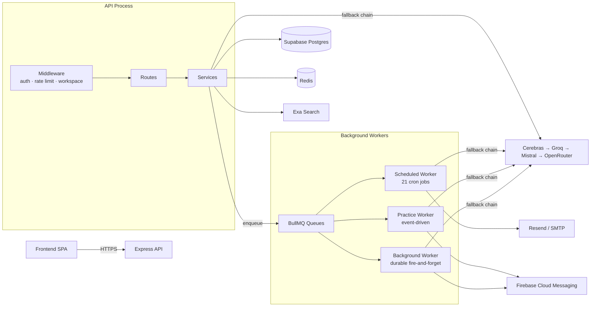

# FounderSales

An AI sales coaching and outreach platform for founders, freelancers, and early-stage sellers — people who have something worth selling but haven't necessarily done outbound sales before.

This is a monorepo with two apps:

- **`backend/`** — Node.js/Express API and background job system (Supabase, Redis, BullMQ, a four-provider AI fallback chain)
- **`frontend/`** — the client the screenshots in this repo come from. Its source isn't part of this documentation pass; everything here about the frontend is inferred from the backend API surface and the app's own UI.

**Status: actively under development.** This is a solo project I'm building toward a real product, not a finished SaaS. Large parts of the backend are genuinely solid — the AI provider layer, the background job system, the calendar cost-gating — and some parts are still rough edges or half-wired (see [Known Gaps](#known-gaps--in-progress-work) below). I'd rather show you both than pretend otherwise.

## Why I Built This

Most sales tools assume you already know how to sell and just need somewhere to log activity. That doesn't hold for a founder doing cold outreach for the first time — they don't know what a good message sounds like, and they have no one to rehearse a hard conversation against before having it for real.

The premise here: everything the platform generates for a user should come from the *same* understanding of who they are and what they're selling, and that understanding should get sharper the longer they use it. A voice profile built during onboarding feeds opportunity scoring, outreach drafting, the personality of the simulated buyer in practice mode, and calendar meeting prep — not four separate AI features that happen to share a login.

I used this project to go deep on the parts of shipping an AI product that don't show up in a "call an LLM API" tutorial: a four-provider fallback chain with structured error classification and cross-instance Redis-coordinated key cooldowns, a cost-gating layer that decides whether an AI call is worth making *before* making it, a single-request buyer simulation that bundles reply generation, a private internal monologue, and outcome detection into one model call instead of four, and a background-job system with real idempotency guarantees. It's also where I've tried to document real trade-offs and known gaps honestly rather than pretend the system has none — see [ARCHITECTURE.md §13](ARCHITECTURE.md#13-known-gaps--engineering-trade-offs).

## What It Does

**Onboarding that builds a real voice profile.** A guided wizard — basic info, then three AI-generated question bursts, then a live preview of the outreach message the resulting profile produces — synthesizes a structured voice profile (differentiator, ICP trigger, objection handling, opening hooks, a personalized avoid-phrase list) that every other AI feature reads from.

**Opportunity discovery with drafted outreach attached.** Finds real conversations online matching a user's product (Exa neural search, gated by an AI router that decides whether a search is worth the cost first), scores them, and drafts a message for every qualifying result — checked against the user's own avoid-phrase list, with a one-shot regeneration if a violation slips through.

**Practice mode with a buyer who has a private opinion.** A simulated buyer persona with hidden motivations the user has to discover through questioning, scored across skill axes, with a state that shifts turn-by-turn. Every reply is one bundled AI call returning the reply text, the buyer's real internal monologue (which can contradict what they actually said), a conversation-outcome classification, and inline coaching — not four sequential calls.

**Calendar intelligence that gates its own AI spend.** Meeting prep, prospect research (reused across meetings with the same prospect within a 14-day window), live meeting-notes capture, voice-memo transcription, and post-meeting debriefs that extract commitments and signals from one AI call instead of two. Every trigger point passes through a cost gate that logs its own proceed/skip decisions to an audit table.

**Coaching driven by blended real + simulated data.** A weekly job reconciles skill scores from real sent-message analysis (0–10 scale) with practice-session scores (0–100 scale, normalized down) onto one comparable trend line, feeding weakness detection, an adaptive drill curriculum, and a fairly deep analytics surface — correlation and trend detection, pipeline-risk flagging, team-level coaching queues.

**A manager/team layer** — leaderboard, a coaching queue that flags reps hitting risk signals, team pipeline and opportunity views, team-wide loss-reason analysis, and a week-over-week team skill-velocity number.

See [PRODUCT_OVERVIEW.md](PRODUCT_OVERVIEW.md) for a full feature-by-feature tour with screenshots.

## Engineering Highlights

**A real multi-provider AI fallback chain, not a single API call with a try/catch.** Four providers (Cerebras → Groq → Mistral → OpenRouter), each with its own key pool, tried in priority order until one succeeds. Failures are classified by *structured status code and parsed error body*, not string-matched against a formatted message — a 429 cools the specific key; a 500 doesn't, because it's the provider's fault, not the key's; a "model not found" response evicts the model from a shared discovery cache without touching the key; anything else aborts the whole chain and reports to Sentry, on the reasoning that retrying a malformed request against three more providers just wastes time reproducing the same bug.

**Cross-instance coordination via Redis, with a documented rollback switch.** Key cooldown state, model-discovery caching, and rate-limit counters are all Redis-shared so a horizontally-scaled deployment behaves correctly — one instance discovering a bad key means every instance knows immediately. Every one of these systems has a working in-memory fallback and a single environment-variable kill switch to revert to it without a deploy.

**A cost gate that runs before the AI call, not after.** `calendarAiGate.js` decides — cooldown reuse, low-stakes skip, quota-aware degradation — whether a calendar AI call is worth making, and logs every decision to an audit table (`calendar_ai_events`). That makes "cost was optimized here" a checkable query, not a claim.

**Real background-job idempotency, matched per job to its own write shape.** Stable BullMQ job IDs for most durable work; an atomic conditional `UPDATE ... WHERE flag = false` for the calendar reminder scan; upserts on composite conflict keys for weekly aggregates; a database re-check before spending an AI call on calendar prep, specifically because BullMQ's job-ID dedup only protects against duplicate *enqueues*, not two different job IDs racing to do the same work.

**Deterministic scoring where it belongs, AI where it doesn't.** Relationship health is plain arithmetic (recency, outcome, signal counts, clamped 0–100) so it stays explainable. Objection classification on short feedback notes uses regex pattern matching, not a second model call, because a full AI call for a two-sentence note isn't worth the cost or the latency.

**A documented, real known gap.** A self-enqueued weekly job (`pattern_insights`) currently has no registered handler and fails every run — left as a deliberately scoped, honestly documented issue rather than silently patched over. See [Known Gaps](#known-gaps--in-progress-work).

## Architecture

The API follows a layered **routes → middleware → services → Supabase** structure. Route handlers are thin — parse the request, call a service, shape the response. Business logic, AI orchestration, and database access live in `services/`, written to accept plain parameters rather than Express `req`/`res`, so the same functions are callable from an HTTP route or a background worker.



The backend can run as a single combined process (`src/app.js` — starts the HTTP server and all three background workers in-process, the default in `package.json`'s `start`/`dev` scripts) or as **two independent processes** — `src/server.js` (API only) and `src/workers/index.js` (scheduler + all three workers, no HTTP server) — decoupling request-handling capacity from background-job throughput. Both entry points exist and are fully wired; the combined process remains the default way the app actually gets started.

Full request-lifecycle diagrams, the AI provider architecture, the data model, and every documented trade-off are in [ARCHITECTURE.md](ARCHITECTURE.md). Every queue, job, retry policy, and idempotency mechanism is in [BACKGROUND_JOBS.md](BACKGROUND_JOBS.md).

### Domain Model

```
Workspace (a tenant — a company, or a personal sales practice)
 ├─ Workspace Profile (AI-synthesized voice/product/audience — one per user per workspace)
 ├─ Opportunities (discovered, scored, drafted outreach attached)
 │   └─ Pipeline (stage progression → feedback → conversation analysis)
 ├─ Practice Sessions (buyer persona, scored, feeds skill progression)
 ├─ Prospects (deduplicated real people)
 │   └─ Calendar Events (prep, debriefs, voice memos, commitments, signals)
 ├─ Growth Cards (tips, plans, detected patterns, weakness alerts)
 └─ Chats (AI coach, meeting-notes mode, growth-card discussion)
```

## Background Jobs

Three BullMQ queues, each shaped for a different kind of "not right now" work:

| Queue | Concurrency | Handles |
|---|---|---|
| `scheduled-jobs` | 1 | 21 cron-driven jobs — daily tips, weekly pattern detection, nightly metrics, calendar sweeps |
| `practice-jobs` | 10 | Post-session scoring, coaching annotations, playbook generation, real conversation analysis |
| `background` | 5 | Calendar prep/research/extraction, voice memo transcription, chat summarization, prospect dedup |

Full detail — trigger, idempotency mechanism, retry policy, and the one job currently failing every run — in [BACKGROUND_JOBS.md](BACKGROUND_JOBS.md).

## Backend Tech Stack

| Layer | Technology |
|---|---|
| Runtime | Node.js, Express 4, ESM (`"type": "module"`) |
| Database | Supabase (managed Postgres), via `@supabase/supabase-js` |
| Auth | Supabase Auth (email/password + Google OAuth), JWT bearer tokens |
| Cache / coordination | Redis (`ioredis` for BullMQ, `redis` for caching/locks/coordination) |
| Background jobs | BullMQ (3 queues, 3 workers), `rate-limit-redis` |
| AI providers | Cerebras, Groq (chat + Whisper transcription), Mistral, OpenRouter — multi-provider fallback chain |
| Web search | Exa (neural search), with an AI router deciding when it's worth the cost, quota-aware Groq fallback |
| File storage | Cloudinary (images, PDFs, audio) |
| Validation | Zod |
| Push notifications | Firebase Admin SDK (FCM) |
| Transactional email | Resend, with SMTP (nodemailer) and console-log fallback |
| Security middleware | Helmet, CORS, `express-rate-limit` |
| Error tracking (optional) | Sentry (`@sentry/node`) |
| Queue monitoring (optional) | Bull Board, gated behind a shared-secret header + rate limiter |
| Testing | Vitest — unit tests on the pure/extractable logic (pagination, error classification, momentum scoring, workspace-profile array resolution) |

## Getting Started

### Prerequisites

- Node.js ≥ 18
- A Supabase project (Postgres + Auth)
- A Redis instance
- At minimum, a Groq API key (every AI feature depends on it as part of the fallback chain)

### Installation

```bash
git clone <this-repo>
cd <this-repo>/backend
npm install
cp .env.example .env   # if present — otherwise see Configuration below
```

### Running

```bash
npm run dev      # combined process, nodemon
npm start        # combined process, node

# or as two independent processes:
node src/server.js          # API only
node src/workers/index.js   # scheduler + all 3 workers only
```

`GET /health` reports basic process status and is suitable for a load-balancer health check.

### Configuration

Required at startup (the process exits immediately with a clear per-variable message if any are missing): `SUPABASE_URL`, `SUPABASE_SERVICE_KEY`, `GROQ_API_KEY`, `ADMIN_SECRET`.

Optional, feature-gating (the app boots without these, with a startup warning, and the corresponding feature degrades): `REDIS_URL` (workspace/profile caching and all background job processing are skipped without it), `EXA_API_KEY` (opportunity discovery falls back to a Groq-generated practice-example mode), `FIREBASE_PROJECT_ID` + service account config, `FRONTEND_URL`, additional provider keys (`CEREBRAS_API_KEY`, `MISTRAL_API_KEY`, `OPENROUTER_API_KEY`, numbered `_1`–`_N` variants for multi-key pools), `SENTRY_DSN`, `RESEND_API_KEY`/SMTP variables.

The database schema is a single `schema.sql` file applied directly to the target Supabase project — it also defines every atomic Postgres RPC the app relies on. See [ARCHITECTURE.md §5](ARCHITECTURE.md#5-data-architecture) for the RPC list and what each one prevents.

## Known Gaps & In-Progress Work

This is a solo project, still moving. Some things worth being upfront about:

- **`pattern_insights`, a self-enqueued weekly job, currently has no registered handler** and fails every run. Scoped and understood — see [BACKGROUND_JOBS.md §4.3](BACKGROUND_JOBS.md#43-known-gap-pattern_insights) — just not fixed yet, because the fix requires deciding between two wiring approaches rather than guessing.
- **Service-role Postgres access, not Row-Level Security, is the actual authorization boundary.** Correct as long as the middleware chain (auth → workspace membership → rate limit) is never bypassed, with no independent database-layer backstop today.
- **Public booking pages exist at the schema level** (`booking_pages`, `availability_windows`) **but aren't wired to any route.** Planned, not shipped.
- **No billing or subscription system.** No payment provider integration, no plan/tier enforcement beyond a few hardcoded tier checks, no subscription state in the schema. This is a solo project, not a business yet.
- **Frontend source isn't part of this documentation pass.** The screenshots throughout this repo's docs reflect a real, working client; its internal architecture isn't traced here.
- **Dead code kept intentionally, not cleaned up yet:** two practice-reply job handlers (`PRACTICE_REPLY`, `PRACTICE_GHOST`) remain registered in the worker even though nothing enqueues them anymore — the synchronous V3 reply path replaced them and the old handlers were kept as a fallback rather than deleted.

I'd rather list these than have someone find them first.

## License

MIT
